# NFS_JAVA_C2_2026 | Full-Stack Development with Java, React & MongoDB

## Programme Description

This 20-day programme is designed to help participants build a complete full-stack web application using Java, Spring Boot, React, and MongoDB.

The programme takes learners from programming and web fundamentals to backend API development, frontend interface design, database modelling, authentication, testing, performance improvement, and final capstone presentation.

Throughout the programme, participants will work on practical exercises and gradually build a small but production-like web application. The final outcome is a working capstone project that demonstrates the use of a React frontend, Spring Boot backend, MongoDB database, secure authentication, API documentation, testing practices, and deployment-readiness basics.

AI tools such as Gemini are used as learning accelerators to help scaffold examples, suggest refactoring ideas, draft tests, generate sample data, and support MongoDB query or aggregation design. However, participants are expected to review, verify, understand, and take ownership of all generated code.

---

## Programme Duration

* Duration: 20 training days

* Daily Duration: 7 hours per day

* Total Training Hours: 140 hours

* Mode: Instructor-led training with guided labs, team build activities, review sessions, quizzes, and capstone development

---

## Programme Objectives

By the end of this programme, participants will be able to:

* Understand web fundamentals, HTTP, REST, and JSON.

* Write basic to intermediate Java and JavaScript code.

* Build REST APIs using Spring Boot.

* Apply validation, authentication, authorisation, and error-handling practices.

* Model data effectively using MongoDB.

* Use MongoDB indexes, queries, pagination, and aggregation pipelines.

* Build accessible React user interfaces with routing, forms, state, and data fetching.

* Apply testing practices for backend and frontend development.

* Use AI coding assistants responsibly for learning, refactoring, testing, and documentation.

* Design, build, document, and present a full-stack capstone project.

---

---

## Day 12 Exercise 01 - Add React Router

Run `npm run dev` inside `support-desk-ui` to run this exercise.

### Files created

- Installed `react-router` via `npm install react-router`.
- `main.jsx` — wrapped the app in `BrowserRouter`, enabling client-side routing based on the URL.
- `App.jsx` — replaced the single page with `Routes`/`Route` definitions for `/login`, `/app/dashboard`, and `/app/tickets`.
- `pages/LoginPage.jsx` / `pages/DashboardPage.jsx` — simple placeholder pages for now.
- `pages/TicketsPage.jsx` — moved all the Day 11 ticket UI (API info card, filter panel, list, detail) here, since it now lives at its own dedicated route instead of being the only content on the page.

### Output Screenshot

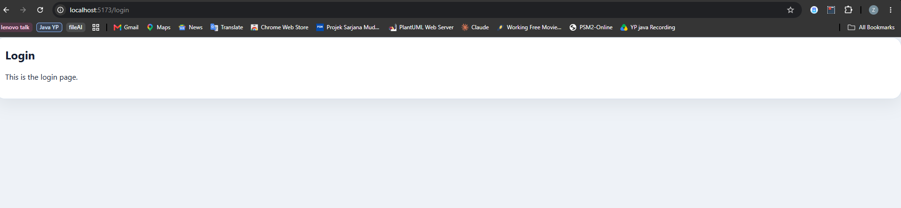
*GET /login shows the placeholder login page*

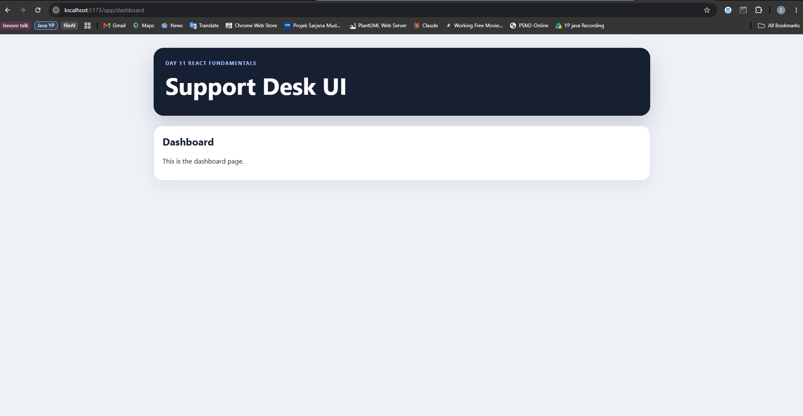
*GET /app/dashboard shows the header plus the placeholder dashboard page*

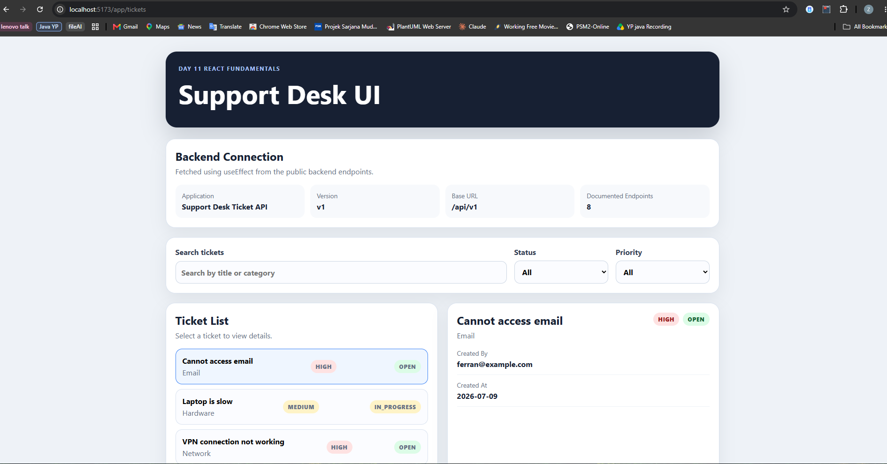
*GET /app/tickets shows the full Day 11 ticket UI, now living at its own route*

---

## Day 12 Exercise 02 - Create Nested App Layout

Run `npm run dev` inside `support-desk-ui` to run this exercise.

### Files created

- `AppShell.jsx` — the shared shell for all `/app/*` pages, with a header, a `NavLink`-based navigation bar, and an `Outlet` where the matching child route renders.
- `pages/ReportsPage.jsx` — a placeholder page for the new `/app/reports` route.
- `App.jsx` — restructured to use nested routing: `/app` renders `AppShell`, with `dashboard`, `tickets`, and `reports` as child routes rendered inside its `Outlet`, replacing the earlier approach of wrapping each page in `Layout` individually.
- `index.css` — added `.app-nav` styling, including the `.active` state React Router applies to whichever `NavLink` matches the current URL.

### Output Screenshot

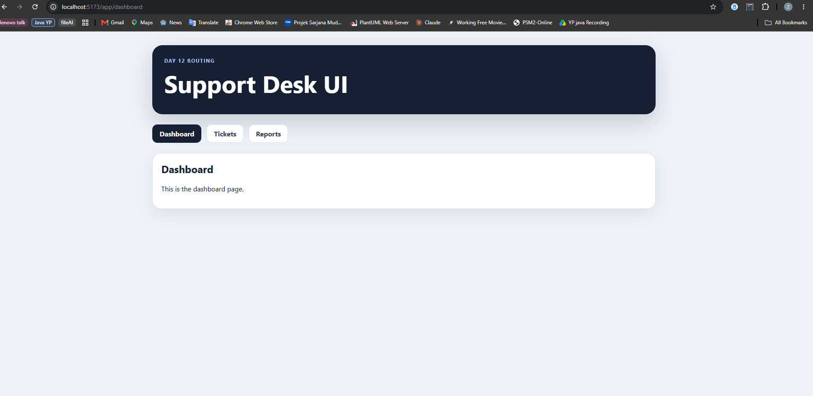
*Dashboard tab active, nav bar and header stay fixed*

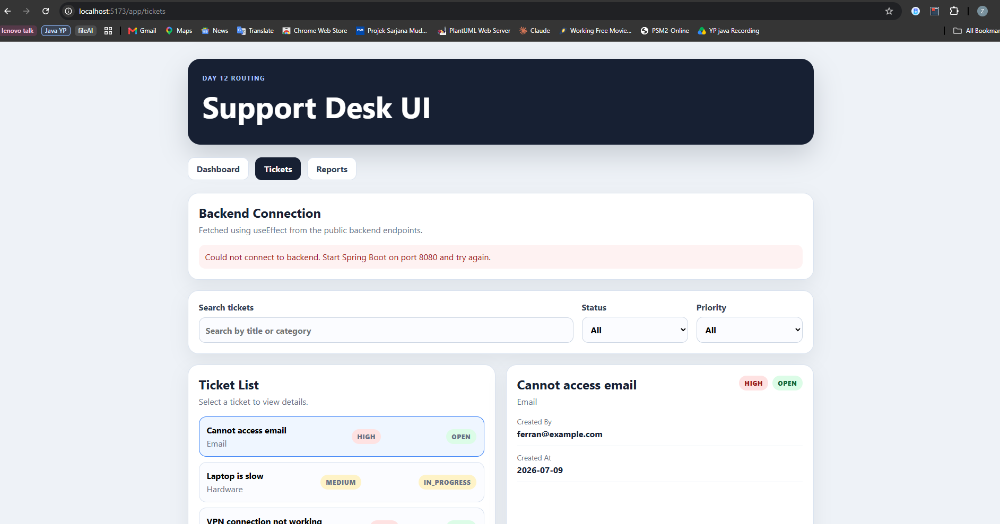
*Tickets tab active, showing the full Day 11 ticket UI inside the shared shell*

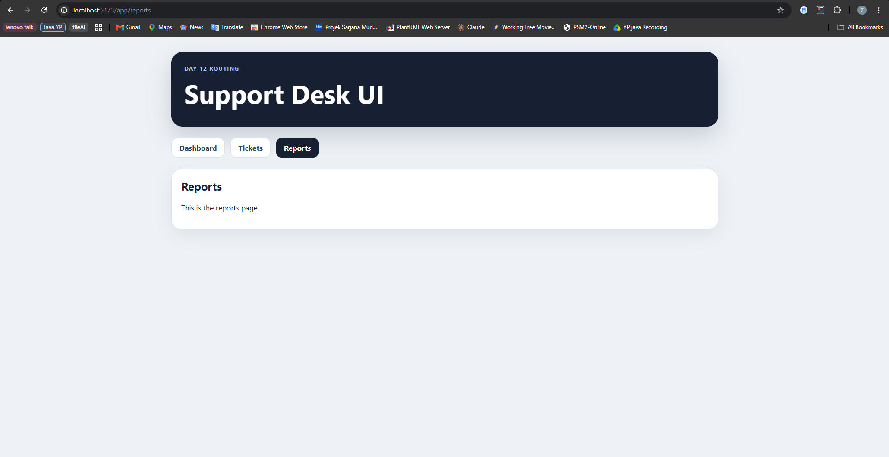
*Reports tab active, showing the new placeholder page*

---

## Day 12 Exercise 03 - Login Page and Auth Context

Run `npm run dev` inside `support-desk-ui` to run this exercise. Backend must be running on port 8080 for login to work.

### Files created/updated

- `context/AuthContext.jsx` — new `AuthProvider`/`useAuth` pair built with `createContext`/`useContext`. Holds the logged-in user, JWT token, and `isAuthenticated` flag in state, persists them to `localStorage` under `supportDeskAuth` so a refresh doesn't log the user out, and exposes `login(email, password)` (calls the backend, stores the response) and `logout()` (clears state and storage).
- `services/api.js` — added `loginRequest(email, password)`, a `POST /api/auth/login` call reusing the existing `parseJsonResponse()` helper so backend validation/auth errors surface as readable messages.
- `pages/LoginPage.jsx` — replaced the placeholder with a real controlled form (email + password), wired to `useAuth().login()`. Shows a loading state while the request is in flight, an `ErrorMessage` on failure (e.g. wrong credentials), and redirects to `/app/dashboard` (or back to whatever page the user was trying to reach) on success. Pre-fills the seeded admin credentials as a convenience. The password field has an eye-icon toggle button (inline SVG, no extra library) to show/hide the typed password instead of a plain "Show/Hide" text button.
- `components/AppShell.jsx` — added a `user-panel` in the header showing the logged-in user's name and role, plus a `Logout` button. Clicking it opens a `window.confirm()` dialog ("Are you sure you want to log out?") before calling `logout()` and navigating back to `/login`, so a logout can't happen from a single accidental click.
- `main.jsx` — wrapped `<App />` in `<AuthProvider>` (inside `BrowserRouter`) so every route can read auth state via `useAuth()`.
- `index.css` — added `.password-field`/`.password-toggle` (icon button positioned inside the input, centered, with a hover state) and `.user-panel` (name, role pill, logout button styling in the dark header).

### Output Screenshot

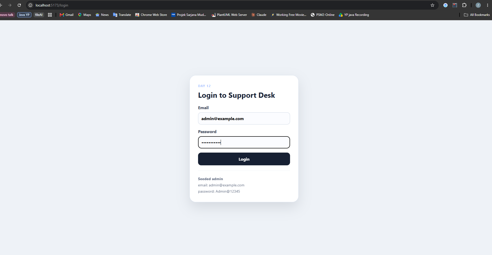
*The login form pre-filled with the seeded admin credentials, password hidden by default*

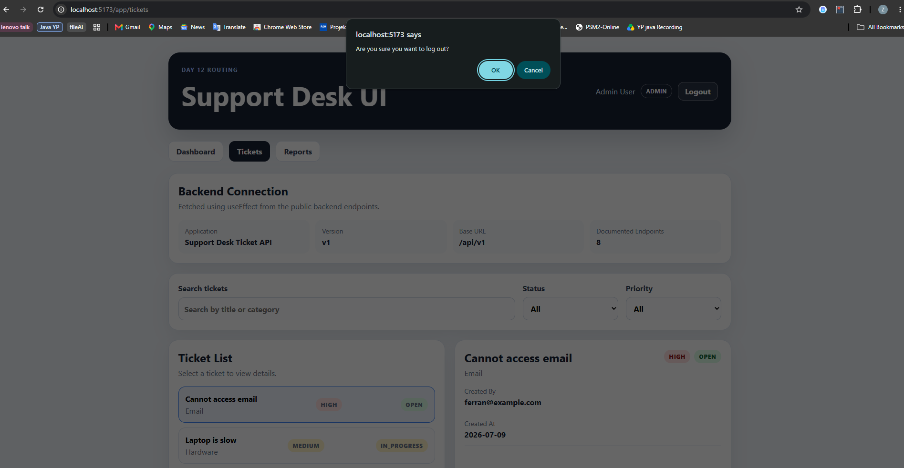
*Clicking Logout in the header opens a confirmation dialog before actually logging out*

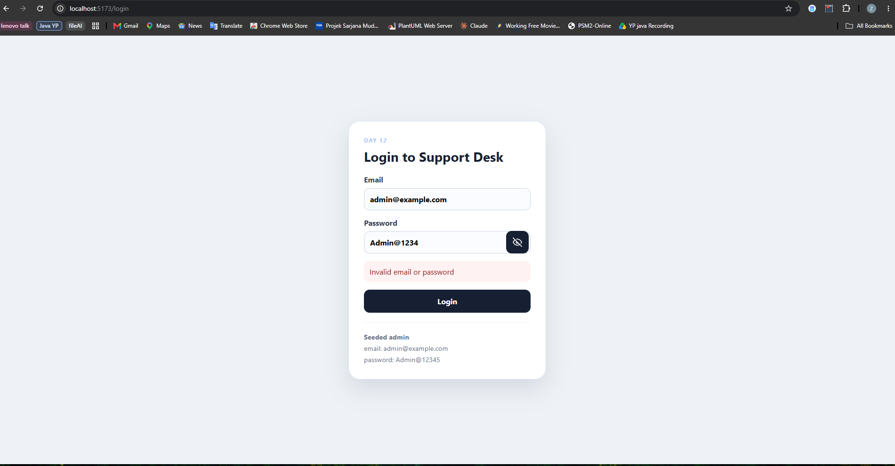
*An incorrect password shows an inline "Invalid email or password" error, with the password revealed via the eye icon*

---

## Day 12 Exercise 04 - Protect Ticket Pages

Run `npm run dev` inside `support-desk-ui` to run this exercise.

### Files created/updated

- `components/ProtectedRoute.jsx` — new gate component. Reads `isAuthenticated` from `useAuth()`; if there's no token it renders `<Navigate to="/login" state={{ from: location }} replace />` (stashing the attempted URL so `LoginPage` can redirect back after a successful login), otherwise it renders `<Outlet />` so the matched child route continues to render.
- `App.jsx` — wrapped the existing `/app` route (and its `dashboard`/`tickets`/`reports` children) in a path-less parent `<Route element={<ProtectedRoute />}>`, so all three pages now require a valid token before they'll render.

### Result

Navigating directly to `/app/tickets` (or `/app/dashboard`, `/app/reports`) while logged out immediately redirects to `/login`, confirmed by testing.

---

## Day 12 Exercise 05 - Redirect After Login

Run `npm run dev` inside `support-desk-ui` to run this exercise.

### Files created/updated

No new code was needed — `ProtectedRoute.jsx` and `LoginPage.jsx` from Exercise 4 and Exercise 3 already cover this:

- `ProtectedRoute.jsx` grabs the current location with `useLocation()` and passes it along in `state={{ from: location }}` when it redirects an unauthenticated user to `/login`.
- `LoginPage.jsx` reads that back with `location.state?.from?.pathname`, falling back to `/app/dashboard` if there isn't one, and calls `navigate(redirectTo, { replace: true })` once `login()` succeeds.

### Result

Logged out, opened `/app/tickets` directly, got redirected to `/login`. After logging in, was returned to `/app/tickets` instead of the dashboard, confirmed by testing.

---

## Day 12 Exercise 06 - Protected Route Reflection

### 1. What is the role of `BrowserRouter`?

The top-level router that uses the browser's History API to sync the URL with what's rendered, so `/app/tickets` shows the tickets page without a full page reload. It's what wraps `<App />` in `main.jsx`.

### 2. What is the difference between `Routes` and `Route`?

`Routes` is the container that looks at the current URL and picks the one best-matching `Route` inside it to render. `Route` is a single path-to-element mapping (e.g. `path="tickets" element={<TicketsPage />}`). `Routes` does the matching; `Route` just describes an option.

### 3. Why do we use `Outlet`?

`Outlet` is a placeholder that says "render whichever child route matched here." It's used in `AppShell.jsx` so the header/nav stay fixed while `dashboard`/`tickets`/`reports` swap in underneath, and again in `ProtectedRoute.jsx` so the actual page renders after the auth check passes.

### 4. What does `Navigate` do?

`Navigate` is a component that immediately redirects to another route when rendered, instead of showing UI. `ProtectedRoute.jsx` uses it to send unauthenticated users to `/login`, and `LoginPage.jsx` uses it to bounce already-logged-in users away from the login form.

### 5. Why is frontend route protection not enough by itself?

`ProtectedRoute` only controls what renders in the browser. It's just JavaScript running on the user's machine — anyone can open dev tools, edit local storage, or call the API directly with `curl`/Postman, bypassing React entirely. It's a UX nicety (don't show a broken page), not a security boundary.

### 6. Which backend endpoints still need to enforce security?

All endpoints that touch protected data: `/api/v1/tickets/**` and `/api/v1/reports/**`, both of which `SecurityConfig` already requires a valid JWT with `USER`/`ADMIN` role for — everything except `/api/health`, `/api/auth/**`, and `/api/docs/**`, which are intentionally `permitAll()`. The real enforcement happens server-side on every request; the frontend route guard just mirrors that for UX.

### Output Screenshot

Covered by the existing routing-flow screenshots from Exercises 3-5 (login form, logout confirmation, wrong-credential error, and the redirect-after-login flow) — no new screenshots needed for this reflection.

---

## Day 13 Exercise 01 - Add Backend Update Ticket Endpoint

Run `mvn spring-boot:run` inside `support-desk-api` to run this exercise. Test with `requests/day13.http`.

### Files created/updated

- `dto/UpdateTicketRequest.java` — new DTO with `title`, `description`, `category`, `priority`, and `status`. `title`/`description`/`category` use `@NotBlank`, while `priority` and `status` use `@Pattern` to restrict them to `LOW|MEDIUM|HIGH` and `OPEN|IN_PROGRESS|CLOSED` respectively.
- `service/TicketService.java` — added `updateTicket(String id, UpdateTicketRequest request)`. Looks up the existing ticket by id (reusing the same `ResourceNotFoundException` → 404 pattern as `getTicketById`), overwrites its fields from the request, then calls `save()`, which updates the existing MongoDB document in place since it already has an `id`.
- `controller/TicketV1Controller.java` — added `PUT /api/v1/tickets/{id}`, validated with `@Valid @RequestBody UpdateTicketRequest`, calling `ticketService.updateTicket(id, request)`.
- `requests/day13.http` — rewritten from the trainer's Asset-domain template to the Ticket domain: login, create a ticket, get all tickets to grab an id, a valid update, and two invalid updates (bad `priority`, bad `status`) to confirm the 400 validation path.

### Output Screenshot

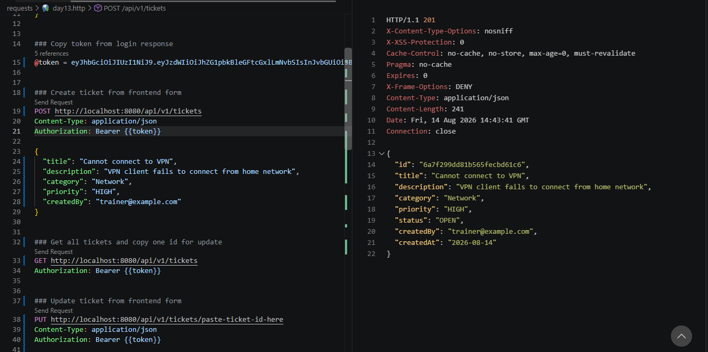
*POST /api/v1/tickets returns 201 with the new ticket*

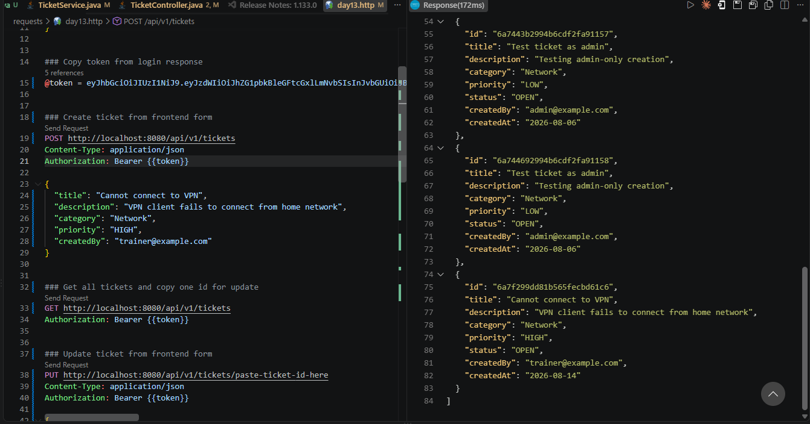
*GET /api/v1/tickets used to copy an id for the update requests*

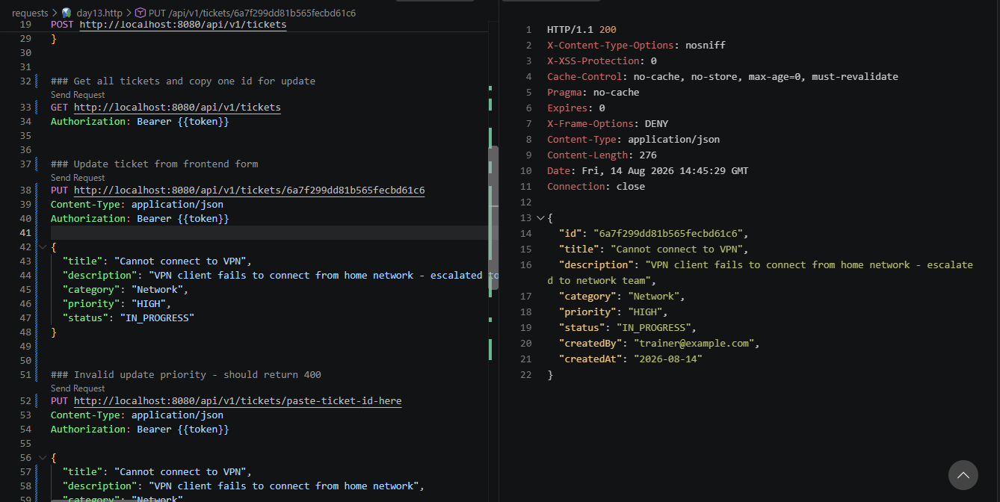
*PUT /api/v1/tickets/{id} with valid data returns 200 with the updated ticket, status now IN_PROGRESS*

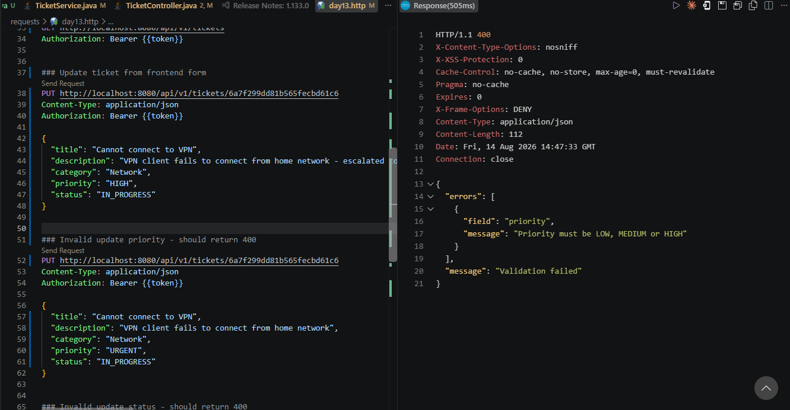
*PUT with priority "URGENT" returns 400 with "Priority must be LOW, MEDIUM or HIGH"*

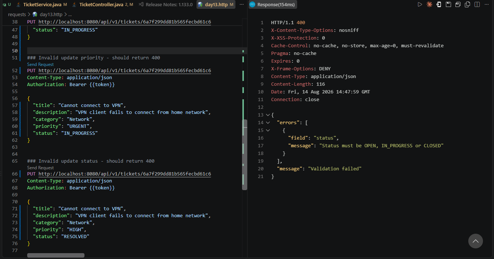
*PUT with status "RESOLVED" returns 400 with "Status must be OPEN, IN_PROGRESS or CLOSED"*

---

## Day 13 Exercise 02 - Create Ticket Form Page

Run `npm run dev` inside `support-desk-ui` (backend must be running on port 8080) to run this exercise.

### Files created/updated

- `components/TicketFormWizard.jsx` — new controlled 3-step form (Ticket details → Priority & status → Review), styled after the trainer's `AssetFormWizard` reference. Step 1 collects `title`/`description`/`category`, Step 2 collects `priority`/`status`, Step 3 shows a read-only review of all values plus a confirmation checkbox before submit. Each step validates before allowing `Continue`, with inline error messages per field.
- `components/TicketFormStepIndicator.jsx` — numbered 3-step progress indicator (1 Ticket details, 2 Priority & status, 3 Review), highlighting the active/completed step.
- `components/InlineFieldError.jsx` — small helper that renders a red inline message under a field only when an error string is present.
- `pages/TicketFormPage.jsx` — the route's page shell: a `welcome-card` header ("Create a new ticket") with a "Back to Tickets" button, wraps `TicketFormWizard`, and owns the actual submit logic.
- `App.jsx` — added the `tickets/new` child route (`/app/tickets/new`) inside the existing `ProtectedRoute` → `AppShell` nesting, plus fixed a duplicate `tickets` route line, added a `/` → `/app/dashboard` redirect (previously blank), and a catch-all `*` route so unknown URLs redirect home instead of showing nothing.
- `pages/TicketsPage.jsx` — added a `welcome-card` header with a "+ New Ticket" button (`Link` to `/app/tickets/new`), and switched from the hardcoded `sampleTickets` array to fetching real tickets from `GET /api/v1/tickets` via `useAuth()`'s token, with loading/error states — matching the trainer's `AssetsPage` pattern.
- `services/api.js` — added `authHeaders()`, `fetchTickets(token)`, `createTicket(token, payload)`, and `updateTicket(id, token, payload)`.
- `index.css` — ported the trainer's `welcome-card`, `action-row`, `button-link` (+`.secondary`), `step-indicator`, `form-grid` (+`.form-grid-full`), `field-error`, `review-grid`, `review-check`, `form-actions`, and `success-message` classes so the new pages match the Day 12 visual system.

### Result

Since the backend's update endpoint already existed from Exercise 1, `createTicket` was wired up immediately instead of waiting for Exercise 4 — submitting the wizard now actually calls `POST /api/v1/tickets` (using the logged-in user's email as `createdBy`) and the new ticket appears in the real ticket list right away. Note the backend always sets a new ticket's status to `OPEN` regardless of what's picked in Step 2 — that field only matters once editing/updating is wired in.

### Output Screenshot

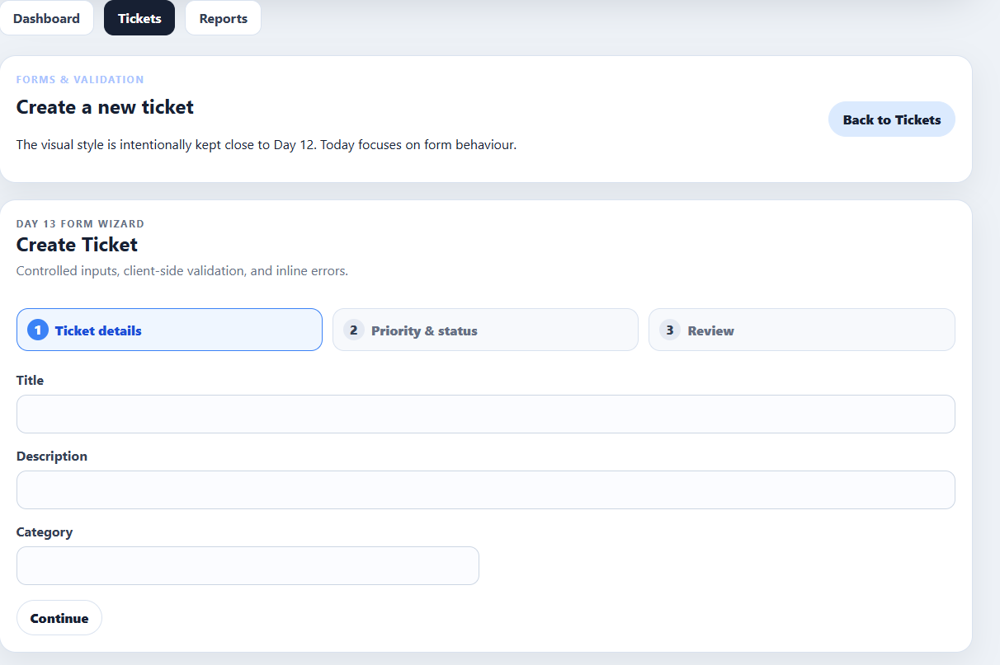
*Step 1 of the Create Ticket wizard, with the step indicator and Back to Tickets button*

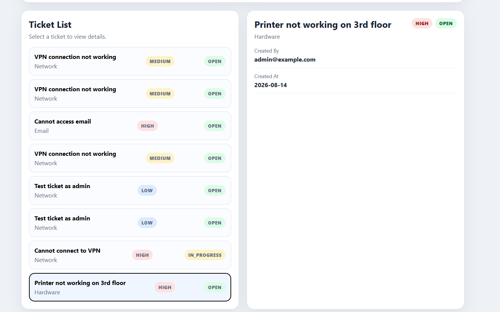
*The newly created "Printer not working on 3rd floor" ticket appears in the real ticket list, fetched from the backend*

---

## AI-Assisted Learning Guidelines

Participants may use AI tools to:

* Generate README drafts and documentation sections.

* Create API call examples and JSON payload samples.

* Suggest method signatures and edge cases.

* Propose refactoring options.

* Draft test scenarios for backend and frontend features.

* Suggest MongoDB document structures, queries, indexes, and aggregation pipelines.

* Improve demo scripts and presentation notes.

Participants must always review, verify, test, and understand any AI-generated output. No passwords, API keys, tokens, private keys, or confidential data should be placed into AI prompts.

