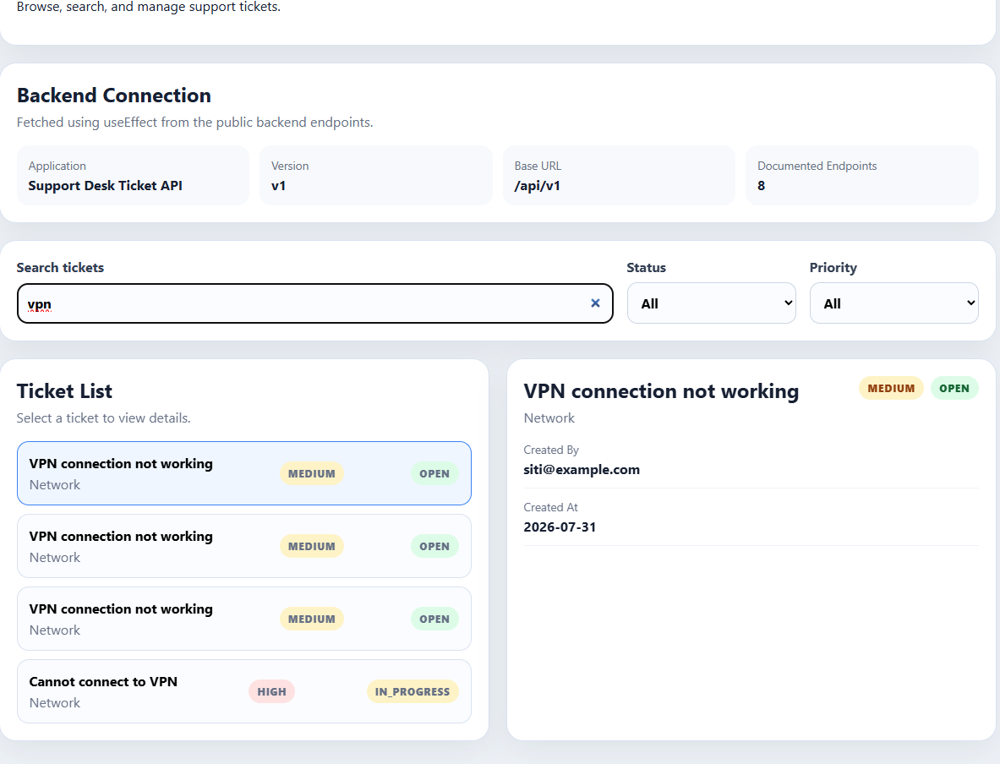
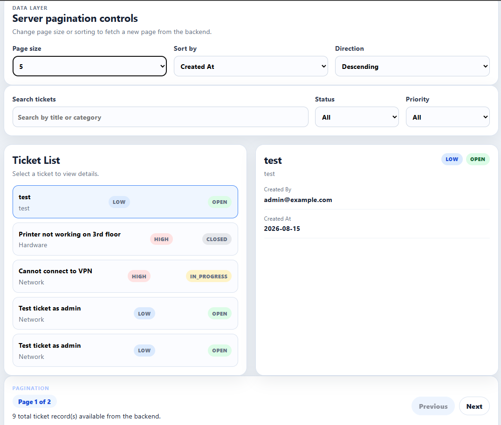

# NFS_JAVA_C2_2026 | Full-Stack Development with Java, React & MongoDB

## Programme Description

This 20-day programme is designed to help participants build a complete full-stack web application using Java, Spring Boot, React, and MongoDB.

The programme takes learners from programming and web fundamentals to backend API development, frontend interface design, database modelling, authentication, testing, performance improvement, and final capstone presentation.

Throughout the programme, participants will work on practical exercises and gradually build a small but production-like web application. The final outcome is a working capstone project that demonstrates the use of a React frontend, Spring Boot backend, MongoDB database, secure authentication, API documentation, testing practices, and deployment-readiness basics.

AI tools such as Gemini are used as learning accelerators to help scaffold examples, suggest refactoring ideas, draft tests, generate sample data, and support MongoDB query or aggregation design. However, participants are expected to review, verify, understand, and take ownership of all generated code.

---

## Programme Duration

* Duration: 20 training days

* Daily Duration: 7 hours per day

* Total Training Hours: 140 hours

* Mode: Instructor-led training with guided labs, team build activities, review sessions, quizzes, and capstone development

---

## Programme Objectives

By the end of this programme, participants will be able to:

* Understand web fundamentals, HTTP, REST, and JSON.

* Write basic to intermediate Java and JavaScript code.

* Build REST APIs using Spring Boot.

* Apply validation, authentication, authorisation, and error-handling practices.

* Model data effectively using MongoDB.

* Use MongoDB indexes, queries, pagination, and aggregation pipelines.

* Build accessible React user interfaces with routing, forms, state, and data fetching.

* Apply testing practices for backend and frontend development.

* Use AI coding assistants responsibly for learning, refactoring, testing, and documentation.

* Design, build, document, and present a full-stack capstone project.

---

---

## Day 14 Exercise 01 - Create API Client Layer

Run `npm run dev` inside `support-desk-ui` (backend must be running on port 8080) to run this exercise.

### Files created/updated

- `services/httpClient.js` — new `apiRequest(path, options)` helper. Takes `{ method, token, body }`, adds the `Authorization: Bearer` header only when a `token` is passed, sets `Content-Type: application/json` and stringifies the body only when a `body` is passed, parses the JSON response, and throws an `Error` carrying the backend's message on a non-OK response.
- `services/api.js` — rewritten so every function (`fetchApiDocs`, `loginRequest`, `fetchTickets`, `fetchTicketById`, `createTicket`, `updateTicket`) is now a one-line call into `apiRequest`, instead of each repeating its own `fetch`/header/JSON-parsing logic. The old `parseJsonResponse`/`authHeaders` duplicated helpers are gone.

No page components needed to change — `TicketsPage.jsx`, `TicketFormPage.jsx`, and `LoginPage.jsx` all still call the same exported functions from `api.js` with the same signatures.

### Result

Re-tested login, viewing tickets, creating a ticket, and editing a ticket after the refactor — all still work correctly through the new shared `apiRequest` layer, confirmed by testing.

---

## Day 14 Exercise 02 - Ticket Data Context And Reducer

Run `npm run dev` inside `support-desk-ui` (backend must be running on port 8080) to run this exercise.

### Files created/updated

- `context/TicketDataContext.jsx` — new `TicketDataProvider` + `useTicketData()`. A `useReducer` manages `tickets`, `selectedTicketId`, `loading`, `error`, `page`, and `filters` (`searchText`/`statusFilter`/`priorityFilter`) in one place, with actions `LOAD_START`, `LOAD_SUCCESS`, `LOAD_ERROR`, `SET_SEARCH_TEXT`, `SET_STATUS_FILTER`, `SELECT_TICKET` (plus `SET_PRIORITY_FILTER`/`SET_PAGE`, since the existing filter panel and the upcoming pagination exercise need them too). Fetches tickets on mount via `fetchTickets(token)`, and derives `filteredTickets`/`selectedTicket` with `useMemo`.
- `App.jsx` — the `tickets` route is now wrapped in `<TicketDataProvider>`.
- `pages/TicketsPage.jsx` — no longer holds its own `tickets`/`filters`/`selectedTicket` state or fetch `useEffect`. It calls `useTicketData()` and passes the values/actions down to `TicketFilterPanel`, `TicketList`, and `TicketDetail` exactly as before — same behavior, just backed by the shared reducer instead of local `useState`.

### Result

Search, status/priority filters, ticket selection, and the "Edit Selected" button all behave the same as before the refactor, now driven entirely through `useTicketData()`, confirmed by testing.

### Output Screenshot

*Searching "vpn" filters the ticket list via the reducer's SET_SEARCH_TEXT action, with the matching ticket's detail shown alongside*

---

## Day 14 Exercise 03 - Add Pagination And Filters

Run `mvn spring-boot:run` inside `support-desk-api` and `npm run dev` inside `support-desk-ui` to run this exercise.

### Files created/updated

- `controller/TicketV1Controller.java` — added `GET /api/v1/tickets/paged?page=&size=&sortBy=&direction=`, exposing the `TicketService.getTicketsPaged()` method that already existed but had no endpoint. Placed above the `/{id}` route so `/paged` isn't matched as a path variable.
- `services/httpClient.js` — added `buildQueryString(params)`, skipping empty/undefined values when building the query string.
- `services/api.js` — added `fetchTicketsPaged(token, params)`.
- `context/TicketDataContext.jsx` — replaced the fetch-on-mount effect with a `loadTicketsPage(overrides)` callback that fetches one page and updates `pageInfo` (`page`, `size`, `sortBy`, `direction`, `totalPages`, `totalElements`) via the reducer. Search/status/priority filters now apply client-side only to the *current page's* records, not the whole dataset.
- `components/TicketDataControls.jsx` — new page-size / sort-field / sort-direction dropdowns, laid out in a 3-column grid.
- `components/TicketPaginationControls.jsx` — new Previous/Next buttons with a "Page X of Y" badge and total record count, buttons disabled at the first/last page.
- `pages/TicketsPage.jsx` — loads the first page once on mount (guarded by a ref so it doesn't refire), wires in both new control components; changing page size or sort resets back to page 0.
- `index.css` — added `.data-controls-grid`, `.pagination-badge`, and a shared `disabled` style for selects/buttons.

### Result

Page size, sort field, sort direction, and Previous/Next all correctly fetch a new page from the backend, with search/status/priority filters still narrowing down whatever page is currently loaded, confirmed by testing.

### Output Screenshot

*Page 1 of 2 showing 5 of 9 total tickets, sorted by Created At descending, with Previous disabled on the first page*

---

## AI-Assisted Learning Guidelines

Participants may use AI tools to:

* Generate README drafts and documentation sections.

* Create API call examples and JSON payload samples.

* Suggest method signatures and edge cases.

* Propose refactoring options.

* Draft test scenarios for backend and frontend features.

* Suggest MongoDB document structures, queries, indexes, and aggregation pipelines.

* Improve demo scripts and presentation notes.

Participants must always review, verify, test, and understand any AI-generated output. No passwords, API keys, tokens, private keys, or confidential data should be placed into AI prompts.

