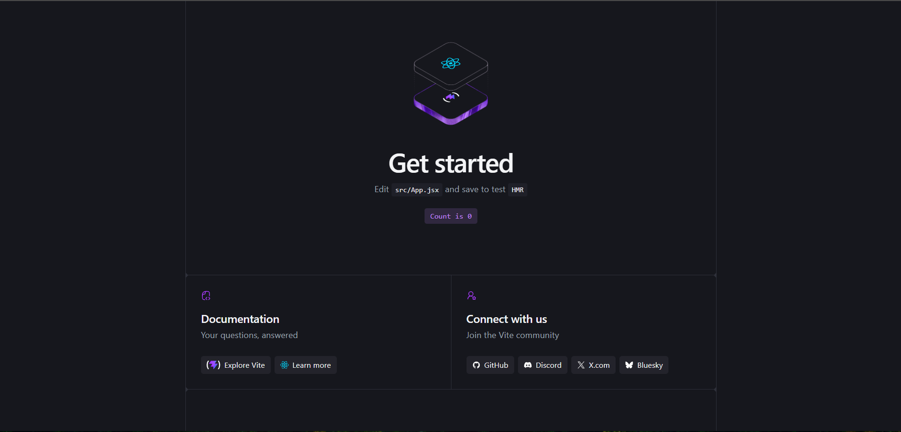
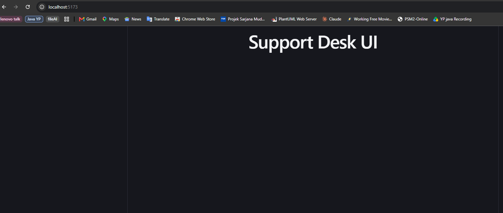
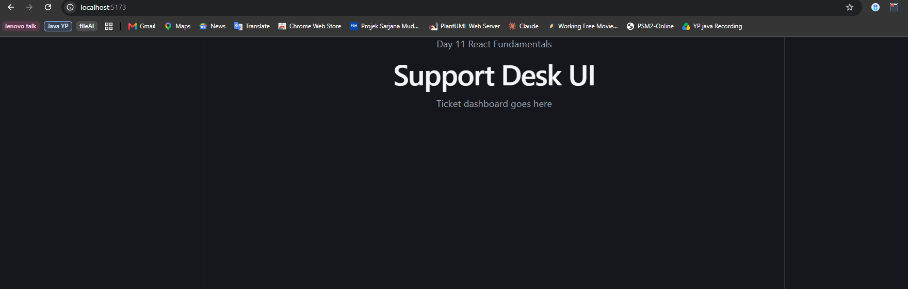
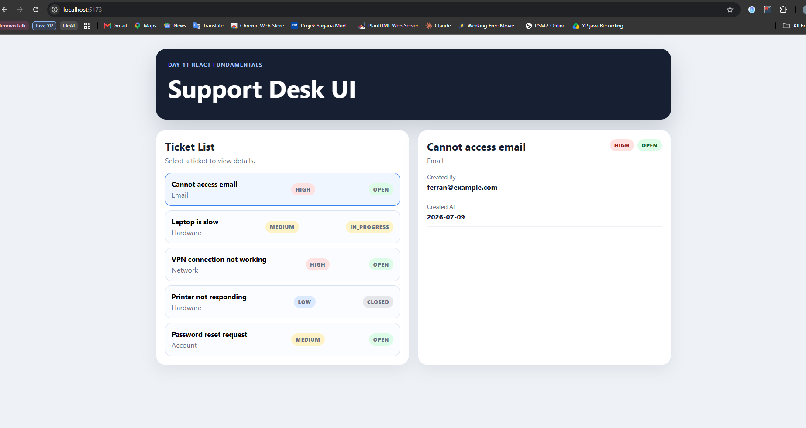
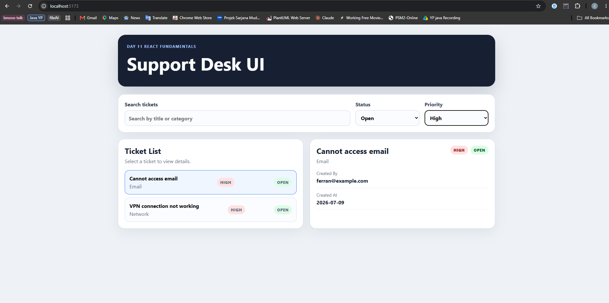
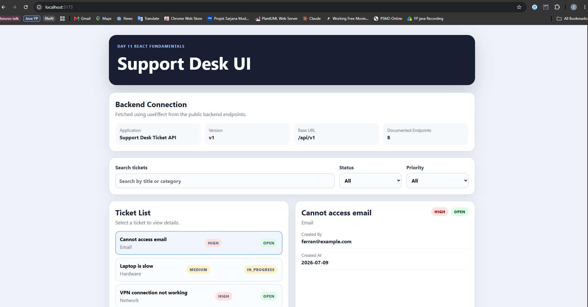
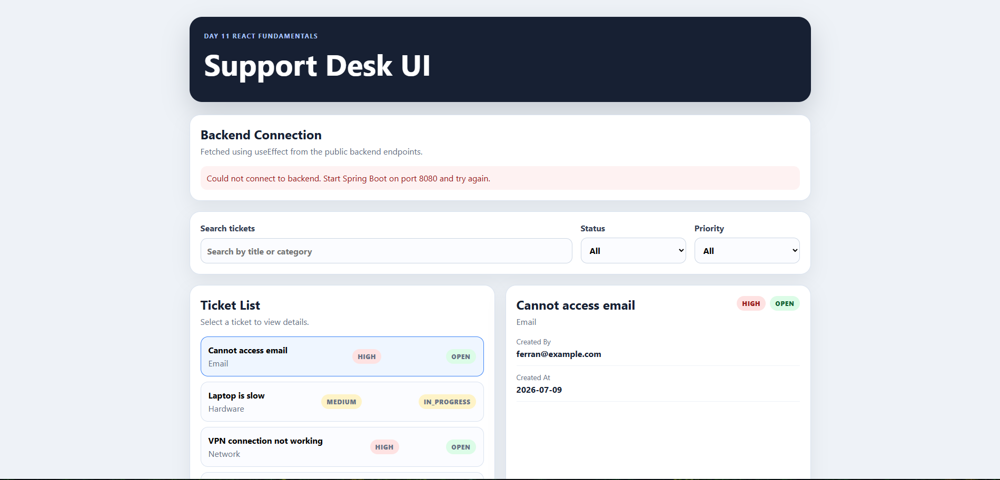

# NFS_JAVA_C2_2026 | Full-Stack Development with Java, React & MongoDB


## Programme Description


This 20-day programme is designed to help participants build a complete full-stack web application using Java, Spring Boot, React, and MongoDB.


The programme takes learners from programming and web fundamentals to backend API development, frontend interface design, database modelling, authentication, testing, performance improvement, and final capstone presentation.


Throughout the programme, participants will work on practical exercises and gradually build a small but production-like web application. The final outcome is a working capstone project that demonstrates the use of a React frontend, Spring Boot backend, MongoDB database, secure authentication, API documentation, testing practices, and deployment-readiness basics.


AI tools such as Gemini are used as learning accelerators to help scaffold examples, suggest refactoring ideas, draft tests, generate sample data, and support MongoDB query or aggregation design. However, participants are expected to review, verify, understand, and take ownership of all generated code.


---


## Programme Duration


* Duration: 20 training days

* Daily Duration: 7 hours per day

* Total Training Hours: 140 hours

* Mode: Instructor-led training with guided labs, team build activities, review sessions, quizzes, and capstone development


---


## Programme Objectives


By the end of this programme, participants will be able to:


* Understand web fundamentals, HTTP, REST, and JSON.

* Write basic to intermediate Java and JavaScript code.

* Build REST APIs using Spring Boot.

* Apply validation, authentication, authorisation, and error-handling practices.

* Model data effectively using MongoDB.

* Use MongoDB indexes, queries, pagination, and aggregation pipelines.

* Build accessible React user interfaces with routing, forms, state, and data fetching.

* Apply testing practices for backend and frontend development.

* Use AI coding assistants responsibly for learning, refactoring, testing, and documentation.

* Design, build, document, and present a full-stack capstone project.


---


---


## Day 11 Exercise 01 - Create the React Project

Run `npm run dev` inside `support-desk-ui` to run this exercise.

### Files created

- `support-desk-ui/` — new Vite React project created with `npm create vite@latest support-desk-ui -- --template react`, using ESLint as the linter.
- `App.jsx` — replaced the default Vite starter content with a simple `<h1>Support Desk UI</h1>`.

### Output Screenshot


*Default Vite + React starter page at localhost:5173*


*App.jsx cleaned up to show "Support Desk UI"*

---

## Day 11 Exercise 02 - Build Layout Components

Run `npm run dev` inside `support-desk-ui` to run this exercise.

### Files created

- `AppHeader.jsx` — shows the "Day 11 React Fundamentals" label and the "Support Desk UI" title.
- `Layout.jsx` — wraps the page, renders `AppHeader` at the top and whatever is passed in as `children` below it.
- `App.jsx` — updated to use `Layout`, passing in a placeholder paragraph as `children`.

### Component Tree

```text
App
└── Layout
    └── AppHeader
```

### Output Screenshot


*Layout renders AppHeader plus the children content passed from App*

---

## Day 11 Exercise 03 - Ticket Sample Data, List and Detail

Run `npm run dev` inside `support-desk-ui` to run this exercise.

### Files created

- `sampleTickets.js` — 5 hardcoded ticket objects with id, title, category, priority, status, createdBy, and createdAt.
- `StatusBadge.jsx` / `PriorityBadge.jsx` — small components that render a colored pill label based on the `status`/`priority` prop.
- `TicketList.jsx` — renders all tickets as clickable rows, highlighting the currently selected one and showing its priority/status badges.
- `TicketDetail.jsx` — shows the full details of whichever ticket is currently selected, or a placeholder message if none is selected.
- `App.jsx` — uses `useState` to hold the ticket list and the currently selected ticket, wiring `TicketList` and `TicketDetail` together so clicking a row updates the detail panel.
- `index.css` — added styling for the card layout, ticket list rows, and priority/status badge colors, adapted from the trainer's reference Asset UI styling.

### Output Screenshot


*Ticket list and detail view working together, with the selected ticket highlighted*

---

## Day 11 Exercise 04 - State, Search and Filter

Run `npm run dev` inside `support-desk-ui` to run this exercise.

### Files created

- `tickets.js` (utils) — `filterTickets()` checks search text against title/category, plus status and priority, returning only tickets matching all active filters.
- `TicketFilterPanel.jsx` — a search input plus status and priority dropdowns, all controlled inputs tied to state in `App.jsx`.
- `App.jsx` — added `searchText`, `statusFilter`, `priorityFilter` state, computing `filteredTickets` with `useMemo` and passing it to `TicketList` instead of the full ticket list.
- `index.css` — added styling for `.filter-panel`, `label`, `input`, and `select`.

### Output Screenshot


*Filtering by status "Open" and priority "High" correctly narrows the ticket list*

---

## Day 11 Exercise 05 - useEffect, Loading and Error UI

Run `npm run dev` inside `support-desk-ui` to run this exercise. Requires `support-desk-api` running on port 8080.

### Files created

- `vite.config.js` — added a proxy so any request to `/api` during development is forwarded to `http://localhost:8080`, avoiding CORS issues.
- `services/api.js` — `fetchApiDocs()` calls `GET /api/docs` on the backend (adapted from the trainer's `/api/v1/info` example, since our own backend uses `/api/docs` from Day 10 Exercise 4), throwing an error if the response is not OK.
- `LoadingMessage.jsx` / `ErrorMessage.jsx` — small components that render a styled message for loading and error states.
- `ApiInfoCard.jsx` — shows a loading message while fetching, an error message if the fetch fails, or a grid of API info (application, version, base URL, documented endpoint count) once loaded successfully.
- `App.jsx` — added a `useEffect` that runs once on mount, fetching the API docs and updating `loadingApi`, `apiError`, and `apiDocs` state through a `try/catch/finally` block.
- `index.css` — added styling for `.api-card`, `.api-info-grid`, `.info-item`, and `.message`/`.loading-message`/`.error-message`.

### Output Screenshot


*Successful state showing API application name, version, base URL, and endpoint count*


*Error state shown when the backend is stopped, rest of the page still works with sample data*

---

## Day 11 Exercise 06 - Component Tree and Reflection

No new code for this exercise, it documents the structure built across Exercises 1-5.

### Component Tree

```text
App
├── Layout
│   └── AppHeader
├── ApiInfoCard
├── TicketFilterPanel
└── (workspace-grid section)
    ├── TicketList
    │   ├── PriorityBadge
    │   └── StatusBadge
    └── TicketDetail
        ├── PriorityBadge
        └── StatusBadge
```

### Reflection Questions

**1. Which component owns the selected ticket state?**

`App` — it holds `selectedTicket` via `useState` and passes it down to both `TicketList` (to know which row to highlight) and `TicketDetail` (to know what to display).

**2. Which components receive props?**

`Layout` (`children`), `TicketFilterPanel` (`searchText`, `statusFilter`, `priorityFilter`, and their `onChange` handlers), `ApiInfoCard` (`loading`, `error`, `apiDocs`), `TicketList` (`tickets`, `selectedTicketId`, `onSelectTicket`), `TicketDetail` (`ticket`), and `PriorityBadge`/`StatusBadge` (`priority`/`status`).

**3. What does useEffect do in your app?**

It fetches the API documentation info from the backend (`GET /api/docs`) once when the app first loads, updating `loadingApi`, `apiError`, and `apiDocs` state depending on whether the request succeeds or fails.

**4. What loading state did you create?**

`loadingApi`, a boolean that starts `true` and flips to `false` in the `finally` block once the fetch completes, shown via `LoadingMessage`.

**5. What error state did you create?**

`apiError`, a string set inside the `catch` block if the fetch fails (e.g. backend not running), shown via `ErrorMessage` instead of the API info grid.

**6. What would change when you connect this UI to the protected backend API later?**

Since `/api/tickets` requires a valid JWT, the fetch calls would need an `Authorization: Bearer <token>` header attached, meaning the app would need a login flow to obtain and store that token first. The hardcoded `sampleTickets.js` data would be replaced with a real fetch to `/api/v1/tickets`, and a `401` response would need to redirect the user back to login instead of just showing an error message.

---

## AI-Assisted Learning Guidelines


Participants may use AI tools to:


* Generate README drafts and documentation sections.

* Create API call examples and JSON payload samples.

* Suggest method signatures and edge cases.

* Propose refactoring options.

* Draft test scenarios for backend and frontend features.

* Suggest MongoDB document structures, queries, indexes, and aggregation pipelines.

* Improve demo scripts and presentation notes.


Participants must always review, verify, test, and understand any AI-generated output. No passwords, API keys, tokens, private keys, or confidential data should be placed into AI prompts.

