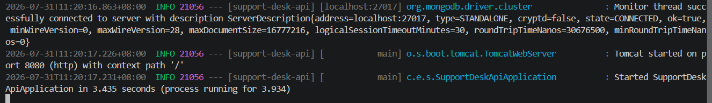
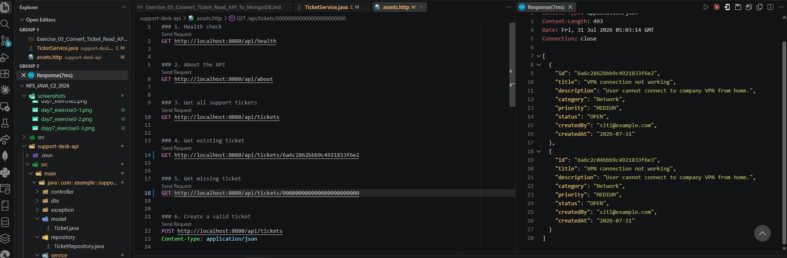
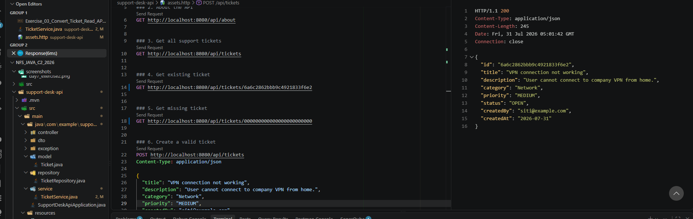
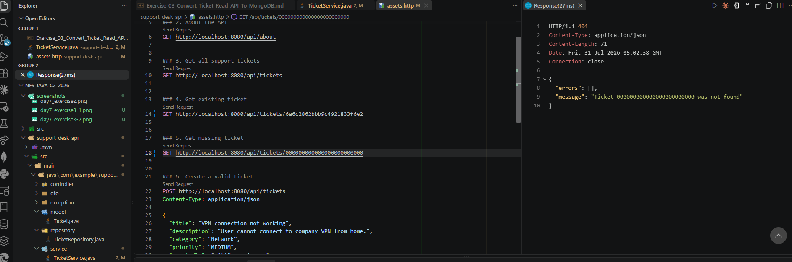

# NFS_JAVA_C2_2026 | Full-Stack Development with Java, React & MongoDB

## Programme Description

This 20-day programme is designed to help participants build a complete full-stack web application using Java, Spring Boot, React, and MongoDB.

The programme takes learners from programming and web fundamentals to backend API development, frontend interface design, database modelling, authentication, testing, performance improvement, and final capstone presentation.

Throughout the programme, participants will work on practical exercises and gradually build a small but production-like web application. The final outcome is a working capstone project that demonstrates the use of a React frontend, Spring Boot backend, MongoDB database, secure authentication, API documentation, testing practices, and deployment-readiness basics.

AI tools such as Gemini are used as learning accelerators to help scaffold examples, suggest refactoring ideas, draft tests, generate sample data, and support MongoDB query or aggregation design. However, participants are expected to review, verify, understand, and take ownership of all generated code.

---

## Programme Duration

* Duration: 20 training days

* Daily Duration: 7 hours per day

* Total Training Hours: 140 hours

* Mode: Instructor-led training with guided labs, team build activities, review sessions, quizzes, and capstone development

---

## Programme Objectives

By the end of this programme, participants will be able to:

* Understand web fundamentals, HTTP, REST, and JSON.

* Write basic to intermediate Java and JavaScript code.

* Build REST APIs using Spring Boot.

* Apply validation, authentication, authorisation, and error-handling practices.

* Model data effectively using MongoDB.

* Use MongoDB indexes, queries, pagination, and aggregation pipelines.

* Build accessible React user interfaces with routing, forms, state, and data fetching.

* Apply testing practices for backend and frontend development.

* Use AI coding assistants responsibly for learning, refactoring, testing, and documentation.

* Design, build, document, and present a full-stack capstone project.

---

---

## Day 7 Exercise 02 - Create Ticket Model and Repository

Run `mvn spring-boot:run` inside `support-desk-api` to run this exercise. Requires MongoDB running locally.

### Files created

- `pom.xml` — added the `spring-boot-starter-data-mongodb` dependency.
- `application.properties` — added `spring.data.mongodb.uri=mongodb://localhost:27017/support_desk_db` to configure the connection.
- `Ticket.java` — a `@Document(collection = "tickets")` model mapped to MongoDB, with an `@Id` field and getters/setters for title, description, category, priority, status, createdBy, and createdAt.
- `TicketRepository.java` — an interface extending `MongoRepository<Ticket, String>`, giving `save()`, `findAll()`, `findById()`, `deleteById()` automatically without writing any implementation.

### Output Screenshot

*Application starts successfully and connects to MongoDB at localhost:27017*

---

## Day 7 Exercise 03 - Convert Ticket Read API to MongoDB

Run `mvn spring-boot:run` inside `support-desk-api` to run this exercise. Requires MongoDB running locally.

### Files updated

- `TicketService.java` — replaced the hardcoded in-memory list with `TicketRepository`. `getAllTickets()` now calls `findAll()` and maps each `Ticket` document to a `TicketResponse`. `getTicketById()` now calls `findById()` and throws `ResourceNotFoundException` if nothing matches. `createTicket()` was also updated to `save()` a new `Ticket` document to MongoDB, since the old in-memory list it relied on no longer exists.
- Added a private `toResponse()` helper that converts a MongoDB `Ticket` document into a `TicketResponse` DTO.

### How I confirmed the data came from MongoDB

The returned ticket ID changed from a manually generated format like `T001` to a real MongoDB `ObjectId` (e.g. `6a6c2862bbb9c4921833f6e2`), which only MongoDB generates on save, confirming the ticket is a genuine document. Checking MongoDB Compass also showed the saved ticket sitting inside a `tickets` collection with all fields matching the request, plus MongoDB's own `_id` and a `_class` field added by Spring Data.

### Output Screenshot

*GET /api/tickets returns tickets read from MongoDB*

*GET /api/tickets/{id} returns the matching ticket with its MongoDB ObjectId*

*GET /api/tickets/000000000000000000000000 returns 404 Not Found*

---

## AI-Assisted Learning Guidelines

Participants may use AI tools to:

* Generate README drafts and documentation sections.

* Create API call examples and JSON payload samples.

* Suggest method signatures and edge cases.

* Propose refactoring options.

* Draft test scenarios for backend and frontend features.

* Suggest MongoDB document structures, queries, indexes, and aggregation pipelines.

* Improve demo scripts and presentation notes.

Participants must always review, verify, test, and understand any AI-generated output. No passwords, API keys, tokens, private keys, or confidential data should be placed into AI prompts.

