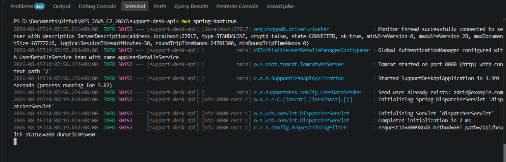
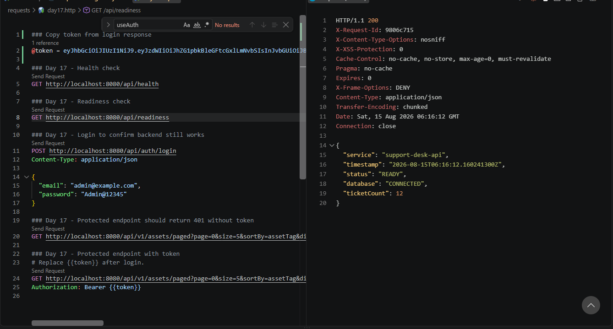
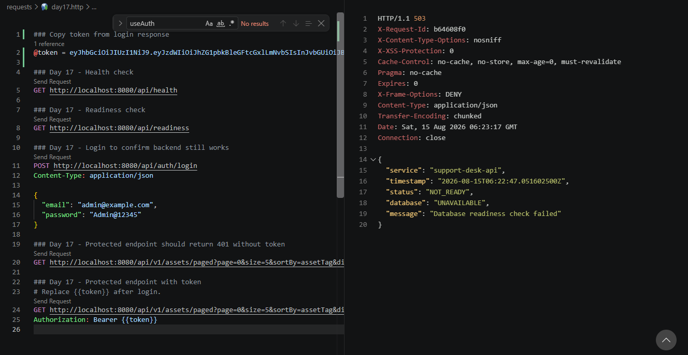

# NFS_JAVA_C2_2026 | Full-Stack Development with Java, React & MongoDB

## Programme Description

This 20-day programme is designed to help participants build a complete full-stack web application using Java, Spring Boot, React, and MongoDB.

The programme takes learners from programming and web fundamentals to backend API development, frontend interface design, database modelling, authentication, testing, performance improvement, and final capstone presentation.

Throughout the programme, participants will work on practical exercises and gradually build a small but production-like web application. The final outcome is a working capstone project that demonstrates the use of a React frontend, Spring Boot backend, MongoDB database, secure authentication, API documentation, testing practices, and deployment-readiness basics.

AI tools such as Gemini are used as learning accelerators to help scaffold examples, suggest refactoring ideas, draft tests, generate sample data, and support MongoDB query or aggregation design. However, participants are expected to review, verify, understand, and take ownership of all generated code.

---

## Programme Duration

* Duration: 20 training days

* Daily Duration: 7 hours per day

* Total Training Hours: 140 hours

* Mode: Instructor-led training with guided labs, team build activities, review sessions, quizzes, and capstone development

---

## Programme Objectives

By the end of this programme, participants will be able to:

* Understand web fundamentals, HTTP, REST, and JSON.

* Write basic to intermediate Java and JavaScript code.

* Build REST APIs using Spring Boot.

* Apply validation, authentication, authorisation, and error-handling practices.

* Model data effectively using MongoDB.

* Use MongoDB indexes, queries, pagination, and aggregation pipelines.

* Build accessible React user interfaces with routing, forms, state, and data fetching.

* Apply testing practices for backend and frontend development.

* Use AI coding assistants responsibly for learning, refactoring, testing, and documentation.

* Design, build, document, and present a full-stack capstone project.

---

---

## Day 17 Exercise 01 - Structured Logs and Request Timing

Run `mvn spring-boot:run` inside `support-desk-api` to run this exercise. Test with `requests/day17.http`.

### Files created/updated

- `config/RequestTimingFilter.java` — a `@Component` implementing `Filter`, registered automatically as a Spring bean. For every request it generates a short `requestId` (from a UUID), times the request with `System.currentTimeMillis()` around `chain.doFilter(...)`, and logs one line: `requestId=... method=... path=... status=... durationMs=...`. The `requestId` is also set as an `X-Request-Id` response header and in MDC. Deliberately logs only the method, URI path, status code, requestId, and duration — never the request body, `Authorization` header, passwords, tokens, or any secret value.

### Result

Every request logs a clean, safe timing line, confirmed by testing.

### Output Screenshot

*`GET /api/health` logged as `requestId=800986d8 method=GET path=/api/health status=200 durationMs=50`*

---

## Day 17 Exercise 02 - Readiness Endpoint

Run `mvn spring-boot:run` inside `support-desk-api` to run this exercise. Test with `requests/day17.http`.

### Files created/updated

- `controller/ReadinessController.java` — new `GET /api/readiness` endpoint. Calls `ticketRepository.count()` to actually verify the MongoDB connection is alive rather than assuming it. On success, returns 200 with `service`, `status: "READY"`, `database: "CONNECTED"`, `ticketCount`, and `timestamp`. If that call throws (database unreachable), returns `503 Service Unavailable` with `status: "NOT_READY"`, `database: "UNAVAILABLE"`, and `message: "Database readiness check failed"`.
- `security/SecurityConfig.java` — added `.requestMatchers("/api/readiness").permitAll()`, same as `/api/health`, so readiness checks don't require a JWT.

### Result

With MongoDB running, `GET /api/readiness` returns 200 with `status: "READY"`. With the backend already running and MongoDB then stopped, the same request returns 503 with `status: "NOT_READY"`, confirmed by testing both paths.

### Output Screenshot

*`GET /api/readiness` returns 200 with status READY and database CONNECTED while MongoDB is up*

*With the backend already running and MongoDB stopped, the same request returns 503 with status NOT_READY and database UNAVAILABLE*

---

## AI-Assisted Learning Guidelines

Participants may use AI tools to:

* Generate README drafts and documentation sections.

* Create API call examples and JSON payload samples.

* Suggest method signatures and edge cases.

* Propose refactoring options.

* Draft test scenarios for backend and frontend features.

* Suggest MongoDB document structures, queries, indexes, and aggregation pipelines.

* Improve demo scripts and presentation notes.

Participants must always review, verify, test, and understand any AI-generated output. No passwords, API keys, tokens, private keys, or confidential data should be placed into AI prompts.

