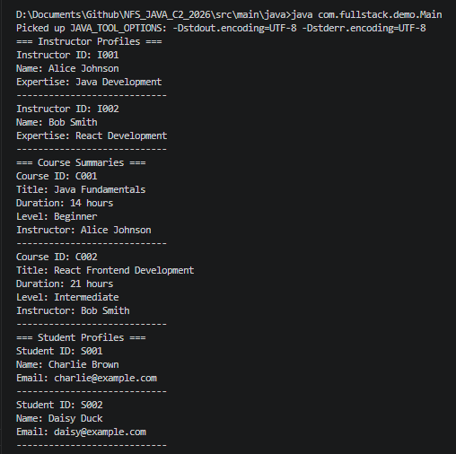
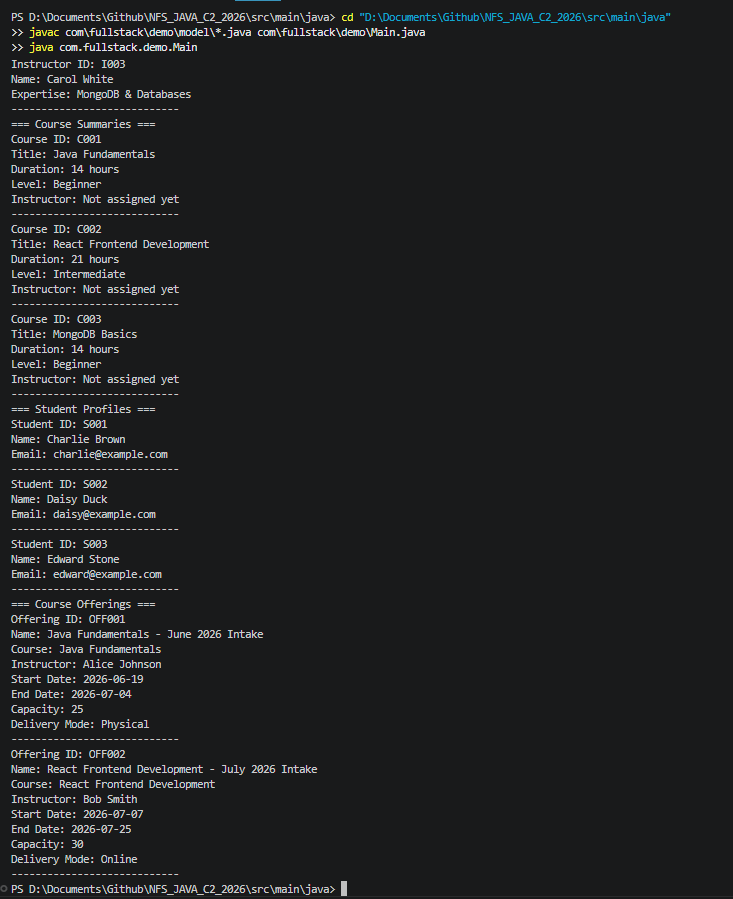

# NFS_JAVA_C2_2026 | Full-Stack Development with Java, React & MongoDB

## Programme Description

This 20-day programme is designed to help participants build a complete full-stack web application using Java, Spring Boot, React, and MongoDB.

The programme takes learners from programming and web fundamentals to backend API development, frontend interface design, database modelling, authentication, testing, performance improvement, and final capstone presentation.

Throughout the programme, participants will work on practical exercises and gradually build a small but production-like web application. The final outcome is a working capstone project that demonstrates the use of a React frontend, Spring Boot backend, MongoDB database, secure authentication, API documentation, testing practices, and deployment-readiness basics.

AI tools such as Gemini are used as learning accelerators to help scaffold examples, suggest refactoring ideas, draft tests, generate sample data, and support MongoDB query or aggregation design. However, participants are expected to review, verify, understand, and take ownership of all generated code.

---

## Programme Duration

* Duration: 20 training days

* Daily Duration: 7 hours per day

* Total Training Hours: 140 hours

* Mode: Instructor-led training with guided labs, team build activities, review sessions, quizzes, and capstone development

---

## Programme Objectives

By the end of this programme, participants will be able to:

* Understand web fundamentals, HTTP, REST, and JSON.

* Write basic to intermediate Java and JavaScript code.

* Build REST APIs using Spring Boot.

* Apply validation, authentication, authorisation, and error-handling practices.

* Model data effectively using MongoDB.

* Use MongoDB indexes, queries, pagination, and aggregation pipelines.

* Build accessible React user interfaces with routing, forms, state, and data fetching.

* Apply testing practices for backend and frontend development.

* Use AI coding assistants responsibly for learning, refactoring, testing, and documentation.

* Design, build, document, and present a full-stack capstone project.

---

---

## Day 2 Assignment 01 - Clean Up the Model Classes

### What changed

**Course.java**
- Constructor now calls setters instead of assigning fields directly with `this.x = x`
- Added `setCourseId()`, `setTitle()`, `setLevel()` with blank validation
- `setDurationHours()` now rejects values of 0 or below
- `printSummary()` now ends with a separator line `----------------------------`
- Added private `requireText()` helper method for reuse across setters

**Instructor.java**
- Constructor now calls setters with validation
- Added `setInstructorId()`, `setInstructorName()`, `setExpertise()` with blank validation
- Renamed `getProfile()` to `printProfile()` (wrong name before)
- Added separator line to `printProfile()`

**Student.java**
- Constructor now calls setters with validation
- Added `setStudentId()`, `setStudentName()`, `setEmail()` with blank validation

### Output Screenshot

### GitHub Commit

[https://github.com/zaiedaziem/NFS_JAVA_C2_2026/tree/day2](https://github.com/zaiedaziem/NFS_JAVA_C2_2026/tree/day2)

---

## Day 2 Assignment 02 - Use ArrayList and Loops

### What changed in `Main.java`

- Added `import java.util.ArrayList` and `import com.fullstack.demo.model.CourseOffering`
- Replaced individual object variables with `ArrayList` collections for courses, instructors, students, and course offerings
- Used enhanced `for` loops to print all records from each list

### Output Screenshot

### GitHub Commit

[https://github.com/zaiedaziem/NFS_JAVA_C2_2026/tree/day2](https://github.com/zaiedaziem/NFS_JAVA_C2_2026/tree/day2)

---

## AI-Assisted Learning Guidelines

Participants may use AI tools to:

* Generate README drafts and documentation sections.

* Create API call examples and JSON payload samples.

* Suggest method signatures and edge cases.

* Propose refactoring options.

* Draft test scenarios for backend and frontend features.

* Suggest MongoDB document structures, queries, indexes, and aggregation pipelines.

* Improve demo scripts and presentation notes.

Participants must always review, verify, test, and understand any AI-generated output. No passwords, API keys, tokens, private keys, or confidential data should be placed into AI prompts.

