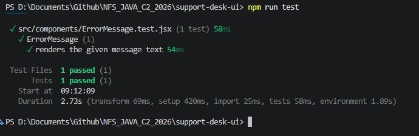
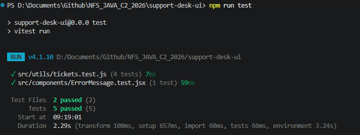
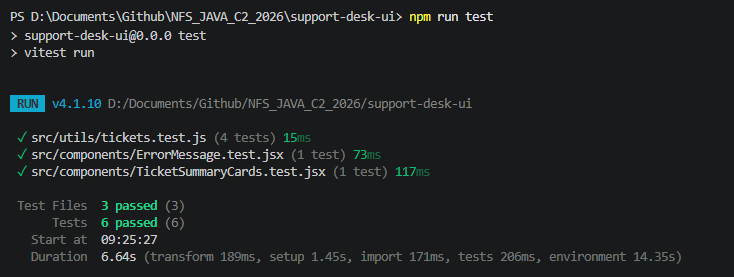
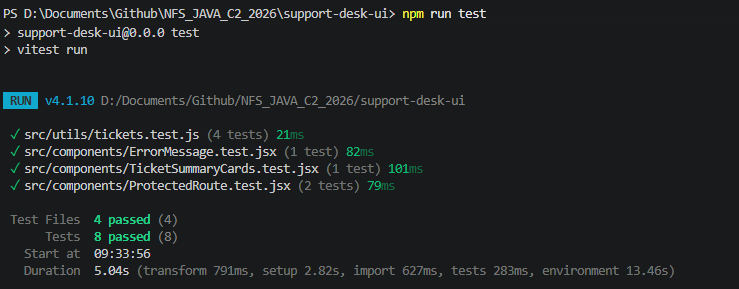
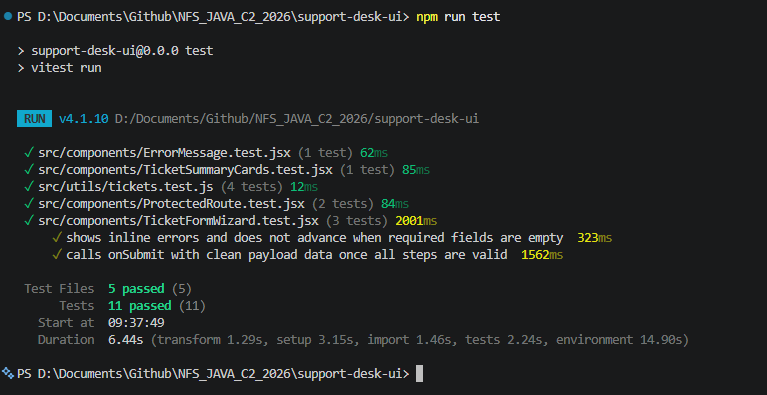
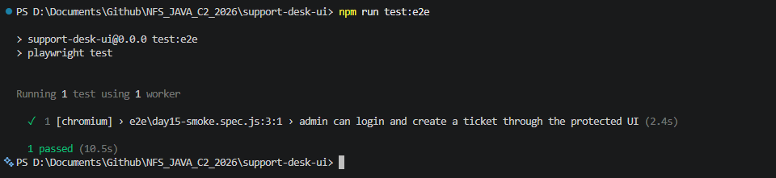

# NFS_JAVA_C2_2026 | Full-Stack Development with Java, React & MongoDB

## Programme Description

This 20-day programme is designed to help participants build a complete full-stack web application using Java, Spring Boot, React, and MongoDB.

The programme takes learners from programming and web fundamentals to backend API development, frontend interface design, database modelling, authentication, testing, performance improvement, and final capstone presentation.

Throughout the programme, participants will work on practical exercises and gradually build a small but production-like web application. The final outcome is a working capstone project that demonstrates the use of a React frontend, Spring Boot backend, MongoDB database, secure authentication, API documentation, testing practices, and deployment-readiness basics.

AI tools such as Gemini are used as learning accelerators to help scaffold examples, suggest refactoring ideas, draft tests, generate sample data, and support MongoDB query or aggregation design. However, participants are expected to review, verify, understand, and take ownership of all generated code.

---

## Programme Duration

* Duration: 20 training days

* Daily Duration: 7 hours per day

* Total Training Hours: 140 hours

* Mode: Instructor-led training with guided labs, team build activities, review sessions, quizzes, and capstone development

---

## Programme Objectives

By the end of this programme, participants will be able to:

* Understand web fundamentals, HTTP, REST, and JSON.

* Write basic to intermediate Java and JavaScript code.

* Build REST APIs using Spring Boot.

* Apply validation, authentication, authorisation, and error-handling practices.

* Model data effectively using MongoDB.

* Use MongoDB indexes, queries, pagination, and aggregation pipelines.

* Build accessible React user interfaces with routing, forms, state, and data fetching.

* Apply testing practices for backend and frontend development.

* Use AI coding assistants responsibly for learning, refactoring, testing, and documentation.

* Design, build, document, and present a full-stack capstone project.

---

---

## Day 15 Exercise 01 - Set Up Frontend Testing Tools

Run `npm run test` inside `support-desk-ui` to run this exercise.

### Files created/updated

- `package.json` — added `vitest`, `jsdom`, `@testing-library/react`, `@testing-library/jest-dom`, and `@testing-library/user-event` as dev dependencies, plus `test`/`test:watch` scripts.
- `vite.config.js` — added a `test` block (`environment: 'jsdom'`, `globals: true`, `setupFiles: './src/test/setup.js'`, `css: true`).
- `src/test/setup.js` — imports `@testing-library/jest-dom/vitest` for readable matchers like `toBeInTheDocument()`, and clears `localStorage`/mocks/rendered components after each test so tests don't leak state into each other.
- `src/components/ErrorMessage.test.jsx` — a small sample test rendering `ErrorMessage` and asserting the message text appears, proving the whole pipeline (Vitest → jsdom → React Testing Library → jest-dom) works end to end. Kept simple and separate from `filterTickets`, since that utility gets its own dedicated test in Exercise 2.

### Result

`npm run test` runs cleanly with no missing test configuration: 1 test file, 1 test, both passing, confirmed by testing.

### Output Screenshot

*`npm run test` inside support-desk-ui passing the ErrorMessage sample test*

---

## Day 15 Exercise 02 - Test Ticket Filter Utility

Run `npm run test` inside `support-desk-ui` to run this exercise.

### Files created/updated

- `src/utils/tickets.test.js` — four tests for the existing `filterTickets(tickets, searchText, statusFilter, priorityFilter)` utility, using the sample ticket data from the exercise spec: filtering by search text alone, filtering by status alone, filtering by search text and status together (including a case with no matches), and returning every ticket when search is empty and status is `ALL`. No React component is rendered — these test the pure filtering logic in isolation.

### Result

`npm run test` passes all 4 new filter tests alongside the existing Exercise 1 test: 2 test files, 5 tests, all green, confirmed by testing.

### Output Screenshot

*`npm run test` passing all 4 filterTickets tests plus the Exercise 1 ErrorMessage test*

---

## Day 15 Exercise 03 - Test Ticket Summary Cards

Run `npm run test` inside `support-desk-ui` to run this exercise. Run `npm run dev` (backend on port 8080) to see it live on `/app/tickets`.

### Files created/updated

- `components/TicketSummaryCards.jsx` — new component showing four stat cards (Total Tickets, Open, In Progress, Closed), styled after the trainer's `SummaryCards` reference. Counts are derived from the `tickets` prop with a local `countByStatus` helper.
- `components/TicketSummaryCards.test.jsx` — renders the component with 6 sample tickets (3 OPEN, 2 IN_PROGRESS, 1 CLOSED — deliberately unique counts per status to avoid ambiguous `getByText` matches) and asserts all four labels and their correct counts appear.
- `pages/TicketsPage.jsx` — wired `TicketSummaryCards` into the real page, right below the header, showing counts for the tickets currently loaded (before filtering).
- `index.css` — ported the trainer's `.summary-grid`/`.summary-card` styling, plus added `.summary-grid` to the existing responsive breakpoint.

### Result

`npm run test` passes the new component test alongside all previous tests: 3 test files, 6 tests, all green. Wired into the live app, the cards correctly show the counts for the currently loaded ticket page, confirmed by testing.

### Output Screenshot

*`npm run test` passing the TicketSummaryCards test alongside all previous tests*

---

## Day 15 Exercise 04 - Test Protected Ticket Route

Run `npm run test` inside `support-desk-ui` to run this exercise.

### Files created/updated

- `components/ProtectedRoute.test.jsx` — two tests. Since the real `ProtectedRoute.jsx` uses the `Outlet`-based pattern (a parent `<Route element={<ProtectedRoute />}>` wrapping nested child routes, not a `children`-prop pattern), the test wraps a small `MemoryRouter` with a `/login` route and a protected `/app/tickets` route nested under `ProtectedRoute`, inside a real `AuthProvider`. The first test renders with no stored auth and asserts `Login Page` shows (not `Protected Tickets`). The second test seeds `localStorage` with a fake `supportDeskAuth` token before rendering — since `AuthContext` reads that on mount — and asserts `Protected Tickets` shows (not `Login Page`). The existing `afterEach` cleanup in `src/test/setup.js` clears `localStorage` between tests so the two cases don't leak into each other.

### Result

`npm run test` passes both new route-guard tests alongside all previous tests: 4 test files, 8 tests, all green, confirmed by testing.

### Output Screenshot

*`npm run test` passing both ProtectedRoute tests alongside all previous tests*

---

## Day 15 Exercise 05 - Test Ticket Form Validation

Run `npm run test` inside `support-desk-ui` to run this exercise.

### Files created/updated

- `components/TicketFormWizard.test.jsx` — three tests using `@testing-library/user-event` to simulate real typing/clicking:
  1. Clicking "Continue" on a blank Step 1 shows all three inline "is required" errors, stays on Step 1, and `onSubmit` is never called.
  2. Typing valid values, stepping through all 3 pages, checking the review confirmation box, and submitting calls `onSubmit` exactly once with the clean trimmed payload (`title`, `description`, `category`, `priority`, `status`).
  3. Rendering with `saving` true and valid `initialValues`, then navigating to Step 3, shows the submit button labeled "Saving..." and disabled.

One test assertion needed adjusting along the way: checking `getByLabelText('Title')` after triggering the Step 1 errors failed, because the `<label>` wraps both the field text and its inline error span, changing the label's full accessible text once an error renders. Replaced with a check that the "Continue" button is still present, which is enough to prove the form didn't advance.

### Result

`npm run test` passes all 3 new form tests alongside every previous test: 5 test files, 11 tests, all green, confirmed by testing.

### Output Screenshot

*`npm run test` passing all 3 TicketFormWizard tests alongside every previous test*

---

## Day 15 Exercise 06 - End-to-End Smoke Test

Run `mvn spring-boot:run` inside `support-desk-api`, then `npm run test:e2e` inside `support-desk-ui` (Playwright starts the frontend dev server automatically via `webServer`).

### Files created/updated

- `package.json` — added `@playwright/test` as a dev dependency, plus `test:e2e`/`test:e2e:ui` scripts.
- `playwright.config.js` — new config: `testDir: './e2e'`, `baseURL: 'http://localhost:5173'`, and a `webServer` block that auto-starts `npm run dev` before tests run (reusing an already-running dev server if one exists). Trimmed to a single `chromium` project — one browser is enough for a smoke test.
- `e2e/day15-smoke.spec.js` — one end-to-end test covering the full flow: open `/login`, log in as the seeded admin, land on `/app/dashboard`, navigate to Tickets, open the Create Ticket form, fill in a uniquely-titled ticket (using `Date.now()` so re-runs never collide), step through all 3 wizard pages, submit, and confirm the new ticket's title appears in the ticket detail panel back on `/app/tickets`.
- `eslint.config.js` — added a Node-globals override for `vite.config.js`/`playwright.config.js`, since those run in Node (not the browser) and reference `process`, which the project's browser-focused ESLint config didn't recognize.

Two selector issues came up while getting this test green:
- `getByLabel('Password')` matched two elements — the password input and the eye-icon toggle button (whose `aria-label="Show password"` also contains "password"). Fixed by switching both email/password fields to `getByPlaceholder(...)`, which is unambiguous.
- The final assertion checking the new ticket's title with `getByText(...)` matched twice — once in the ticket list row, once in the detail panel heading (a newly created ticket is auto-selected). Fixed by scoping to `getByRole('heading', { name: ticketTitle })`.

### Result

`npm run test:e2e` passes: 1 test, proving the React UI, the protected route, and the backend API all work together end to end, confirmed by testing.

### Output Screenshot

*`npm run test:e2e` passing the full login-to-create-ticket smoke test in a real Chromium browser*

---

## AI-Assisted Learning Guidelines

Participants may use AI tools to:

* Generate README drafts and documentation sections.

* Create API call examples and JSON payload samples.

* Suggest method signatures and edge cases.

* Propose refactoring options.

* Draft test scenarios for backend and frontend features.

* Suggest MongoDB document structures, queries, indexes, and aggregation pipelines.

* Improve demo scripts and presentation notes.

Participants must always review, verify, test, and understand any AI-generated output. No passwords, API keys, tokens, private keys, or confidential data should be placed into AI prompts.

