# NFS_JAVA_C2_2026 | Full-Stack Development with Java, React & MongoDB

## Programme Description

This 20-day programme is designed to help participants build a complete full-stack web application using Java, Spring Boot, React, and MongoDB.

The programme takes learners from programming and web fundamentals to backend API development, frontend interface design, database modelling, authentication, testing, performance improvement, and final capstone presentation.

Throughout the programme, participants will work on practical exercises and gradually build a small but production-like web application. The final outcome is a working capstone project that demonstrates the use of a React frontend, Spring Boot backend, MongoDB database, secure authentication, API documentation, testing practices, and deployment-readiness basics.

AI tools such as Gemini are used as learning accelerators to help scaffold examples, suggest refactoring ideas, draft tests, generate sample data, and support MongoDB query or aggregation design. However, participants are expected to review, verify, understand, and take ownership of all generated code.

---

## Programme Duration

* Duration: 20 training days

* Daily Duration: 7 hours per day

* Total Training Hours: 140 hours

* Mode: Instructor-led training with guided labs, team build activities, review sessions, quizzes, and capstone development

---

## Programme Objectives

By the end of this programme, participants will be able to:

* Understand web fundamentals, HTTP, REST, and JSON.

* Write basic to intermediate Java and JavaScript code.

* Build REST APIs using Spring Boot.

* Apply validation, authentication, authorisation, and error-handling practices.

* Model data effectively using MongoDB.

* Use MongoDB indexes, queries, pagination, and aggregation pipelines.

* Build accessible React user interfaces with routing, forms, state, and data fetching.

* Apply testing practices for backend and frontend development.

* Use AI coding assistants responsibly for learning, refactoring, testing, and documentation.

* Design, build, document, and present a full-stack capstone project.

---

---

## Day 5 Exercise 01 - HTTP Investigation

Run `node rest-basics/mock-api.js` to start the mock server, then open `rest-basics/requests.http` with the REST Client extension to run this exercise.

### Note

The original `requests.http` request #3 used `C001`, which does not exist in the mock data (the real IDs are `CO001` and `CO002`) — that request returned `404`. I changed it to `GET /api/course-offerings/CO001` so it matches an existing record and returns `200` with the actual course offering data.

### Investigation Table

| Method | URL | Status Code | Response Type | What Happened? |
|---|---|---:|---|---|
| GET | /api/health | 200 | Single object | Server responded confirming the API is up and running |
| GET | /api/course-offerings | 200 | List | Returned an array of all existing course offerings |
| GET | /api/course-offerings/CO001 | 200 | Single object | Returned the course offering matching ID `CO001` |
| GET | /api/course-offerings/C999 | 404 | Error object | No course offering exists with ID `C999`, so the server returned a not-found message |
| POST | /api/course-offerings (valid data) | 201 | Single object | A new course offering was created and returned with a generated ID and status `OPEN` |
| POST | /api/course-offerings (empty data) | 400 | Error object | Validation failed because required fields were empty, server returned a list of field-level errors |

### 1. Which request returned a successful list response?

`GET /api/course-offerings` — returned status `200` with an array of course offerings.

### 2. Which request returned a not-found response?

`GET /api/course-offerings/C999` — returned status `404` because that ID does not exist in the data.

### 3. Which request returned a validation error?

`POST /api/course-offerings` with empty fields — returned status `400` with a list of field errors.

### 4. What is the difference between a successful response and an error response?

A successful response returns a status code in the `2xx` range along with the data that was requested or created. An error response returns a status code in the `4xx` or `5xx` range along with a message explaining what went wrong, instead of the actual data.

### 5. Why is the status code important for frontend developers?

The status code tells the frontend how to react without needing to read the whole response body first. A `200` or `201` means the frontend can display the data or confirm success. A `404` means it should show a "not found" message. A `400` means it should show validation errors next to the form fields. Frontend code branches its behaviour based on the status code.

### Reflection

After this exercise, I understand better that REST is not just about getting data back — the status code itself carries meaning. A `404` and a `400` both look like "it failed," but they mean completely different things: one says the resource does not exist, the other says the request itself was invalid. Reading the status code first tells you what kind of problem you're dealing with before even looking at the response body.

### Output Screenshots

---

## Day 5 Exercise 02 - REST API Design

This is a design-only exercise — no code was written.

### API Specification Table

| Resource | Method | Endpoint | Purpose | Request Body Needed? | Success Status | Possible Error Status |
|---|---|---|---|---|---:|---:|
| Events | GET | /api/events | View all available events | No | 200 | 500 |
| Events | GET | /api/events/{eventId} | View details of one event | No | 200 | 404 |
| Bookings | POST | /api/bookings | Create a new booking | Yes | 201 | 400, 404 |
| Bookings | GET | /api/bookings | View all bookings | No | 200 | 500 |
| Bookings | GET | /api/bookings/{bookingId} | View one booking | No | 200 | 404 |
| Bookings | DELETE | /api/bookings/{bookingId} | Cancel a booking | No | 200 | 404, 409 |

### Request Body Planning

| Endpoint | Request Body Description |
|---|---|
| POST /api/bookings | Should contain eventId, attendee name, and number of seats requested |

### Error Planning

| Error Case | Related Endpoint | Suitable Status Code | Explanation |
|---|---|---:|---|
| Event does not exist | POST /api/bookings | 404 | The eventId in the request body does not match any existing event |
| Booking already cancelled | DELETE /api/bookings/{bookingId} | 409 | The booking exists but is already cancelled, so cancelling it again is a conflict, not a valid action |
| Missing required field | POST /api/bookings | 400 | The request body is missing eventId or attendee name |
| Event fully booked | POST /api/bookings | 400 | There are no available seats left for that event |

### Why these endpoint names follow REST principles

Each endpoint name is a noun representing a resource (`/events`, `/bookings`), not a verb describing an action. The HTTP method itself tells you the action — `GET` to read, `POST` to create, `DELETE` to remove. This avoids duplication like `/createBooking` where both the URL and the method say "create."

---

## Day 5 Exercise 03 - Display Event JSON on a Webpage

Run `event-preview/index.html` in a browser to run this exercise.

### Files created

- `event-preview/index.html` — starter HTML page with a status text and an empty `<ul>` with `id="eventList"`.
- `event-preview/app.js` — selects the list and status elements, loops through the `events` array using `forEach`, creates an `<li>` for each event showing title, date, venue, and available seats, flags events with fewer than 50 seats as "Limited seats", and updates the status text with the total number of events displayed.

### Bugs fixed

- Typo `event.availableSeatts` (extra `t`) meant the property never matched the real `availableSeats` field, so the "Limited seats" challenge task never triggered. Fixed by correcting the property name.
- The status text update line was missing entirely, so the page always showed "Events not displayed yet." Added `statusText.textContent = \`${events.length} event(s) displayed.\`;` at the end of the script.

### Output Screenshot

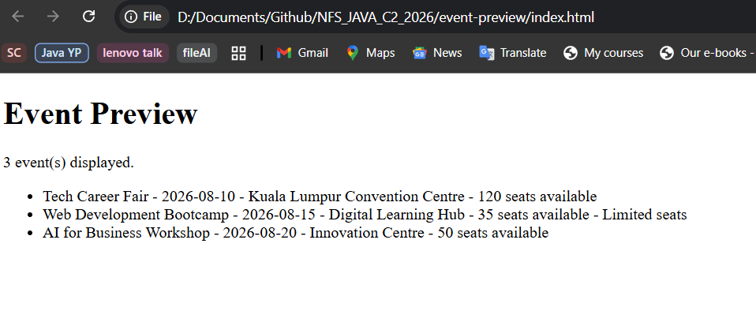

---

## Day 5 Exercise 04 - Build an Event API Client

Run `event-rest-client/index.html` using Live Server to run this exercise. Requires the mock server to be running (`node rest-basics/mock-api.js`).

### Files created

- `event-rest-client/index.html` — HTML page with a status text, an empty `div` for the event list, and a search section with an input and a Find Event button.
- `event-rest-client/app.js` — `loadEvents()` fetches all events from `GET /api/events` and displays them, updating the status message before and after loading, with a `try/catch` to show an error message if the request fails. `findEventById()` fetches one event from `GET /api/events/{id}` and displays it, or shows a "not found" message if the response is not OK.

### Output Screenshot

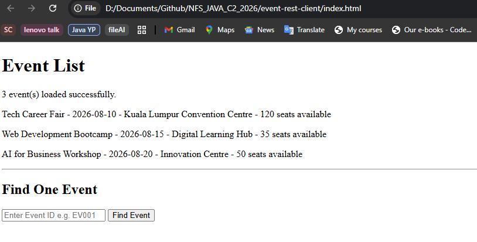
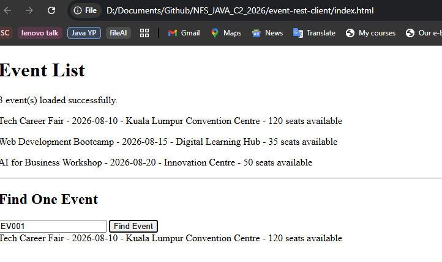

---

## Day 5 Final Exercise - Add Booking Endpoints to the Mock API

Run `node rest-basics/mock-api.js` to start the mock server, then open `rest-basics/requests.http` with the REST Client extension to run this exercise.

### Files updated

- `mock-api.js` — added a `bookings` array, a `validateBooking()` function, and 4 endpoints: `GET /api/bookings` (list all), `GET /api/bookings/{id}` (find one), `POST /api/bookings` (create, with validation, event existence check, and seat availability check), and `DELETE /api/bookings/{id}` (optional task — cancels a booking, sets status to `CANCELLED`, and returns the seats back to the event).
- `requests.http` — added test requests 7 through 15 covering all bookings scenarios: empty list, valid creation, get one, missing fields, invalid event ID, too many seats, seat reduction check, cancellation, and seat restoration check.

### What was completed

- `GET /api/bookings` and `GET /api/bookings/{id}` work correctly
- `POST /api/bookings` creates a booking and returns `201`
- Missing fields return `400` with field-level errors
- Unknown event ID returns `404`
- Booking more seats than available returns `400`
- Available seats reduce on the event after a successful booking
- Optional `DELETE /api/bookings/{id}` cancels a booking and restores the seats

### Output Screenshots

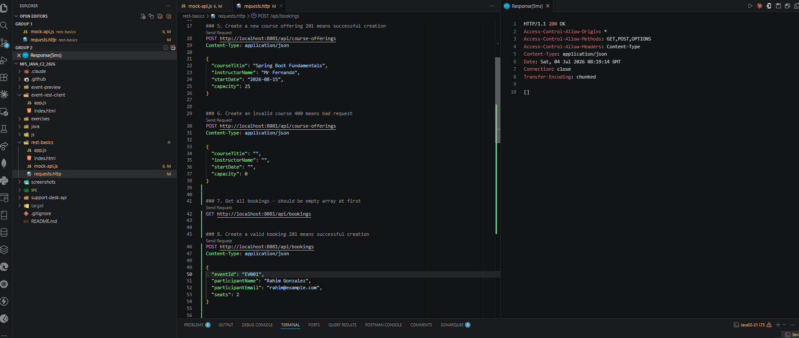
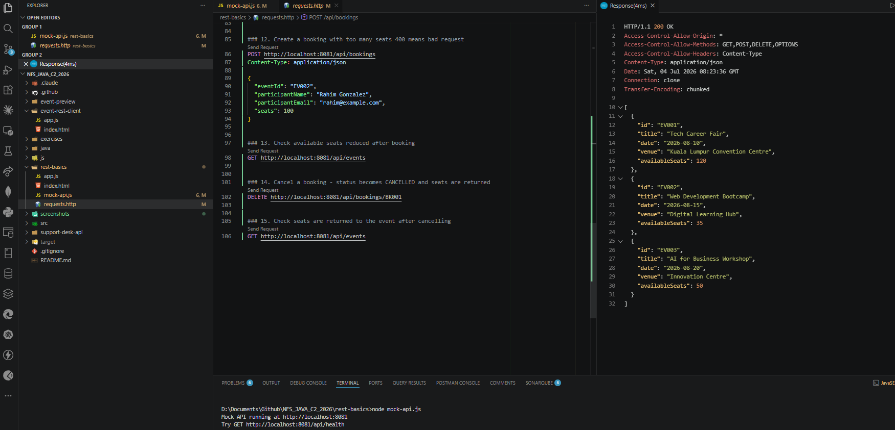
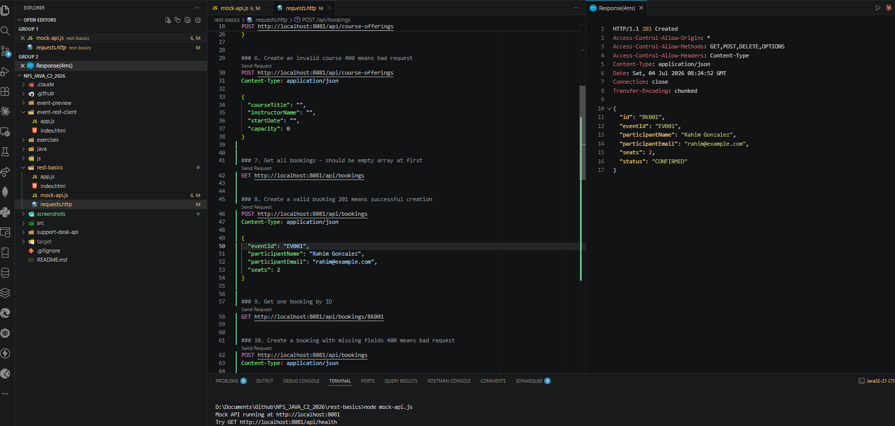
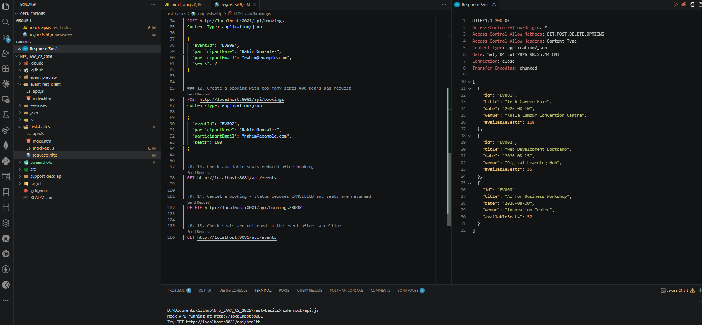
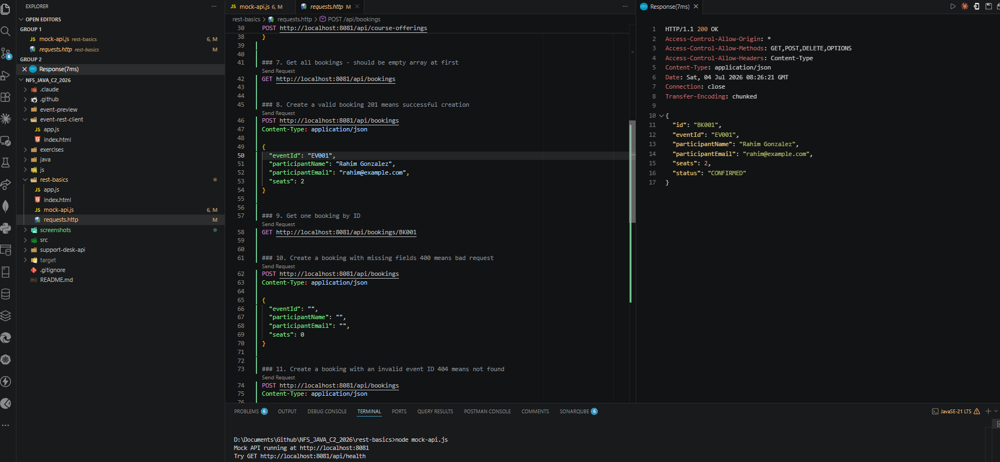
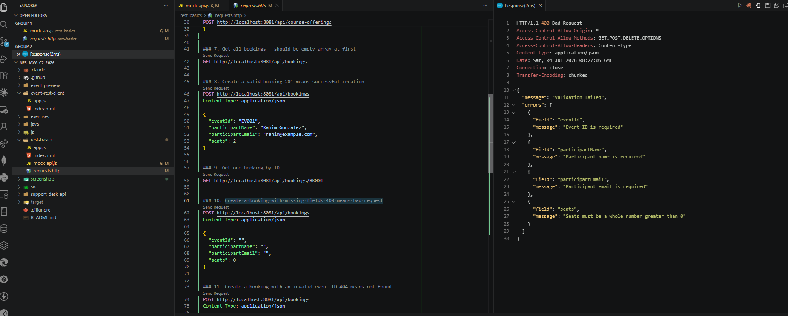
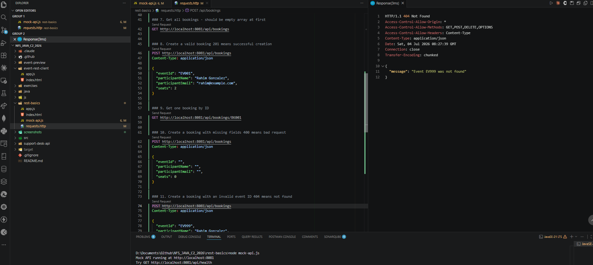
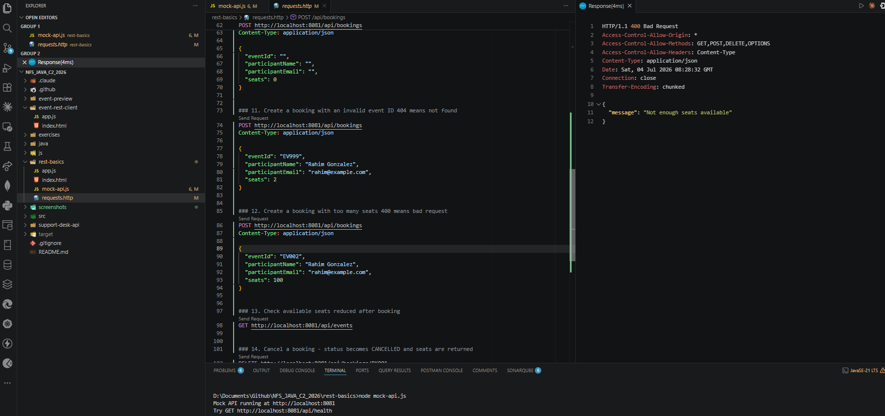
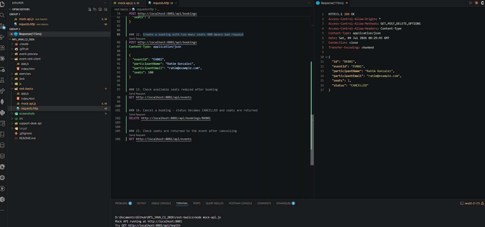
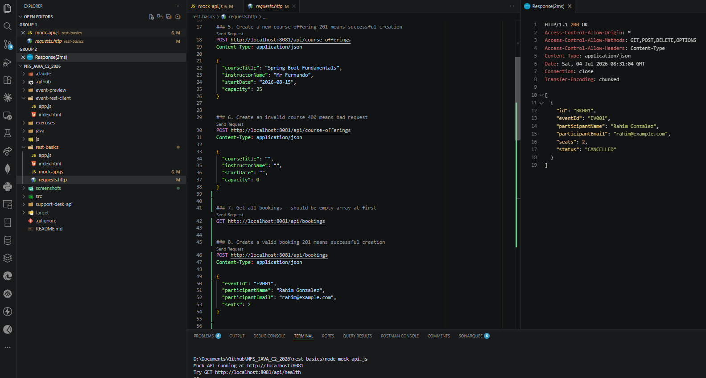

---

## AI-Assisted Learning Guidelines

Participants may use AI tools to:

* Generate README drafts and documentation sections.

* Create API call examples and JSON payload samples.

* Suggest method signatures and edge cases.

* Propose refactoring options.

* Draft test scenarios for backend and frontend features.

* Suggest MongoDB document structures, queries, indexes, and aggregation pipelines.

* Improve demo scripts and presentation notes.

Participants must always review, verify, test, and understand any AI-generated output. No passwords, API keys, tokens, private keys, or confidential data should be placed into AI prompts.

