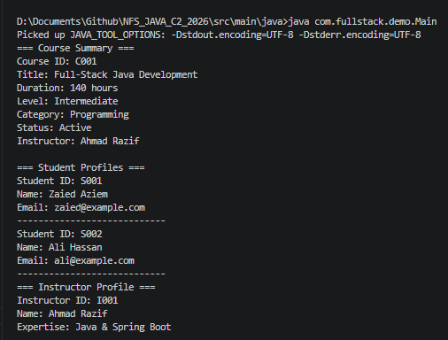

# NFS_JAVA_C2_2026 | Full-Stack Development with Java, React & MongoDB

## Programme Description

This 20-day programme is designed to help participants build a complete full-stack web application using Java, Spring Boot, React, and MongoDB.

The programme takes learners from programming and web fundamentals to backend API development, frontend interface design, database modelling, authentication, testing, performance improvement, and final capstone presentation.

Throughout the programme, participants will work on practical exercises and gradually build a small but production-like web application. The final outcome is a working capstone project that demonstrates the use of a React frontend, Spring Boot backend, MongoDB database, secure authentication, API documentation, testing practices, and deployment-readiness basics.

AI tools such as Gemini are used as learning accelerators to help scaffold examples, suggest refactoring ideas, draft tests, generate sample data, and support MongoDB query or aggregation design. However, participants are expected to review, verify, understand, and take ownership of all generated code.

---

## Programme Duration

* Duration: 20 training days

* Daily Duration: 7 hours per day

* Total Training Hours: 140 hours

* Mode: Instructor-led training with guided labs, team build activities, review sessions, quizzes, and capstone development

---

## Programme Objectives

By the end of this programme, participants will be able to:

* Understand web fundamentals, HTTP, REST, and JSON.

* Write basic to intermediate Java and JavaScript code.

* Build REST APIs using Spring Boot.

* Apply validation, authentication, authorisation, and error-handling practices.

* Model data effectively using MongoDB.

* Use MongoDB indexes, queries, pagination, and aggregation pipelines.

* Build accessible React user interfaces with routing, forms, state, and data fetching.

* Apply testing practices for backend and frontend development.

* Use AI coding assistants responsibly for learning, refactoring, testing, and documentation.

* Design, build, document, and present a full-stack capstone project.

---

---

## Day 1 Exercise 01 - Code Explanation

### 1. What is the purpose of `Course.java`?

`Course.java` is a **blueprint (class)** that represents a course in the system. It stores course data — the course ID, title, duration in hours, level, and which instructor teaches it. It also provides methods to read that data (`getCourseId()`, `getTitle()`, etc.), a method to link an instructor to the course (`setInstructor()`), and a method to print a readable course summary (`printSummary()`). Every time you create a `Course` object, it follows this blueprint.

---

### 2. What is the purpose of `Instructor.java`?

`Instructor.java` is a **blueprint** that represents a trainer or lecturer. It holds three pieces of data: an instructor ID, their name, and their area of expertise. It provides getter methods to retrieve each field, and a `printProfile()` method to display the instructor's details to the console. It models a real-world instructor as a Java object.

---

### 3. What is the purpose of `Student.java`?

`Student.java` is a **blueprint** that represents a learner enrolled in the programme. It stores a student ID, name, and email address. Like the other classes, it has getter methods and a `printProfile()` method that prints the student's details followed by a separator line. It models a real-world student as a Java object.

---

### 4. What does the constructor do?

A constructor is a **special method that runs automatically when you create a new object** with the `new` keyword. It receives values as arguments and uses them to set the object's fields so the object is ready to use straight away.

Example from `Student.java`:
```java
public Student(String studentId, String studentName, String email) {
    this.studentId = studentId;
    this.studentName = studentName;
    this.email = email;
}
```
When you write:
```java
Student student1 = new Student("S001", "Zaied Aziem", "zaied@example.com");
```
Java calls the constructor, which stores `"S001"`, `"Zaied Aziem"`, and `"zaied@example.com"` inside the new object's fields.

**TypeScript analogy:** Same as a `constructor(...)` method inside a TypeScript class.  
**C# analogy:** Identical — a method with the same name as the class and no return type.

---

### 5. Why are the fields marked as `private`?

Fields are `private` so that **only code inside the same class can directly read or change them**. This is called **encapsulation**. Outside code must use the public getter/setter methods instead.

Why this matters:
- It protects the data from being accidentally changed by unrelated code.
- It lets you control or validate changes — e.g., a setter can reject an invalid value before storing it.
- It hides internal details so the rest of the program does not break if you change how a field works internally.

**TypeScript analogy:** Same as marking a class property `private` in TypeScript.  
**C# analogy:** Identical to `private` fields accessed through `{ get; set; }` properties.

---

### 6. What does `course1.assignInstructor(instructor1);` mean?

It calls a method **on the `course1` object**, passing the `instructor1` object as an argument. Inside that method, `course1`'s `instructor` field is set to point at `instructor1`. After this line, the course "knows" who teaches it — this is how two objects form a **relationship** in Java.

In this project the method is named `setInstructor()` rather than `assignInstructor()`, but the concept is identical:
```java
course1.setInstructor(instructor1);
```
In plain English: *"Link instructor1 to course1 as its teacher."*

The dot (`.`) means: *"call this method on this specific object."*

---

### 7. What does `student1.printProfile();` do?

It calls the `printProfile` method **on the `student1` object**. That method reads the student's private fields and prints them to the console in a formatted block, for example:
```
Student ID: S001
Name: Zaied Aziem
Email: zaied@example.com
----------------------------
```
No data is changed — `printProfile()` is a read-only display method. The dot again means *"run this method belonging to this specific object."*

---

### AI-Assisted Task

**Prompt used:** *"Explain this Java class to someone who already knows TypeScript or C#."*

**One explanation from AI that helped:**

> "In Java, `private` fields with `public` getters are the standard way to do what TypeScript does with `private` properties and C# does with `{ get; set; }` auto-properties. The constructor in Java works exactly like a `constructor()` in a TypeScript class or a C# constructor — same name as the class, no return type, called automatically when you use `new`. The `this.` keyword is also identical in all three languages."

This was helpful because it confirmed that the pattern is not new — it just uses slightly different syntax. Recognising that `private String name` + `getName()` in Java is the same idea as `private name: string` + a getter in TypeScript made the code feel immediately readable.

**One part that still needed the trainer or my own reading to understand:**

The `this.` keyword inside the constructor was initially confusing. The AI explained that it refers to "the current object's field", but understanding *why it is required here* — because the parameter name and the field name are exactly the same (both called `studentName`), so Java needs `this.studentName` to mean "the field" and `studentName` alone to mean "the parameter" — needed a slow re-read of the constructor and a concrete walkthrough. Without that distinction, `this.studentName = studentName` looks like a line that assigns a variable to itself.

---

## Day 1 Exercise 02 - Improve Course Class

### What changed in `Course.java`

Two new private fields were added to the `Course` class:

```java
private String category;
private boolean active;
```

The constructor was updated to accept these two new values:

```java
public Course(String courseId, String title, int durationHours, String level, String category, boolean active) {
    ...
    this.category = category;
    this.active = active;
}
```

Two new getter methods were added — `getCategory()` and `isActive()` (Java convention uses `is` instead of `get` for booleans).

`printSummary()` was updated to display the new fields. The `active` boolean is converted to friendly text using a ternary operator instead of printing `true` or `false` directly:

```java
System.out.println("Category: " + category);
System.out.println("Status: " + (active ? "Active" : "Inactive"));
```

### Updated Course Output



### GitHub Commit

[https://github.com/zaiedaziem/NFS_JAVA_C2_2026/tree/day1](https://github.com/zaiedaziem/NFS_JAVA_C2_2026/tree/day1)

---

## AI-Assisted Learning Guidelines


Participants may use AI tools to:


* Generate README drafts and documentation sections.

* Create API call examples and JSON payload samples.

* Suggest method signatures and edge cases.

* Propose refactoring options.

* Draft test scenarios for backend and frontend features.

* Suggest MongoDB document structures, queries, indexes, and aggregation pipelines.

* Improve demo scripts and presentation notes.


Participants must always review, verify, test, and understand any AI-generated output. No passwords, API keys, tokens, private keys, or confidential data should be placed into AI prompts.

