# NFS_JAVA_C2_2026 | Full-Stack Development with Java, React & MongoDB

## Programme Description

This 20-day programme is designed to help participants build a complete full-stack web application using Java, Spring Boot, React, and MongoDB.

The programme takes learners from programming and web fundamentals to backend API development, frontend interface design, database modelling, authentication, testing, performance improvement, and final capstone presentation.

Throughout the programme, participants will work on practical exercises and gradually build a small but production-like web application. The final outcome is a working capstone project that demonstrates the use of a React frontend, Spring Boot backend, MongoDB database, secure authentication, API documentation, testing practices, and deployment-readiness basics.

AI tools such as Gemini are used as learning accelerators to help scaffold examples, suggest refactoring ideas, draft tests, generate sample data, and support MongoDB query or aggregation design. However, participants are expected to review, verify, understand, and take ownership of all generated code.

---

## Programme Duration

* Duration: 20 training days

* Daily Duration: 7 hours per day

* Total Training Hours: 140 hours

* Mode: Instructor-led training with guided labs, team build activities, review sessions, quizzes, and capstone development

---

## Programme Objectives

By the end of this programme, participants will be able to:

* Understand web fundamentals, HTTP, REST, and JSON.

* Write basic to intermediate Java and JavaScript code.

* Build REST APIs using Spring Boot.

* Apply validation, authentication, authorisation, and error-handling practices.

* Model data effectively using MongoDB.

* Use MongoDB indexes, queries, pagination, and aggregation pipelines.

* Build accessible React user interfaces with routing, forms, state, and data fetching.

* Apply testing practices for backend and frontend development.

* Use AI coding assistants responsibly for learning, refactoring, testing, and documentation.

* Design, build, document, and present a full-stack capstone project.

---

---

## Day 4 Exercise 01 - Create a JavaScript Student Object

Run `js/student-object.js` to run this exercise.

### Files created

- `student-object.js` — creates a JavaScript object literal with four properties: `studentId`, `studentName`, `email`, and `status`. Prints the whole object, then prints each property individually using dot notation and bracket notation.

### What is one difference between a Java object and a JavaScript object?

In Java, you must define a class first with declared fields and types before you can create an object. In JavaScript, you can create an object directly using `{}` without any class — just write the property names and values inline. Java is strictly typed, JavaScript is not.

### Output Screenshot

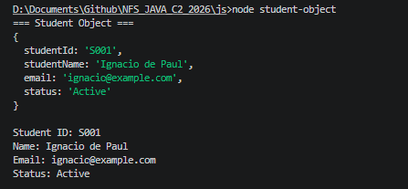

---

## Day 4 Exercise 02 - Store Instructors in an Array and Loop Through Them

Run `js/instructor-array.js` to run this exercise.

### Files created

- `instructor-array.js` — creates an array of 4 instructor objects, loops through them using `for...of`, prints each instructor in a readable format, and prints the total count using `.length`.

### How is a JavaScript array similar to Java ArrayList?

Both can store multiple objects, grow dynamically, and be looped through with an enhanced for loop. In Java you write `new ArrayList<>()` and use `.size()` for the count. In JavaScript you write `[]` and use `.length`. The idea is the same — a list that can hold many items.

### Output Screenshot

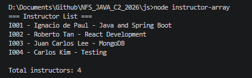

---

## Day 4 Exercise 03 - Write Functions and Arrow Functions for Student Data

Run `js/student-functions.js` to run this exercise.

### Files created

- `student-functions.js` — creates one student object then writes three types of functions: a normal function that formats the student into a readable string, an arrow function that returns the email, and a short arrow function that returns the status in a single line with no `return` keyword.

### Why are arrow functions important before learning React?

React uses arrow functions everywhere — in event handlers, inside `.map()` and `.filter()` to render lists, and when defining functional components. If you are not comfortable with arrow function syntax, React code will look confusing. Learning arrow functions now means the syntax will feel familiar when you start writing React components.

### Output Screenshot

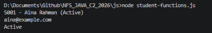

---

## Day 4 Exercise 04 - Practise JavaScript Array Methods

Run `js/student-array-methods.js` to run this exercise.

### Files created

- `student-array-methods.js` — creates an array of 3 students and practises 8 array methods: `forEach` to print names, `filter` to get active students, `find` to find one student by ID, `map` to extract emails, `push` to add to the end, `pop` to remove from the end, `unshift` to add to the beginning, and `shift` to remove from the beginning.

### 1. What is the difference between filter, find, and map?

`filter` keeps only items where the condition is true and returns a new array. `find` returns only the first item that matches the condition — one object, not an array. `map` does not filter anything — it transforms every item and returns a new array with the transformed values.

### 2. Which four array methods change the original array?

`push`, `pop`, `unshift`, and `shift`.

### 3. What does push return?

The new length of the array after the item is added.

### 4. What does pop return?

The item that was removed from the end of the array.

### 5. What is the difference between shift and unshift?

`shift` removes the first item from the array. `unshift` adds a new item to the beginning of the array.

### Output Screenshot

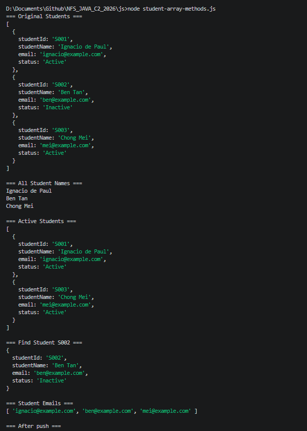
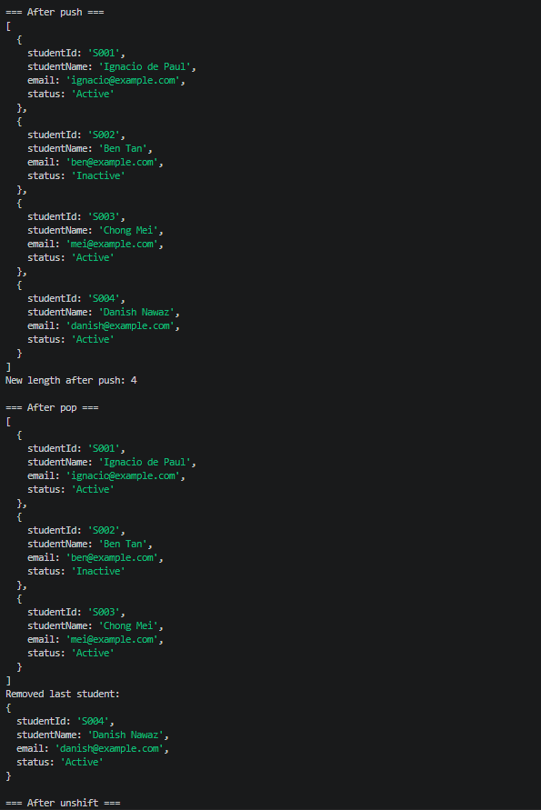
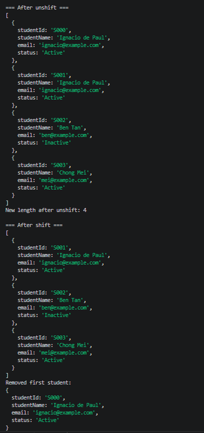
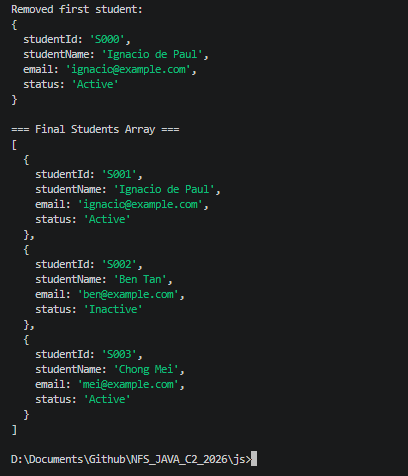

---

## Day 4 Exercise 05 - Render Student Cards in HTML

Run `student-dom-rendering/index.html` in a browser to run this exercise.

### Files created

- `student-dom-rendering/index.html` — HTML page with a heading and an empty `div` with `id="student-list"` where the cards will be injected. Links `script.js` at the bottom.
- `student-dom-rendering/script.js` — creates an array of 4 students, selects the `student-list` div using `document.getElementById`, loops through students with `forEach`, creates a card div for each student using `document.createElement`, fills it with `innerHTML`, and adds it to the page using `appendChild`.

### What does the DOM allow JavaScript to do?

The DOM (Document Object Model) allows JavaScript to read and change the content of an HTML page after it has loaded. Without the DOM, JavaScript can only run logic — it cannot touch anything on screen. With the DOM, JavaScript can create new elements, update text, change styles, and respond to user actions like clicks.

### Output Screenshot

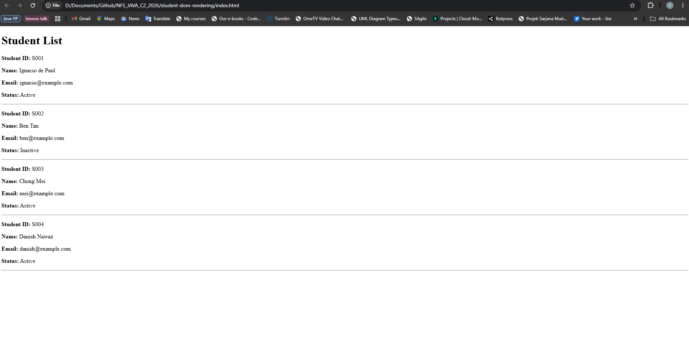

---

## Day 4 Exercise 06 - Add Search to the Student List

Run `student-search-ui/index.html` in a browser to run this exercise.

### Files created

- `student-search-ui/index.html` — HTML page with a search input, a Search button, a Reset button, and an empty `div` with `id="student-list"`.
- `student-search-ui/script.js` — creates an array of 4 students and a `renderStudents()` function that clears the list and renders cards. The Search button filters students by name using `filter` and re-renders the results. The Reset button clears the input and renders all students again.

### How is JavaScript filter used in a search feature?

When the Search button is clicked, the input value is read and converted to lowercase. `filter` then goes through every student and keeps only the ones whose name contains the keyword. The result is a new array of matching students which is passed to `renderStudents()` to display on screen.

### Output Screenshot

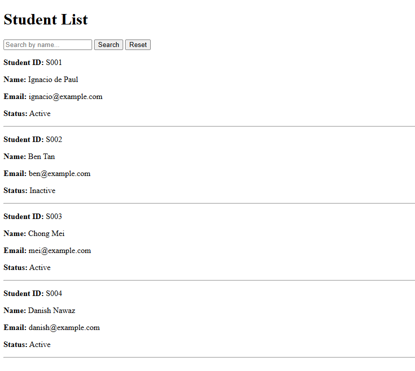
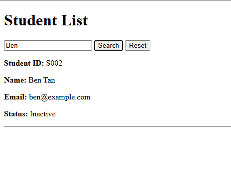

---

## Day 4 Exercise 07 - Load Students from a JSON File Using Fetch

Run `student-fetch-json/index.html` using Live Server to run this exercise.

### Files created

- `student-fetch-json/students.json` — contains 4 student records in JSON format.
- `student-fetch-json/index.html` — HTML page with a status message and an empty `div` for student cards.
- `student-fetch-json/script.js` — uses an `async` function to fetch `students.json`, waits for the response using `await`, converts it to JavaScript objects, and renders student cards. Uses `try/catch` to handle errors.

### 1. What does async mean?

`async` marks a function as asynchronous — meaning it is allowed to wait for tasks that take time to finish, like loading a file or calling an API.

### 2. What does await do?

`await` pauses the function at that line until the task finishes before moving to the next line. Without it, JavaScript would continue running before the data is ready.

### 3. What does fetch do?

`fetch` sends a request to load data from a file or an API URL. It returns a response that needs to be converted into usable data using `.json()`.

### 4. Why do we use fetch before connecting to a real backend API?

Because the idea is the same. `fetch("students.json")` loads from a local file. `fetch("http://localhost:8080/api/students")` loads from a Spring Boot backend. Practising with a local JSON file first makes the switch to a real API easier to understand.

### 5. Why should this exercise be run using Live Server?

`fetch()` is blocked by the browser when opening files directly from `file:///` because the browser treats local files as untrusted. Live Server runs a local web server at `http://127.0.0.1:5500` which allows `fetch()` to work correctly.

### Output Screenshot

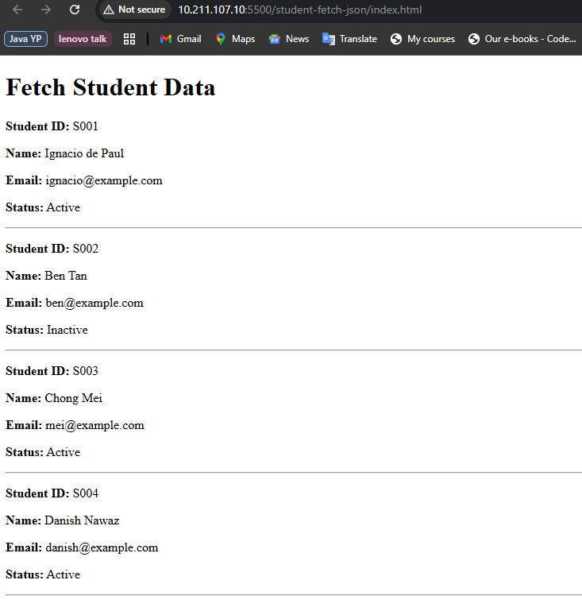

---

## AI-Assisted Learning Guidelines

Participants may use AI tools to:

* Generate README drafts and documentation sections.

* Create API call examples and JSON payload samples.

* Suggest method signatures and edge cases.

* Propose refactoring options.

* Draft test scenarios for backend and frontend features.

* Suggest MongoDB document structures, queries, indexes, and aggregation pipelines.

* Improve demo scripts and presentation notes.

Participants must always review, verify, test, and understand any AI-generated output. No passwords, API keys, tokens, private keys, or confidential data should be placed into AI prompts.

