# NFS_JAVA_C2_2026 | Full-Stack Development with Java, React & MongoDB

## Programme Description

This 20-day programme is designed to help participants build a complete full-stack web application using Java, Spring Boot, React, and MongoDB.

The programme takes learners from programming and web fundamentals to backend API development, frontend interface design, database modelling, authentication, testing, performance improvement, and final capstone presentation.

Throughout the programme, participants will work on practical exercises and gradually build a small but production-like web application. The final outcome is a working capstone project that demonstrates the use of a React frontend, Spring Boot backend, MongoDB database, secure authentication, API documentation, testing practices, and deployment-readiness basics.

AI tools such as Gemini are used as learning accelerators to help scaffold examples, suggest refactoring ideas, draft tests, generate sample data, and support MongoDB query or aggregation design. However, participants are expected to review, verify, understand, and take ownership of all generated code.

---

## Programme Duration

* Duration: 20 training days

* Daily Duration: 7 hours per day

* Total Training Hours: 140 hours

* Mode: Instructor-led training with guided labs, team build activities, review sessions, quizzes, and capstone development

---

## Programme Objectives

By the end of this programme, participants will be able to:

* Understand web fundamentals, HTTP, REST, and JSON.

* Write basic to intermediate Java and JavaScript code.

* Build REST APIs using Spring Boot.

* Apply validation, authentication, authorisation, and error-handling practices.

* Model data effectively using MongoDB.

* Use MongoDB indexes, queries, pagination, and aggregation pipelines.

* Build accessible React user interfaces with routing, forms, state, and data fetching.

* Apply testing practices for backend and frontend development.

* Use AI coding assistants responsibly for learning, refactoring, testing, and documentation.

* Design, build, document, and present a full-stack capstone project.

---

---

## Day 9 Exercise 01 - Create User Model and Repository

No test screenshot required for this exercise, there is no endpoint yet, only the model and repository.

### Files created

- `AppUser.java` — a `@Document(collection = "users")` model with `id`, `name`, `email` (marked `@Indexed(unique = true)` so MongoDB rejects duplicate emails), `passwordHash`, and `role`. The field is named `passwordHash`, not `password`, since raw passwords should never be stored directly.
- `AppUserRepository.java` — an interface extending `MongoRepository<AppUser, String>` with `findByEmailIgnoreCase()` and `existsByEmailIgnoreCase()`, generated automatically by Spring Data from the method names.

---

## Day 9 Exercise 02 - Register and Login

Run `mvn spring-boot:run` inside `support-desk-api` to run this exercise. Requires MongoDB running locally.

### Files created

- `RegisterRequest.java`, `LoginRequest.java` — request DTOs with `@Email`, `@NotBlank`, and `@Size` validation.
- `AuthResponse.java` — response DTO holding the JWT token, token type, expiry, and basic user info.
- `DuplicateResourceException.java` — thrown when registering with an email that already exists, mapped to `409 Conflict` in `GlobalExceptionHandler`.
- `JwtService.java` — builds and signs a JWT containing the user's email, ID, name, and role as claims.
- `AppUserDetailsService.java` — bridges Spring Security's authentication process to `AppUserRepository`, so it can look up a user by email and check their hashed password.
- `SecurityConfig.java` — minimal setup for this exercise: `PasswordEncoder` (BCrypt) for hashing, `AuthenticationManager` for verifying login credentials, `JwtEncoder` for signing tokens, and a `SecurityFilterChain` permitting `/api/auth/**` (and everything else, for now) publicly. Full endpoint protection is added in Exercise 3.
- `AuthService.java` — `register()` normalizes and checks the email, hashes the password, saves the user with role `USER`, and returns a signed JWT. `login()` authenticates via `AuthenticationManager` and returns a JWT if valid.
- `AuthController.java` — exposes `POST /api/auth/register` (returns `201`) and `POST /api/auth/login`.
- `AppUser.java` — added a parameterized constructor for creating new users during registration.
- `GlobalExceptionHandler.java` — added a handler for `AuthenticationException`, mapped to `401 Unauthorized`. Without this, a wrong password returned `403 Forbidden` instead, since Spring Security has no `AuthenticationEntryPoint` configured (httpBasic and formLogin are both disabled) and falls back to a default that returns 403.
- `assets.http` — added test requests for register success, login success, duplicate email, and wrong password.

### Output Screenshot

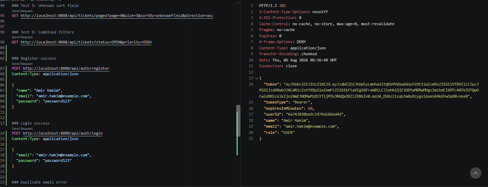
*POST /api/auth/register returns 201 with a JWT token*

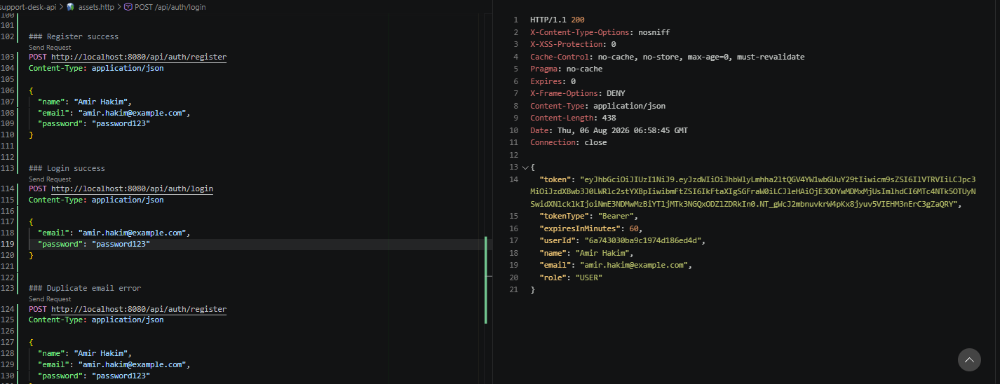
*POST /api/auth/login returns a JWT token for valid credentials*

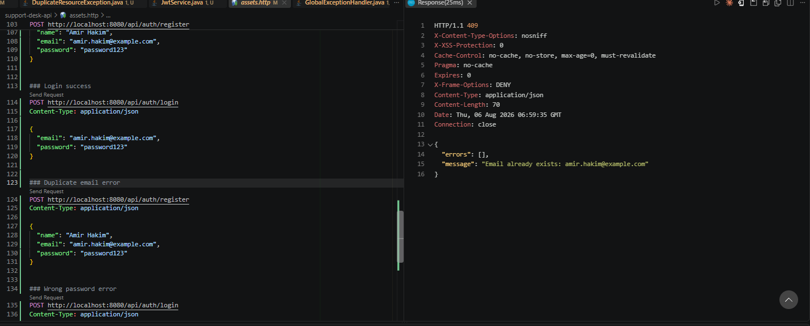
*Registering with an existing email returns 409 Conflict*

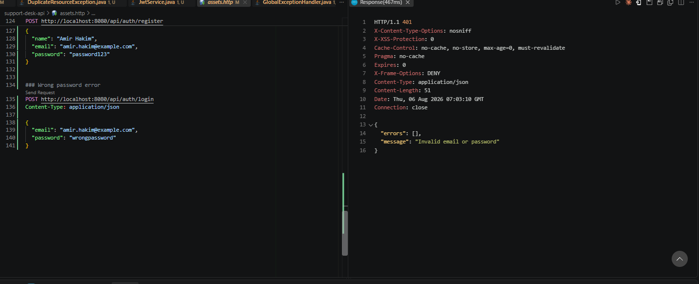
*Logging in with the wrong password returns 401 Unauthorized*

---

## Day 9 Exercise 03 - Protect Ticket Endpoints

Run `mvn spring-boot:run` inside `support-desk-api` to run this exercise. Requires MongoDB running locally.

### Files updated

- `SecurityConfig.java` — expanded from the minimal Exercise 2 version. Added `authorizeHttpRequests` rules: `/api/health` and `/api/auth/**` stay public, `GET /api/tickets/**` requires `USER` or `ADMIN`, `POST /api/tickets` requires `ADMIN` only, everything else requires being logged in. Added `oauth2ResourceServer().jwt(...)` to actually validate incoming tokens, plus two new beans: `JwtDecoder` (validates tokens using the same secret used to sign them) and `JwtAuthenticationConverter` (reads the `role` claim from the token and turns it into a Spring Security authority like `ROLE_ADMIN`, which `hasRole()` checks against).
- `assets.http` — added test requests for all 4 expected behaviours.

### Test Results

| Test | Expected | Result |
|---|---|---|
| `GET /api/tickets` without token | 401 | Confirmed - returned `401` |
| `GET /api/tickets` with USER token | 200 | Confirmed - returned `200` with ticket list |
| `POST /api/tickets` with USER token | 403 | Confirmed - returned `403` with `insufficient_scope` error |
| `POST /api/tickets` with ADMIN token | 201 | Confirmed - returned `201` with the created ticket. Tested after Exercise 4 seeded a real ADMIN account |

### Output Screenshot

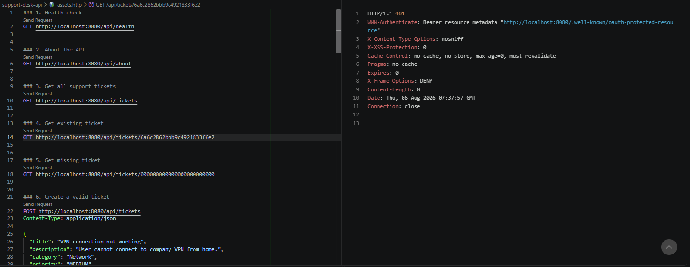
*GET /api/tickets without a token returns 401 Unauthorized*

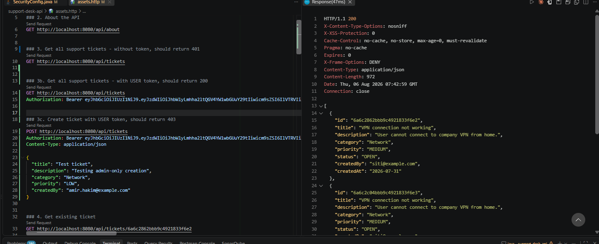
*GET /api/tickets with a USER token returns 200 OK*

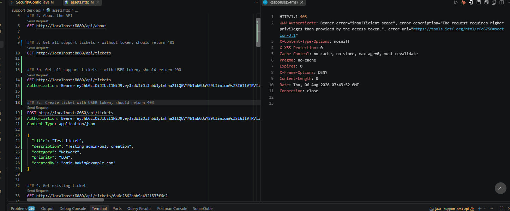
*POST /api/tickets with a USER token returns 403 Forbidden, since only ADMIN can create tickets*

---

## Day 9 Exercise 04 - Seed an Admin User

Run `mvn spring-boot:run` inside `support-desk-api` to run this exercise. Requires MongoDB running locally.

### Files created

- `UserDataSeeder.java` — a `@Configuration` class with a `CommandLineRunner` bean that runs automatically once on every app startup. It seeds one admin account (`admin@example.com` / `Admin@12345`, role `ADMIN`) with the password hashed via `PasswordEncoder`. Checks `existsByEmailIgnoreCase()` first so it never creates a duplicate admin on repeated restarts.

### Output Screenshot

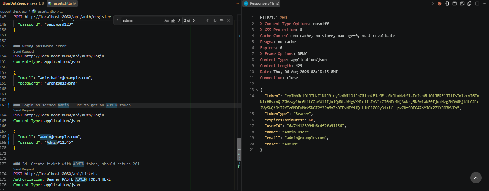
*POST /api/auth/login with the seeded admin credentials returns 200 with role ADMIN*

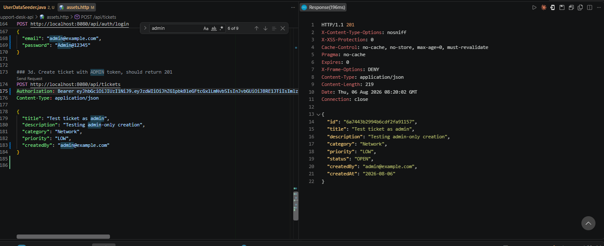
*Using the ADMIN token to create a ticket returns 201 Created, completing the last pending test case from Exercise 3*

---

## Day 9 Exercise 05 - Authentication Test Evidence

Open `requests/day09-auth.http` with the REST Client extension to run this exercise. Requires `support-desk-api` running and MongoDB running locally.

### Files created

- `requests/day09-auth.http` — consolidated `.http` file covering all 8 required auth tests: health public, ticket endpoint requires token, register returns token, login returns token, ticket endpoint with token succeeds, USER token blocked from creating tickets, admin login returns token, ADMIN token allowed to create tickets.

### Test Results

| Test | Expected | Result |
|---|---|---|
| Health endpoint is public | 200 | Confirmed |
| Ticket endpoint without token | 401 | Confirmed |
| Register user returns token | 201 with token | Confirmed in Exercise 2 (this run showed 409 since the test account already existed from earlier testing) |
| Login user returns token | 200 with token | Confirmed |
| Ticket endpoint with token | 200 | Confirmed |
| Create ticket with USER token | 403 | Confirmed |
| Login admin returns token | 200 with role ADMIN | Confirmed |
| Create ticket with ADMIN token | 201 | Confirmed |

### Output Screenshot

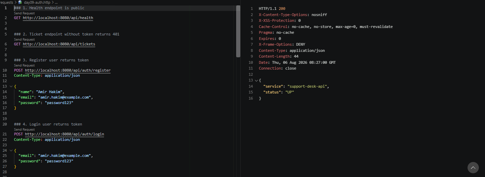
*Health check and setup*

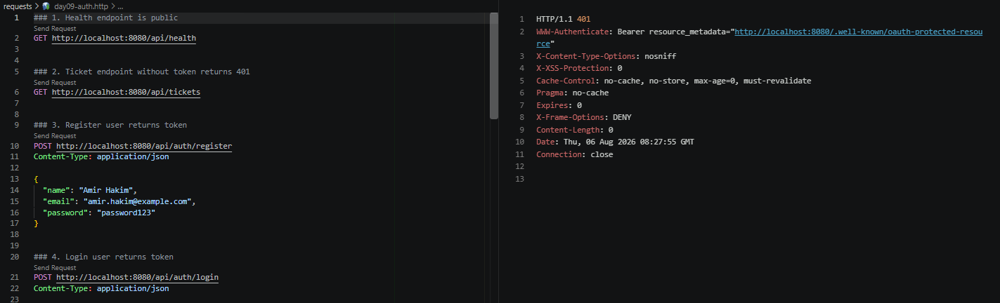
*Ticket endpoint without token returns 401*

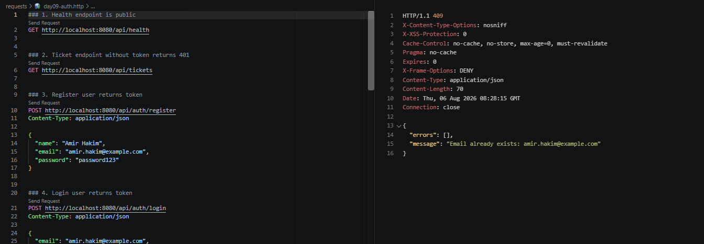
*Register attempt with existing account returns 409, already confirmed working with a fresh account in Exercise 2*

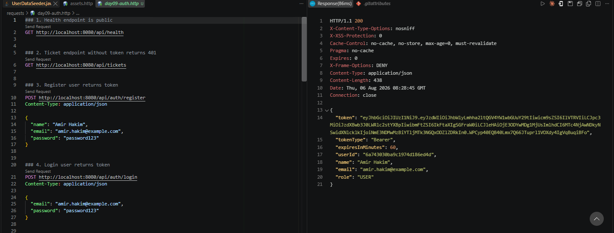
*Login returns a JWT token*

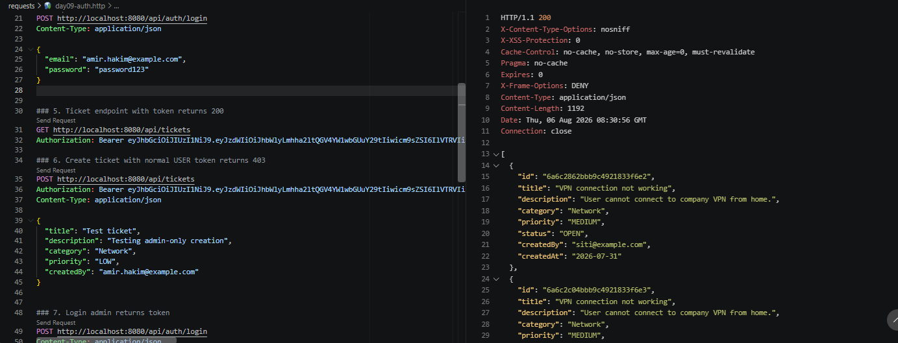
*Ticket endpoint with token returns 200*

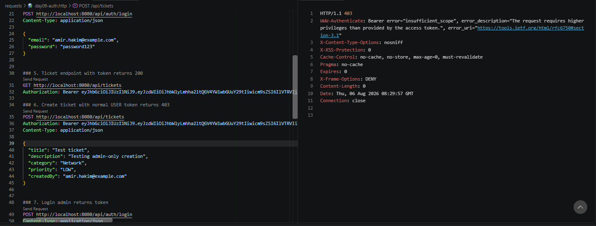
*Create ticket with USER token returns 403*

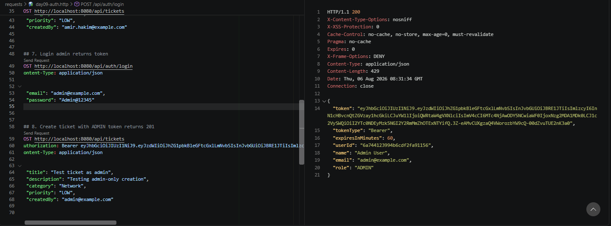
*Admin login returns a JWT token with role ADMIN*

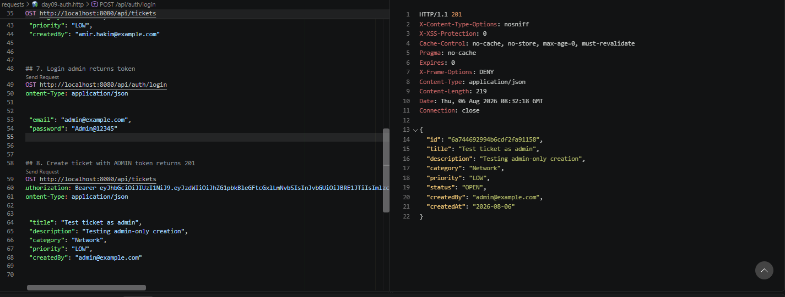
*Create ticket with ADMIN token returns 201*

---

## AI-Assisted Learning Guidelines

Participants may use AI tools to:

* Generate README drafts and documentation sections.

* Create API call examples and JSON payload samples.

* Suggest method signatures and edge cases.

* Propose refactoring options.

* Draft test scenarios for backend and frontend features.

* Suggest MongoDB document structures, queries, indexes, and aggregation pipelines.

* Improve demo scripts and presentation notes.

Participants must always review, verify, test, and understand any AI-generated output. No passwords, API keys, tokens, private keys, or confidential data should be placed into AI prompts.

