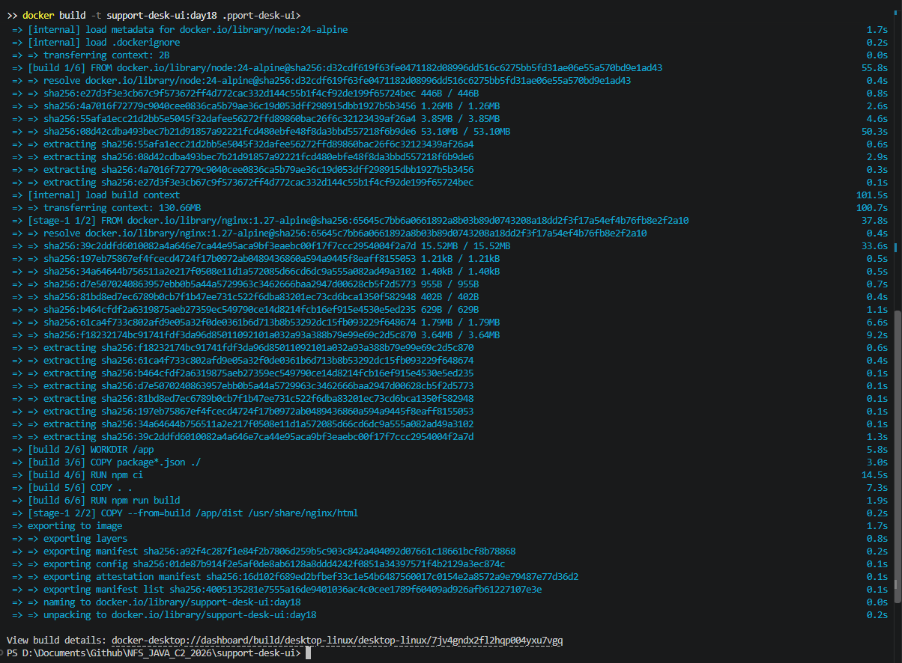
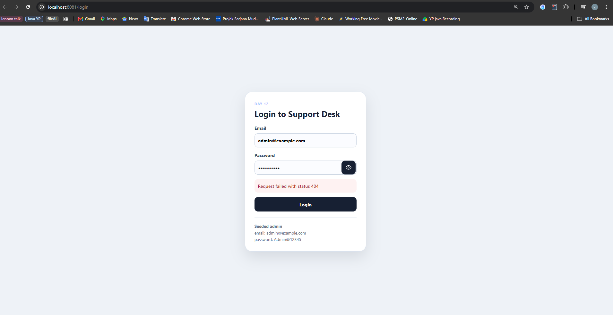
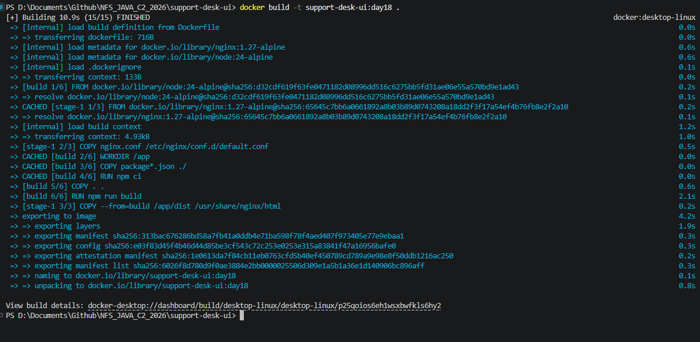
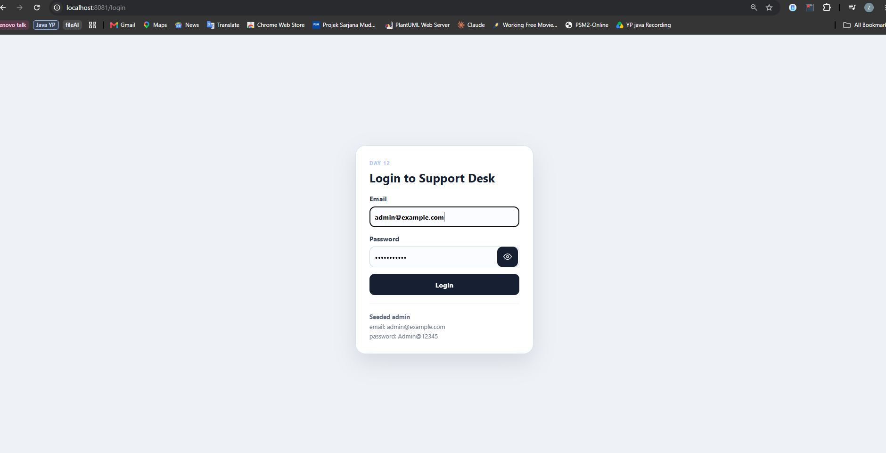
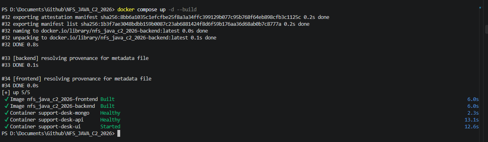
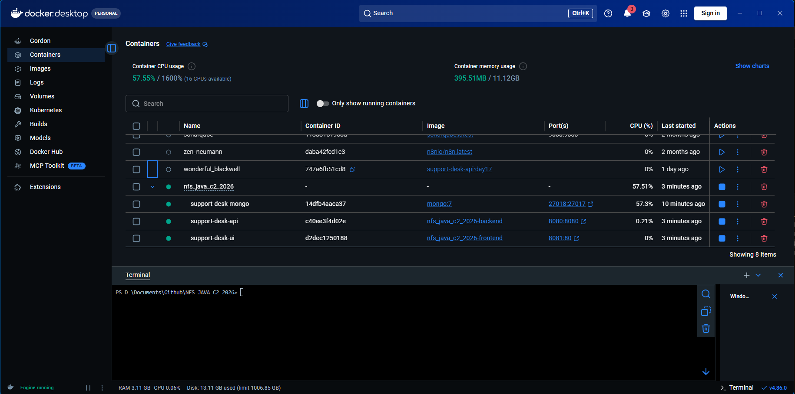

# NFS_JAVA_C2_2026 | Full-Stack Development with Java, React & MongoDB


## Programme Description


This 20-day programme is designed to help participants build a complete full-stack web application using Java, Spring Boot, React, and MongoDB.


The programme takes learners from programming and web fundamentals to backend API development, frontend interface design, database modelling, authentication, testing, performance improvement, and final capstone presentation.


Throughout the programme, participants will work on practical exercises and gradually build a small but production-like web application. The final outcome is a working capstone project that demonstrates the use of a React frontend, Spring Boot backend, MongoDB database, secure authentication, API documentation, testing practices, and deployment-readiness basics.


AI tools such as Gemini are used as learning accelerators to help scaffold examples, suggest refactoring ideas, draft tests, generate sample data, and support MongoDB query or aggregation design. However, participants are expected to review, verify, understand, and take ownership of all generated code.


---


## Programme Duration


* Duration: 20 training days

* Daily Duration: 7 hours per day

* Total Training Hours: 140 hours

* Mode: Instructor-led training with guided labs, team build activities, review sessions, quizzes, and capstone development


---


## Programme Objectives


By the end of this programme, participants will be able to:


* Understand web fundamentals, HTTP, REST, and JSON.

* Write basic to intermediate Java and JavaScript code.

* Build REST APIs using Spring Boot.

* Apply validation, authentication, authorisation, and error-handling practices.

* Model data effectively using MongoDB.

* Use MongoDB indexes, queries, pagination, and aggregation pipelines.

* Build accessible React user interfaces with routing, forms, state, and data fetching.

* Apply testing practices for backend and frontend development.

* Use AI coding assistants responsibly for learning, refactoring, testing, and documentation.

* Design, build, document, and present a full-stack capstone project.


---


---

## Day 18 Exercise 01 - Frontend Dockerfile

Run `docker build -t support-desk-ui:day18 .` inside `support-desk-ui` to run this exercise.

### Files created/updated

- `support-desk-ui/Dockerfile` — multi-stage build. Build stage (`node:24-alpine`) copies `package*.json` first for layer caching, runs `npm ci`, copies source, and runs `npm run build` (Vite build, producing static files in `dist/`). Runtime stage (`nginx:1.27-alpine`, no Node at all) copies **only** `dist/` from the build stage into `/usr/share/nginx/html`. `EXPOSE 80`, plus a `HEALTHCHECK` hitting `/` (using `wget`, since Alpine doesn't ship `curl` by default — same fix applied to the backend Dockerfile in Day 17). `CMD ["nginx", "-g", "daemon off;"]` keeps Nginx in the foreground so Docker tracks it correctly. Satisfies "not use `npm run dev` in the final container" since the runtime image has no Node, no source, and no dev server at all — just static files.
- `support-desk-ui/.dockerignore` — excludes `node_modules`, `dist`, `.git`, test artifacts (`coverage`, `test-results`, `playwright-report`), and editor folders from the build context. Without it, the initial build sent 130.66MB of local `node_modules`/build output to Docker unnecessarily (visible in the first build's `transferring context: 130.66MB` step, which alone took over 100 seconds) — `node_modules` gets reinstalled fresh inside the container via `npm ci` anyway, so shipping the local copy is pure waste.

### Result

`docker build` completes successfully (14/14 steps). Running the container and opening it in a browser correctly serves the fully-styled login page — confirming the static build + Nginx serving works. Submitting the login form correctly fails with "Request failed with status 404" — expected at this stage, not a bug: the frontend calls a relative `/api/...` path that only gets proxied to the backend in Vite's *dev* server config (`vite.config.js`'s `server.proxy`), which has no effect on the production build served by Nginx. Nginx has no rule yet to forward `/api/*` to the backend, so it 404s trying to find a literal file at that path. Fixing that is exactly Day 18 Exercise 2 (Nginx Config).

### Output Screenshot


*docker build completing all 14 steps for support-desk-ui:day18*


*The containerized frontend serving the fully-styled login page via Nginx; the 404 on submit is expected until Exercise 2 adds the API proxy*

---

## Day 18 Exercise 02 - Nginx Config

Run `docker build -t support-desk-ui:day18 .` inside `support-desk-ui` to run this exercise.

### Files created/updated

- `support-desk-ui/nginx.conf` — new custom Nginx server config, replacing the base image's default. `location /api/ { proxy_pass $backend_upstream; }` forwards any `/api/...` request to the backend container (hostname `backend`, port 8080) instead of Nginx trying to serve it as a static file — this is the fix for the 404 from Exercise 1. Uses `resolver 127.0.0.11` (Docker's embedded DNS) plus a `set $backend_upstream` variable so Nginx re-resolves the `backend` hostname per request instead of caching a stale IP if that container restarts. `location / { try_files $uri $uri/ /index.html; }` is the React Router fallback — without it, opening or refreshing a client-side route like `/app/tickets` directly would 404, since Nginx has no idea that path is handled by React Router's JavaScript, not a real file.
- `support-desk-ui/Dockerfile` — added `COPY nginx.conf /etc/nginx/conf.d/default.conf` in the runtime stage, right before copying the built static files, so the image actually uses this config instead of Nginx's generic default.

### Result

`docker build` completes successfully (15/15 steps), and the container still serves the fully-styled login page correctly. The `/api/` proxy rule can't be fully exercised yet, though — it depends on a hostname called `backend` that only resolves once the frontend and backend containers run together on the same Docker network with that service name, which is exactly what Day 18 Exercise 3 (Compose File) sets up next.

### Output Screenshot


*docker build completing all 15 steps, now copying nginx.conf into the image*


*The containerized frontend still serving the login page correctly after the Nginx config change*

---

## Day 18 Exercise 03 - Compose File

Run `docker compose up -d --build` at the repo root to run this exercise.

### Files created/updated

- `compose.yaml` (repo root, new) — defines three services: `mongo` (image `mongo:7`, data persisted in a named volume, host port `27018` to avoid clashing with a local MongoDB already on `27017`), `backend` (built from `./support-desk-api`, depends on `mongo` being healthy), and `frontend` (built from `./support-desk-ui`, depends on `backend` being healthy). All container-to-container communication uses service names (`mongo`, `backend`), never `localhost`.
- `.env.example` (repo root) — rewritten from the leftover trainer template (Asset-Tracker-branded, mismatched variable names) to match this project's real settings.
- `.env` (repo root) — created locally with real values. **Not committed** — covered by the root `.gitignore`'s `*.env` rule.

### The real Day 17 bug, finally found and fixed

While testing this exercise, the MongoDB connectivity bug documented as unresolved back in Day 17 (Exercises 7-8) got tracked down and fixed. Inspecting the actual jars bundled inside the built backend image (`unzip`-ing `BOOT-INF/lib/*.jar` and grepping `META-INF/spring-configuration-metadata.json`) revealed that this Spring Boot version moved MongoDB configuration into a new module (`spring-boot-mongodb`, package `org.springframework.boot.mongodb.autoconfigure`) with a **different property name**: `spring.mongodb.uri`, not the `spring.data.mongodb.uri` this project had used since Day 6. The old property name still exists in metadata (from a separate, parallel `spring-boot-data-mongodb` module) but no longer feeds the actual `MongoClient` bean — so setting it, by any mechanism, silently did nothing. This is also why the trainer's own reference `compose.yml` used `SPRING_MONGODB_URI` rather than `SPRING_DATA_MONGODB_URI` — that naming was the correct answer the whole time.

- `support-desk-api/src/main/resources/application.properties` — `spring.data.mongodb.uri` → `spring.mongodb.uri`.
- `compose.yaml` — backend's environment variable renamed to `SPRING_MONGODB_URI` to match.

A second, smaller issue surfaced once Mongo connectivity was fixed: the frontend container reported `unhealthy` even though it worked fine externally (`curl` to the mapped host port succeeded). The compose/Dockerfile healthchecks used `wget http://localhost/`, and `wget` was resolving `localhost` to `::1` (IPv6) first, while Nginx only listens on `0.0.0.0:80` (IPv4) — a false failure, not a real one. Fixed by using `http://127.0.0.1/` explicitly in both `support-desk-ui/Dockerfile`'s `HEALTHCHECK` and `compose.yaml`'s frontend healthcheck.

### Result

`docker compose up -d --build` brings up all three containers, all reporting `healthy`:

```text
NAMES                STATUS
support-desk-ui      Up 13 seconds (healthy)
support-desk-api     Up 34 seconds (healthy)
support-desk-mongo   Up 4 minutes (healthy)
```

Logging in **through the frontend's Nginx proxy** (`http://localhost:8081/api/auth/login`, not talking to the backend directly) returns a real JWT — proving the Day 18 Exercise 2 proxy rule and this exercise's Compose networking work correctly together, end to end, confirmed by testing.

### Output Screenshot


*docker compose up -d --build bringing up both images and all three containers, mongo/backend healthy*


*Docker Desktop showing support-desk-mongo, support-desk-api, and support-desk-ui all running together under the nfs_java_c2_2026 project*

---

## AI-Assisted Learning Guidelines


Participants may use AI tools to:


* Generate README drafts and documentation sections.

* Create API call examples and JSON payload samples.

* Suggest method signatures and edge cases.

* Propose refactoring options.

* Draft test scenarios for backend and frontend features.

* Suggest MongoDB document structures, queries, indexes, and aggregation pipelines.

* Improve demo scripts and presentation notes.


Participants must always review, verify, test, and understand any AI-generated output. No passwords, API keys, tokens, private keys, or confidential data should be placed into AI prompts.

