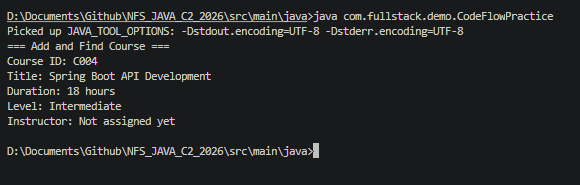
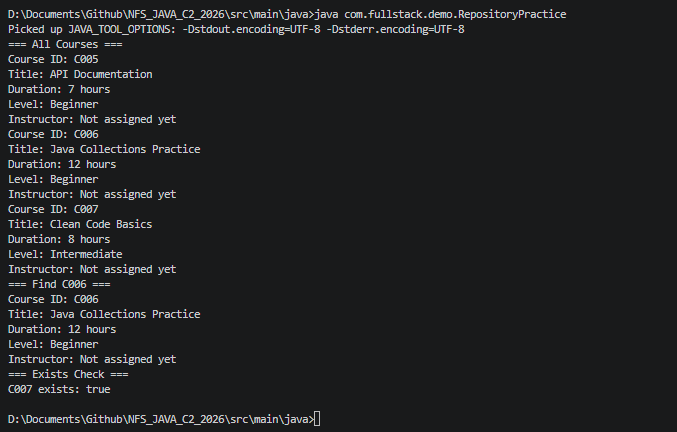

# NFS_JAVA_C2_2026 | Full-Stack Development with Java, React & MongoDB

## Programme Description

This 20-day programme is designed to help participants build a complete full-stack web application using Java, Spring Boot, React, and MongoDB.

The programme takes learners from programming and web fundamentals to backend API development, frontend interface design, database modelling, authentication, testing, performance improvement, and final capstone presentation.

Throughout the programme, participants will work on practical exercises and gradually build a small but production-like web application. The final outcome is a working capstone project that demonstrates the use of a React frontend, Spring Boot backend, MongoDB database, secure authentication, API documentation, testing practices, and deployment-readiness basics.

AI tools such as Gemini are used as learning accelerators to help scaffold examples, suggest refactoring ideas, draft tests, generate sample data, and support MongoDB query or aggregation design. However, participants are expected to review, verify, understand, and take ownership of all generated code.

---

## Programme Duration

* Duration: 20 training days

* Daily Duration: 7 hours per day

* Total Training Hours: 140 hours

* Mode: Instructor-led training with guided labs, team build activities, review sessions, quizzes, and capstone development

---

## Programme Objectives

By the end of this programme, participants will be able to:

* Understand web fundamentals, HTTP, REST, and JSON.

* Write basic to intermediate Java and JavaScript code.

* Build REST APIs using Spring Boot.

* Apply validation, authentication, authorisation, and error-handling practices.

* Model data effectively using MongoDB.

* Use MongoDB indexes, queries, pagination, and aggregation pipelines.

* Build accessible React user interfaces with routing, forms, state, and data fetching.

* Apply testing practices for backend and frontend development.

* Use AI coding assistants responsibly for learning, refactoring, testing, and documentation.

* Design, build, document, and present a full-stack capstone project.

---

---

## Day 3 Exercise 03 - Exception Practice with CourseService

### Why is throwing CourseNotFoundException better than printing inside CourseService?

Because different callers handle errors differently. A console app prints a friendly message, a Spring Boot REST controller returns a `404` HTTP response, and a frontend app shows a popup. If `CourseService` printed the error directly, it would only work for one type of caller. By throwing the exception, the service just reports what went wrong — and each caller decides how to display it.

### Output Screenshot

### GitHub Commit

[https://github.com/zaiedaziem/NFS_JAVA_C2_2026/tree/day3](https://github.com/zaiedaziem/NFS_JAVA_C2_2026/tree/day3)

---

## Day 3 Exercise 02 - Interface and Repository Storage Practice

### Why is InMemoryCourseRepository temporary storage? What would replace it later?

`InMemoryCourseRepository` stores data in a `LinkedHashMap` in RAM. When the program stops, all data is gone — nothing is saved to disk or a database. It is temporary by nature. Later when we connect MongoDB, a `MongoCourseRepository` would replace it. Because `CourseRepository` is an interface, `CourseService` does not need to change at all — only the implementation is swapped.

### Output Screenshot

### GitHub Commit

[https://github.com/zaiedaziem/NFS_JAVA_C2_2026/tree/day3](https://github.com/zaiedaziem/NFS_JAVA_C2_2026/tree/day3)

---

## AI-Assisted Learning Guidelines

Participants may use AI tools to:

* Generate README drafts and documentation sections.

* Create API call examples and JSON payload samples.

* Suggest method signatures and edge cases.

* Propose refactoring options.

* Draft test scenarios for backend and frontend features.

* Suggest MongoDB document structures, queries, indexes, and aggregation pipelines.

* Improve demo scripts and presentation notes.

Participants must always review, verify, test, and understand any AI-generated output. No passwords, API keys, tokens, private keys, or confidential data should be placed into AI prompts.

