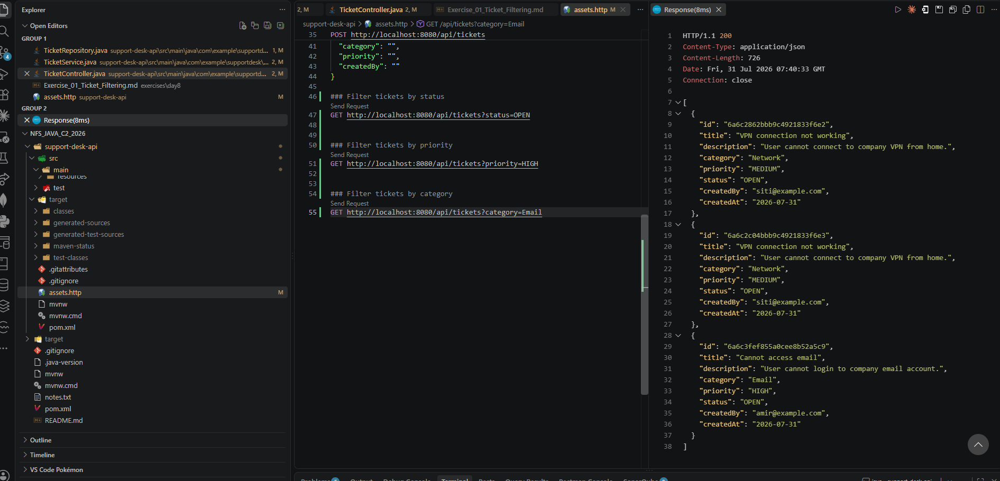
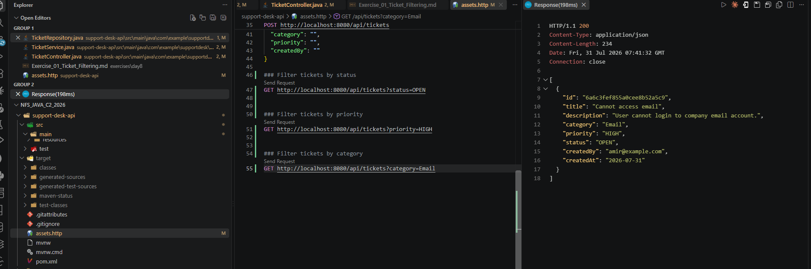
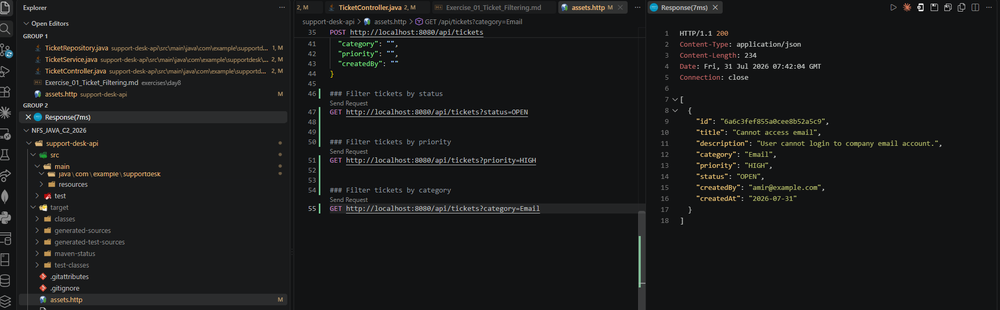
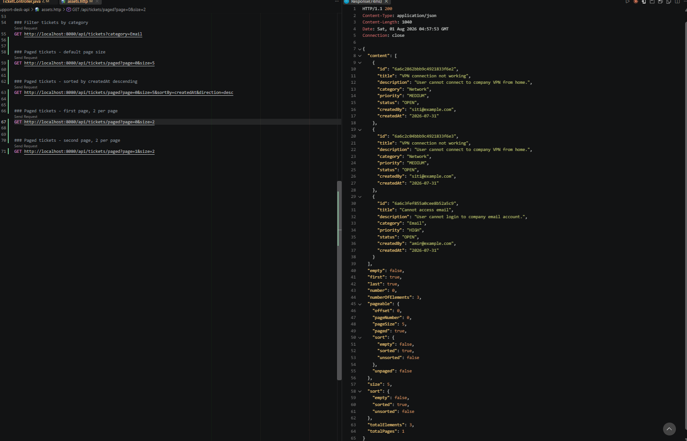
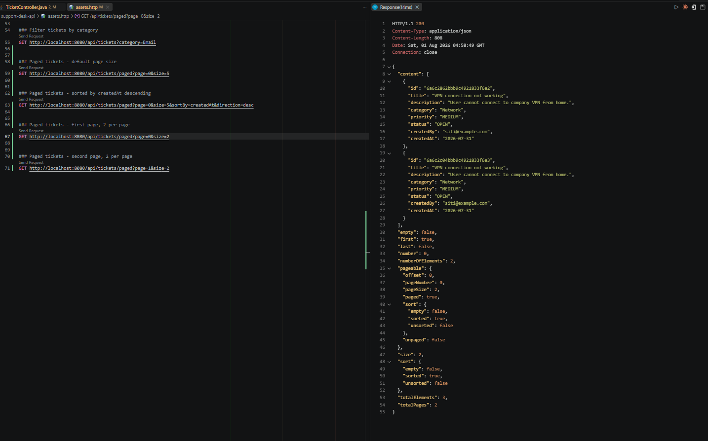
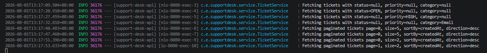

# NFS_JAVA_C2_2026 | Full-Stack Development with Java, React & MongoDB


## Programme Description


This 20-day programme is designed to help participants build a complete full-stack web application using Java, Spring Boot, React, and MongoDB.


The programme takes learners from programming and web fundamentals to backend API development, frontend interface design, database modelling, authentication, testing, performance improvement, and final capstone presentation.


Throughout the programme, participants will work on practical exercises and gradually build a small but production-like web application. The final outcome is a working capstone project that demonstrates the use of a React frontend, Spring Boot backend, MongoDB database, secure authentication, API documentation, testing practices, and deployment-readiness basics.


AI tools such as Gemini are used as learning accelerators to help scaffold examples, suggest refactoring ideas, draft tests, generate sample data, and support MongoDB query or aggregation design. However, participants are expected to review, verify, understand, and take ownership of all generated code.


---


## Programme Duration


* Duration: 20 training days

* Daily Duration: 7 hours per day

* Total Training Hours: 140 hours

* Mode: Instructor-led training with guided labs, team build activities, review sessions, quizzes, and capstone development


---


## Programme Objectives


By the end of this programme, participants will be able to:


* Understand web fundamentals, HTTP, REST, and JSON.

* Write basic to intermediate Java and JavaScript code.

* Build REST APIs using Spring Boot.

* Apply validation, authentication, authorisation, and error-handling practices.

* Model data effectively using MongoDB.

* Use MongoDB indexes, queries, pagination, and aggregation pipelines.

* Build accessible React user interfaces with routing, forms, state, and data fetching.

* Apply testing practices for backend and frontend development.

* Use AI coding assistants responsibly for learning, refactoring, testing, and documentation.

* Design, build, document, and present a full-stack capstone project.


---


---


## Day 8 Exercise 01 - Add Ticket Filtering

Run `mvn spring-boot:run` inside `support-desk-api` to run this exercise. Requires MongoDB running locally.

### Files updated

- `TicketRepository.java` — added `findByStatusIgnoreCase()`, `findByPriorityIgnoreCase()`, and `findByCategoryIgnoreCase()`. Spring Data generates the MongoDB query automatically from the method name, no implementation needed.
- `TicketService.java` — added `getFilteredTickets(status, priority, category)`, which checks each optional filter in order and falls back to `findAll()` when none are provided.
- `TicketController.java` — `GET /api/tickets` now accepts optional query parameters (`@RequestParam(required = false)`) for `status`, `priority`, and `category`, passing them to the service.
- `assets.http` — added test requests for filtering by status, priority, and category.

### Output Screenshot


*GET /api/tickets?status=OPEN returns only matching tickets*


*GET /api/tickets?priority=HIGH returns only matching tickets*


*GET /api/tickets?category=Email returns only matching tickets*

---

## Day 8 Exercise 02 - Add Ticket Pagination and Sorting

Run `mvn spring-boot:run` inside `support-desk-api` to run this exercise. Requires MongoDB running locally.

### Files updated

- `TicketService.java` — added `getTicketsPaged(page, size, sortBy, direction)`, which builds a `Sort` and `Pageable` and calls `findAll(Pageable)` from `MongoRepository`, mapping the resulting `Page<Ticket>` into `Page<TicketResponse>`.
- `TicketController.java` — added `GET /api/tickets/paged`, accepting `page`, `size`, `sortBy`, and `direction` as query parameters with default values (`page=0`, `size=5`, `sortBy=createdAt`, `direction=desc`). Placed before `GET /api/tickets/{id}` so `/paged` is not mistaken for a ticket ID.
- `assets.http` — added test requests for default paging, sorting, and splitting results across two pages.

### Output Screenshot


*GET /api/tickets/paged returns a page of results with pagination metadata*


*Paging and sorting parameters applied correctly*

---

## Day 8 Exercise 03 - Add Ticket Indexes and Logging

Run `mvn spring-boot:run` inside `support-desk-api` to run this exercise. Requires MongoDB running locally.

### Files updated

- `Ticket.java` — added `@Indexed` to `status`, `priority`, `category`, `createdBy`, and `createdAt`, so MongoDB can look up and sort by these fields quickly instead of scanning every document.
- `application.properties` — added `spring.data.mongodb.auto-index-creation=true` so Spring Data automatically creates these indexes on startup.
- `TicketService.java` — added an SLF4J `Logger` and log statements in `getFilteredTickets()`, `getTicketsPaged()`, and `createTicket()`, logging filter values, pagination parameters, and the ID of newly created tickets.

### Output Screenshot


*Terminal logs showing filter values and pagination parameters being fetched*

---

## Day 8 Exercise 04 - Query Test File and Notes

Open `support-desk-api/assets.http` with the REST Client extension to run this exercise. Requires `support-desk-api` running and MongoDB running locally.

### Files updated

- `assets.http` — added the remaining required test request (`page=1&size=5`), completing full coverage of all query, filter, pagination, and sorting scenarios from Exercises 1-3.

### 1. Which query parameters did you implement?

For filtering: `status`, `priority`, `category` on `GET /api/tickets`. For pagination: `page`, `size`, `sortBy`, `direction` on `GET /api/tickets/paged`.

### 2. Which fields did you index?

`status`, `priority`, `category`, `createdBy`, and `createdAt`, using `@Indexed` on the `Ticket` model.

### 3. Why should an API use pagination?

Returning every record in one response does not scale. As the ticket collection grows to thousands of entries, sending them all at once would slow down the API and overwhelm the client. Pagination limits each response to a manageable page size, letting the client request more as needed.

### 4. What log messages appear when you call the filtering endpoint?

```
Fetching tickets with status=OPEN, priority=null, category=null
```

The unused filters show as `null`, confirming only one filter is applied at a time.

### 5. What endpoint proves your sorting works?

```
GET /api/tickets/paged?page=0&size=5&sortBy=createdAt&direction=desc
```

The response's `pageable.sort` shows `sorted: true`, confirming sorting is applied based on the `sortBy` and `direction` parameters.

---

## AI-Assisted Learning Guidelines


Participants may use AI tools to:


* Generate README drafts and documentation sections.

* Create API call examples and JSON payload samples.

* Suggest method signatures and edge cases.

* Propose refactoring options.

* Draft test scenarios for backend and frontend features.

* Suggest MongoDB document structures, queries, indexes, and aggregation pipelines.

* Improve demo scripts and presentation notes.


Participants must always review, verify, test, and understand any AI-generated output. No passwords, API keys, tokens, private keys, or confidential data should be placed into AI prompts.

