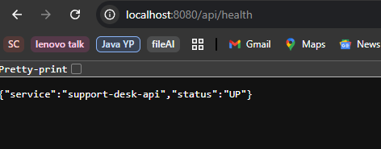
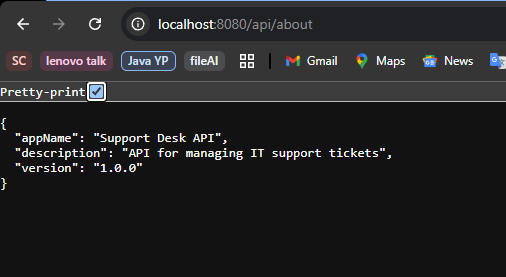
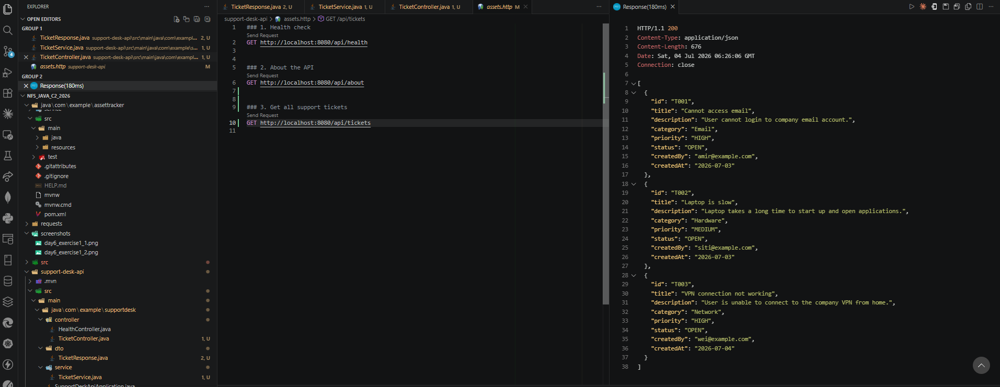
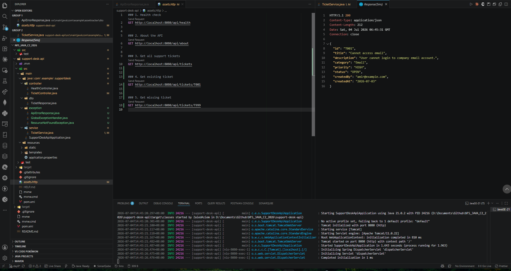
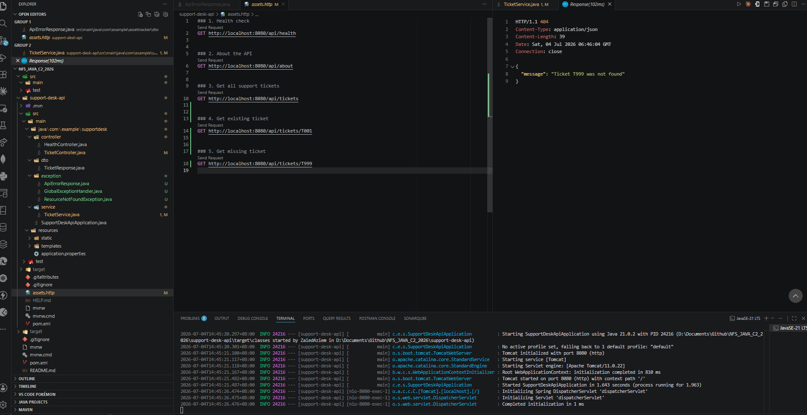
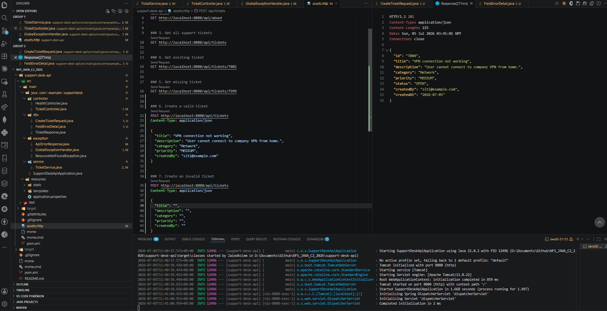
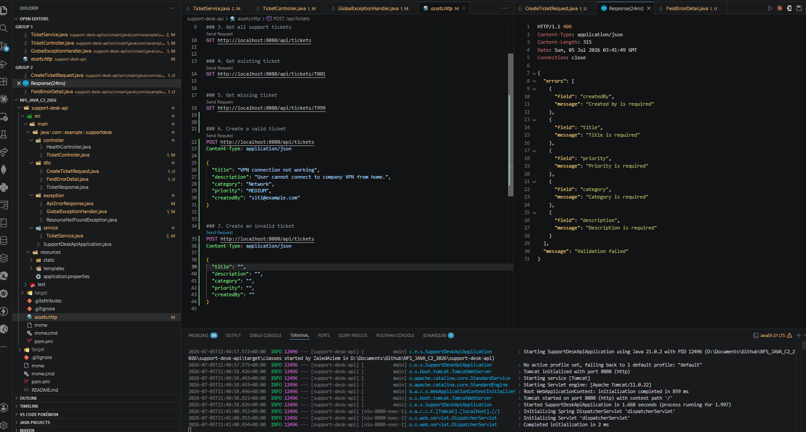

# NFS_JAVA_C2_2026 | Full-Stack Development with Java, React & MongoDB

## Programme Description

This 20-day programme is designed to help participants build a complete full-stack web application using Java, Spring Boot, React, and MongoDB.

The programme takes learners from programming and web fundamentals to backend API development, frontend interface design, database modelling, authentication, testing, performance improvement, and final capstone presentation.

Throughout the programme, participants will work on practical exercises and gradually build a small but production-like web application. The final outcome is a working capstone project that demonstrates the use of a React frontend, Spring Boot backend, MongoDB database, secure authentication, API documentation, testing practices, and deployment-readiness basics.

AI tools such as Gemini are used as learning accelerators to help scaffold examples, suggest refactoring ideas, draft tests, generate sample data, and support MongoDB query or aggregation design. However, participants are expected to review, verify, understand, and take ownership of all generated code.

---

## Programme Duration

* Duration: 20 training days

* Daily Duration: 7 hours per day

* Total Training Hours: 140 hours

* Mode: Instructor-led training with guided labs, team build activities, review sessions, quizzes, and capstone development

---

## Programme Objectives

By the end of this programme, participants will be able to:

* Understand web fundamentals, HTTP, REST, and JSON.

* Write basic to intermediate Java and JavaScript code.

* Build REST APIs using Spring Boot.

* Apply validation, authentication, authorisation, and error-handling practices.

* Model data effectively using MongoDB.

* Use MongoDB indexes, queries, pagination, and aggregation pipelines.

* Build accessible React user interfaces with routing, forms, state, and data fetching.

* Apply testing practices for backend and frontend development.

* Use AI coding assistants responsibly for learning, refactoring, testing, and documentation.

* Design, build, document, and present a full-stack capstone project.

---

---

## Day 6 Exercise 01 - Health and About Endpoints

Run `mvn spring-boot:run` inside `support-desk-api` to run this exercise.

### Files created

- `support-desk-api/` — new Spring Boot project generated from Spring Initializr with group `com.example`, artifact `support-desk-api`, package `com.example.supportdesk`, and the Spring Web dependency.
- `HealthController.java` — a `@RestController` with two `GET` endpoints: `/api/health` returns a status and service name, `/api/about` returns app name, version, and description. Both return a `Map<String, String>` which Spring automatically converts into JSON.

### Output Screenshot

*GET /api/health response*

*GET /api/about response*

---

## Day 6 Exercise 02 - Build the Ticket Read API

Run `mvn spring-boot:run` inside `support-desk-api` to run this exercise.

### Files created

- `TicketResponse.java` — a DTO holding ticket fields (id, title, description, category, priority, status, createdBy, createdAt) with getters. Shapes what gets returned as JSON.
- `TicketService.java` — a `@Service` bean that holds a hardcoded list of 3 tickets and exposes `getAllTickets()` to return them.
- `TicketController.java` — a `@RestController` that depends on `TicketService` through constructor injection and exposes `GET /api/tickets`, returning the ticket list as a JSON array.

### Output Screenshot

*GET /api/tickets response showing the hardcoded ticket list*

---

## Day 6 Exercise 03 - Ticket by ID and 404 Handling

Run `mvn spring-boot:run` inside `support-desk-api` to run this exercise.

### Files created

- `ResourceNotFoundException.java` — a custom exception extending `RuntimeException`, thrown when a ticket ID is not found.
- `ApiErrorResponse.java` — a simple DTO holding an error message, returned as JSON when an exception is caught.
- `GlobalExceptionHandler.java` — a `@RestControllerAdvice` that catches `ResourceNotFoundException` anywhere in the app and converts it into a `404 Not Found` response with the error message.
- `TicketService.java` — added `getTicketById(String id)` which searches the ticket list using a stream and throws `ResourceNotFoundException` if no match is found.
- `TicketController.java` — added `GET /api/tickets/{id}` which reads the ID from the URL using `@PathVariable` and delegates the lookup to the service.

### Output Screenshot

*GET /api/tickets/T001 - existing ticket returns 200 OK*

*GET /api/tickets/T999 - missing ticket returns 404 Not Found*

---

## Day 6 Exercise 04 - Create Ticket with Validation

Run `mvn spring-boot:run` inside `support-desk-api` to run this exercise.

### Files created

- `CreateTicketRequest.java` — a request DTO with `@NotBlank` validation on all 5 required fields (title, description, category, priority, createdBy).
- `FieldErrorDetail.java` — pairs a field name with its validation error message.
- `ApiErrorResponse.java` — updated to hold both a `message` and a list of `FieldErrorDetail`, so validation failures return field-level detail instead of just a generic message.
- `TicketService.java` — added `createTicket()` which generates a new ID, sets status to `OPEN`, sets the current date, and adds the ticket to the in-memory list.
- `TicketController.java` — added `POST /api/tickets` using `@Valid @RequestBody`, returning `201 Created` on success.
- `GlobalExceptionHandler.java` — added a handler for `MethodArgumentNotValidException` that collects all field errors and returns them in a `400 Bad Request` response.

### Output Screenshot

*POST /api/tickets with valid data - returns 201 Created*

*POST /api/tickets with blank fields - returns 400 Bad Request with field-level errors*

---

## AI-Assisted Learning Guidelines

Participants may use AI tools to:

* Generate README drafts and documentation sections.

* Create API call examples and JSON payload samples.

* Suggest method signatures and edge cases.

* Propose refactoring options.

* Draft test scenarios for backend and frontend features.

* Suggest MongoDB document structures, queries, indexes, and aggregation pipelines.

* Improve demo scripts and presentation notes.

Participants must always review, verify, test, and understand any AI-generated output. No passwords, API keys, tokens, private keys, or confidential data should be placed into AI prompts.

