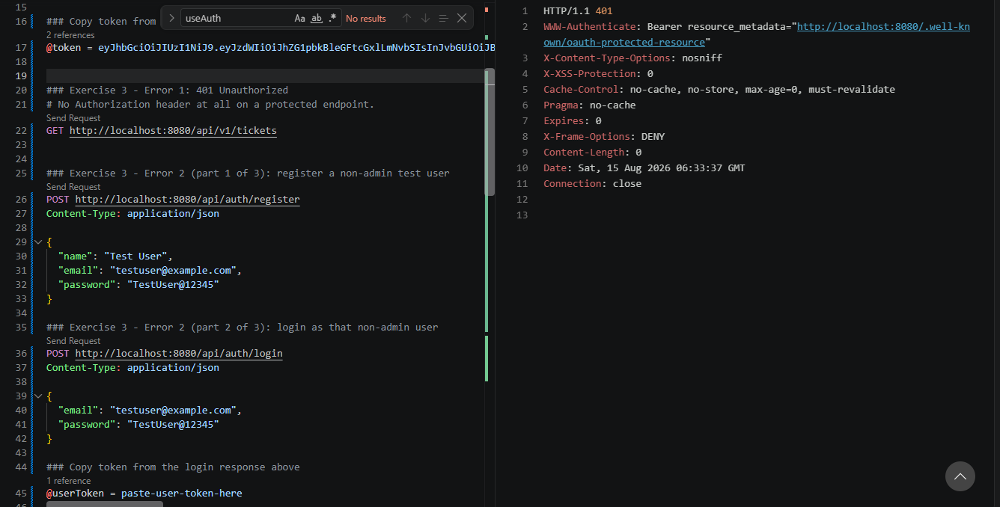
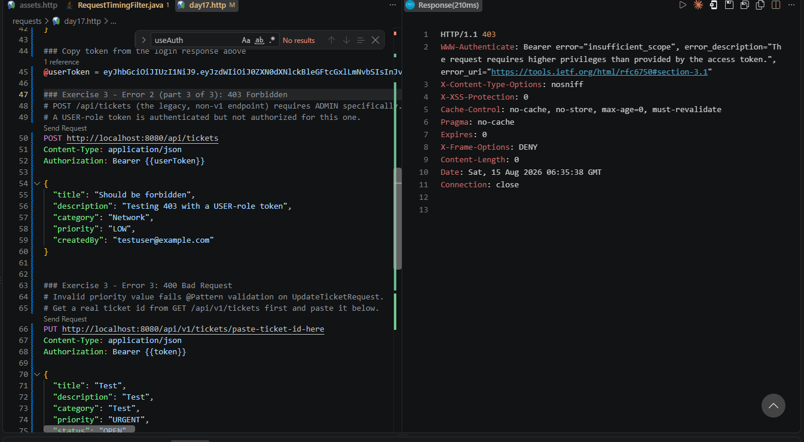
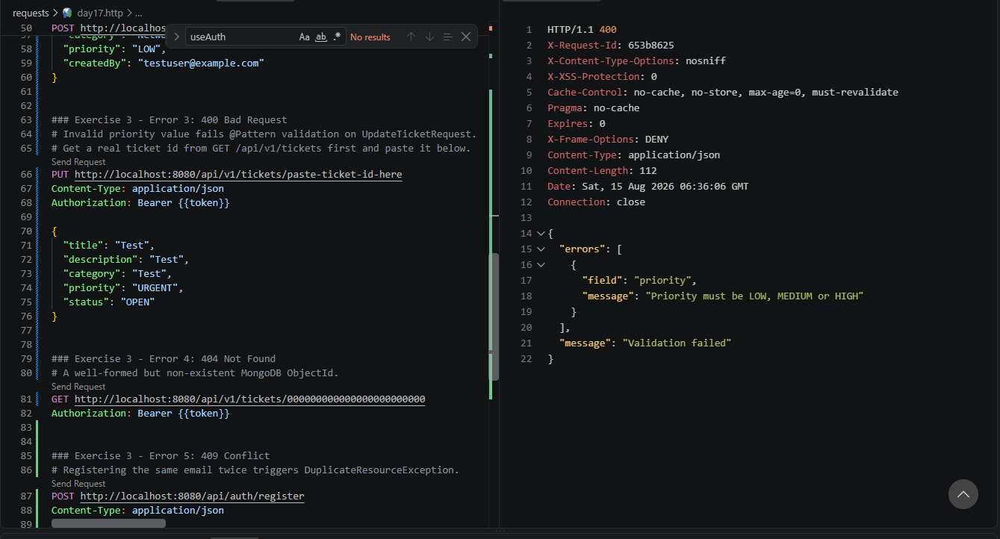
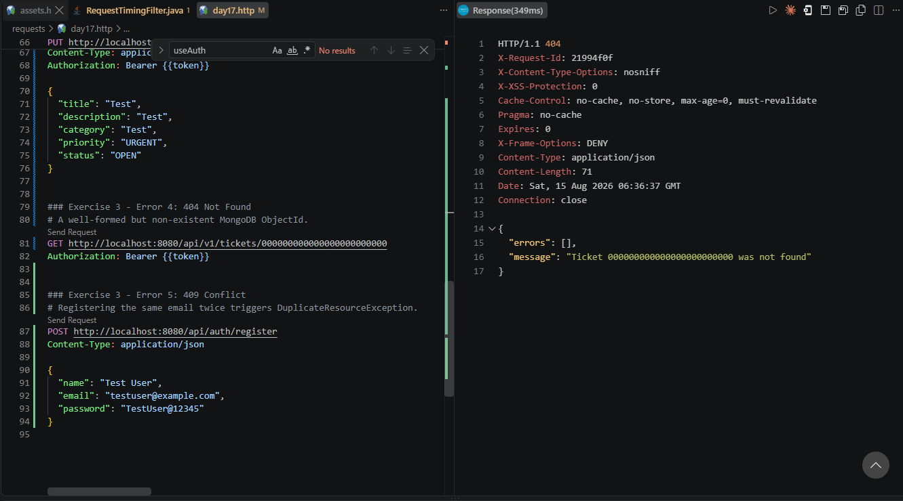
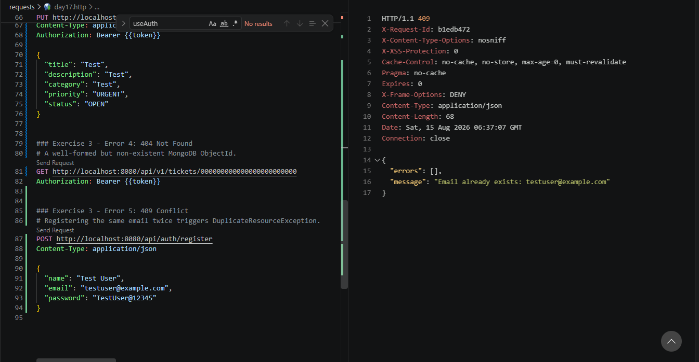
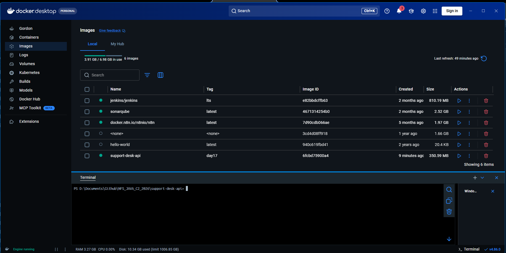

# NFS_JAVA_C2_2026 | Full-Stack Development with Java, React & MongoDB


## Programme Description


This 20-day programme is designed to help participants build a complete full-stack web application using Java, Spring Boot, React, and MongoDB.


The programme takes learners from programming and web fundamentals to backend API development, frontend interface design, database modelling, authentication, testing, performance improvement, and final capstone presentation.


Throughout the programme, participants will work on practical exercises and gradually build a small but production-like web application. The final outcome is a working capstone project that demonstrates the use of a React frontend, Spring Boot backend, MongoDB database, secure authentication, API documentation, testing practices, and deployment-readiness basics.


AI tools such as Gemini are used as learning accelerators to help scaffold examples, suggest refactoring ideas, draft tests, generate sample data, and support MongoDB query or aggregation design. However, participants are expected to review, verify, understand, and take ownership of all generated code.


---


## Programme Duration


* Duration: 20 training days

* Daily Duration: 7 hours per day

* Total Training Hours: 140 hours

* Mode: Instructor-led training with guided labs, team build activities, review sessions, quizzes, and capstone development


---


## Programme Objectives


By the end of this programme, participants will be able to:


* Understand web fundamentals, HTTP, REST, and JSON.

* Write basic to intermediate Java and JavaScript code.

* Build REST APIs using Spring Boot.

* Apply validation, authentication, authorisation, and error-handling practices.

* Model data effectively using MongoDB.

* Use MongoDB indexes, queries, pagination, and aggregation pipelines.

* Build accessible React user interfaces with routing, forms, state, and data fetching.

* Apply testing practices for backend and frontend development.

* Use AI coding assistants responsibly for learning, refactoring, testing, and documentation.

* Design, build, document, and present a full-stack capstone project.


---


---

## Day 17 Exercise 01 - Structured Logs and Request Timing

Run `mvn spring-boot:run` inside `support-desk-api` to run this exercise. Test with `requests/day17.http`.

### Files created/updated

- `config/RequestTimingFilter.java` — a `@Component` implementing `Filter`, registered automatically as a Spring bean. For every request it generates a short `requestId` (from a UUID), times the request with `System.currentTimeMillis()` around `chain.doFilter(...)`, and logs one line: `requestId=... method=... path=... status=... durationMs=...`. The `requestId` is also set as an `X-Request-Id` response header and in MDC. Deliberately logs only the method, URI path, status code, requestId, and duration — never the request body, `Authorization` header, passwords, tokens, or any secret value.

### Result

Every request logs a clean, safe timing line, confirmed by testing.

### Output Screenshot


*`GET /api/health` logged as `requestId=800986d8 method=GET path=/api/health status=200 durationMs=50`*

---

## Day 17 Exercise 02 - Readiness Endpoint

Run `mvn spring-boot:run` inside `support-desk-api` to run this exercise. Test with `requests/day17.http`.

### Files created/updated

- `controller/ReadinessController.java` — new `GET /api/readiness` endpoint. Calls `ticketRepository.count()` to actually verify the MongoDB connection is alive rather than assuming it. On success, returns 200 with `service`, `status: "READY"`, `database: "CONNECTED"`, `ticketCount`, and `timestamp`. If that call throws (database unreachable), returns `503 Service Unavailable` with `status: "NOT_READY"`, `database: "UNAVAILABLE"`, and `message: "Database readiness check failed"`.
- `security/SecurityConfig.java` — added `.requestMatchers("/api/readiness").permitAll()`, same as `/api/health`, so readiness checks don't require a JWT.

### Result

With MongoDB running, `GET /api/readiness` returns 200 with `status: "READY"`. With the backend already running and MongoDB then stopped, the same request returns 503 with `status: "NOT_READY"`, confirmed by testing both paths.

### Output Screenshot


*`GET /api/readiness` returns 200 with status READY and database CONNECTED while MongoDB is up*


*With the backend already running and MongoDB stopped, the same request returns 503 with status NOT_READY and database UNAVAILABLE*

---

## Day 17 Exercise 03 - Error Tracking Practice

Run `mvn spring-boot:run` inside `support-desk-api` to run this exercise. Test with `requests/day17.http`.

### Files created/updated

- `requests/day17.http` — added five requests, each deliberately triggering one error status: no token on a protected endpoint, a USER-role token hitting an ADMIN-only endpoint, an invalid priority value, a made-up ticket id, and a duplicate email registration. Also fixed the leftover trainer asset-domain requests (`/api/v1/assets/paged`) to use the actual ticket endpoints.

### Error table

| Error | Request made | Why it happened | Where seen |
|---|---|---|---|
| 401 Unauthorized | `GET /api/v1/tickets` with no `Authorization` header | No token supplied, so Spring Security's resource server rejects the request before it reaches the controller | `WWW-Authenticate: Bearer` header in the response |
| 403 Forbidden | `POST /api/tickets` (legacy, non-v1) with a USER-role token | That endpoint requires `ADMIN` specifically (`SecurityConfig`); the token is valid and authenticated, just not authorized | `WWW-Authenticate: Bearer error="insufficient_scope"` in the response |
| 400 Bad Request | `PUT /api/v1/tickets/{id}` with `priority: "URGENT"` | Fails the `@Pattern` validation on `UpdateTicketRequest`, caught by `GlobalExceptionHandler`'s `MethodArgumentNotValidException` handler | Response body: `"message": "Priority must be LOW, MEDIUM or HIGH"` |
| 404 Not Found | `GET /api/v1/tickets/000000000000000000000000` | Well-formed MongoDB ObjectId, but no matching document; `findTicketOrThrow` throws `ResourceNotFoundException` | Response body: `"Ticket 000000000000000000000000 was not found"` |
| 409 Conflict | `POST /api/auth/register` with an email already used | `AuthService.register()` checks `existsByEmailIgnoreCase` first and throws `DuplicateResourceException` | Response body: `"Email already exists: testuser@example.com"` |

### Result

All five error paths triggered and confirmed with the exact status code and message expected, confirmed by testing.

### Output Screenshot


*401 from a protected endpoint with no Authorization header*


*403 from a USER-role token hitting an ADMIN-only endpoint*


*400 from an invalid priority value*


*404 from a well-formed but non-existent ticket id*


*409 from registering an already-used email*

---

## Day 17 Exercise 04 - Performance and Index Review

### Files created/updated

- [`docs/day17-index-tuning-notes.md`](docs/day17-index-tuning-notes.md) — new notes covering fields used for filtering, sorting, uniqueness, and reports, cross-referenced against `Ticket.java`'s `@Indexed` annotations, `TicketService`'s filter/sort logic, and `TicketReportService`'s aggregation grouping fields. Includes real `mongosh db.tickets.getIndexes()` output and real `curl -w` timing measurements — no invented numbers.

### Result

Every field marked `@Indexed` (`category`, `priority`, `status`, `createdBy`, `createdAt`) is confirmed to have a real MongoDB index. One gap found: sorting by `title` (offered in the frontend's sort dropdown) has no matching index. One unrelated environment finding: the actual ticket/user data lives in the `test` database, not `support_desk_db` as `application.properties` configures — `support_desk_db` doesn't exist on this machine at all. Documented as a known discrepancy, not fixed as part of this exercise.

---

## Day 17 Exercise 05 - Input Sanitisation

Run `mvn test -Dtest=InputSanitizerTest` inside `support-desk-api` to run this exercise.

### Files created/updated

- `util/InputSanitizer.java` — new utility with `trimToNull(value)`, `cleanText(value)` (trims, strips real control characters via `\p{Cntrl}`, collapses whitespace — deliberately keeps normal punctuation like `!`/`?` intact), and `upperCode(value)` (clean + uppercase, for priority/status).
- `test/java/.../util/InputSanitizerTest.java` — 6 unit tests covering trimming, blank-to-null conversion, punctuation preservation, control-character/whitespace cleanup, and code uppercasing.
- `service/TicketService.java` — `createTicket`/`updateTicket` now call `InputSanitizer.cleanText`/`upperCode` instead of the private `normalizeRequired`/`normalizeStatus`/`normalizePriority` helpers added in Day 16 (which only trimmed); those are now removed since the new utility does the same job plus strips control characters.

Two things fixed from the trainer's reference `InputSanitizer` while adapting it: their `cleanText` used `.replaceAll("\\{Cntrl\\}", "")`, which is broken regex matching the literal text `{Cntrl}`, not control characters — fixed to `\p{Cntrl}`. Their version also stripped *all* punctuation, which would mangle a normal ticket description like `"Cannot connect to VPN!"` into `"Cannot connect to VPN"` — ours only strips genuine control characters, since punctuation isn't a security or data-quality problem for free-text fields.

### Reflection

1. **What is validation?** Deciding whether an input is allowed at all, e.g. `@NotBlank`/`@Pattern` on priority/status. If it fails, the request is rejected outright.
2. **What is sanitisation?** Cleaning up input that is already allowed, before storing it, e.g. trimming, removing control characters, normalizing case, without changing whether it was valid.
3. **Example where input should be cleaned:** A ticket title typed as `"  Cannot connect to VPN  "`. The extra whitespace is harmless and should just be trimmed, not rejected.
4. **Example where input should be rejected:** A priority of `"URGENT"`. That is not a valid enum value; sanitisation must never silently rewrite it to something valid, since that would hide a real client bug or a deliberate bypass attempt.

### Result

`mvn test -Dtest=InputSanitizerTest` passes 6 tests, all green. `mvn compile` confirms `TicketService` still builds after swapping in the new utility, confirmed by testing.

---

## Day 17 Exercise 06 - Security Hardening Evidence

### Files created/updated

- [`docs/day17-security-hardening-evidence.md`](docs/day17-security-hardening-evidence.md) — new evidence document covering all 6 required items: missing token → 401, wrong role → 403, duplicate record → 409, invalid input → 400, logs never showing JWTs/passwords, and `.env` not being committed. Items 1-4 reuse the real screenshots already captured in Exercise 3; item 5 reuses the safe log line from Exercise 1; item 6 is a fresh `git ls-files` check confirming only `.env.example` (a safe template with placeholder values) is tracked, with real `.env`/secrets/keys excluded by the root `.gitignore`.

### Result

All 6 required evidence items collected and verified against the actual repo state, confirmed by review.

---

## Day 17 Exercise 07 - Backend Dockerfile

### Files created/updated

- `support-desk-api/Dockerfile` — multi-stage build. Build stage (`maven:3.9-eclipse-temurin-21`) copies `pom.xml` first and runs `dependency:resolve`/`dependency:resolve-plugins` so that layer is cached separately from source changes, then copies `src/` and runs `mvn clean package`. Runtime stage (`eclipse-temurin:21-jre-alpine`, a much smaller image with no build tools) copies **only** the final built JAR from the build stage. `EXPOSE 8080`, plus a `HEALTHCHECK` hitting `/api/health`. No secrets baked in — `app.jwt.secret` still comes from a runtime environment variable, same as it always has.

Bugs fixed while adapting the trainer's reference Dockerfile: `HEALTHCHECK --retries=` had no value (invalid Docker syntax); the health check used `curl`, which the Alpine-based runtime image doesn't include by default (switched to `wget`, which Alpine's busybox does include); and `dependency:go-offline` was swapped for the lighter `dependency:resolve`/`dependency:resolve-plugins`, since `go-offline` tries to resolve a large, mostly-unnecessary dependency tree (reporting/doc-generation plugins the app doesn't use), which made it more prone to failing on a flaky connection than it needed to be.

### Result

`docker build -t support-desk-api:day17 .` completes successfully — all 16 build steps pass, image produced.

Also tried actually running the built image to double-check it serves traffic. Found (but did not fix, out of scope for this exercise) the same robustness gap noted back in Exercise 2: `UserDataSeeder` makes a blocking database call at startup, so if MongoDB isn't reachable in time, the container exits instead of starting and staying up to serve `/api/health`/`/api/readiness` (which themselves don't need the seeder to have succeeded). A real deployment would need MongoDB reachable before the app container starts (e.g. via `docker-compose` service dependencies), or `UserDataSeeder` would need to tolerate a temporarily unavailable database instead of failing startup outright.

### Output

```text
PS> docker build -t support-desk-api:day17 .
[+] Building 71.8s (16/16) FINISHED
 => [build 1/7] FROM docker.io/library/maven:3.9-eclipse-temurin-21@sha256:c07f7ccf...
 => [stage-1 1/3] FROM docker.io/library/eclipse-temurin:21-jre-alpine@sha256:3f08b1...
 => CACHED [stage-1 2/3] WORKDIR /app
 => CACHED [build 2/7] WORKDIR /workspace
 => CACHED [build 3/7] COPY pom.xml ./
 => [build 4/7] RUN mvn -B -DskipTests dependency:resolve dependency:resolve-plugins
 => [build 5/7] COPY src ./src
 => [build 6/7] RUN mvn -B clean package -DskipTests
 => [build 7/7] RUN JAR_FILE=$(find target -maxdepth 1 -type f -name "*.jar" ...)
 => [stage-1 3/3] COPY --from=build /workspace/app.jar app.jar
 => exporting to image
 => => naming to docker.io/library/support-desk-api:day17
```

### Output Screenshot


*support-desk-api:day17 (350.59 MB) built and listed in Docker Desktop's local images*

---

## AI-Assisted Learning Guidelines


Participants may use AI tools to:


* Generate README drafts and documentation sections.

* Create API call examples and JSON payload samples.

* Suggest method signatures and edge cases.

* Propose refactoring options.

* Draft test scenarios for backend and frontend features.

* Suggest MongoDB document structures, queries, indexes, and aggregation pipelines.

* Improve demo scripts and presentation notes.


Participants must always review, verify, test, and understand any AI-generated output. No passwords, API keys, tokens, private keys, or confidential data should be placed into AI prompts.

