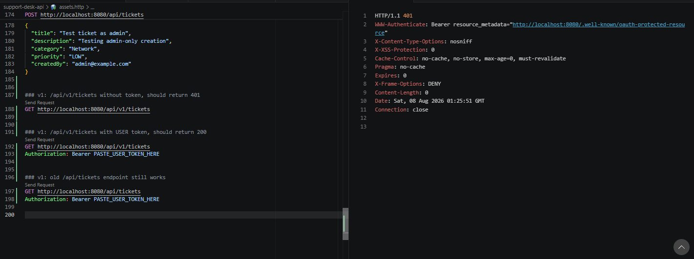
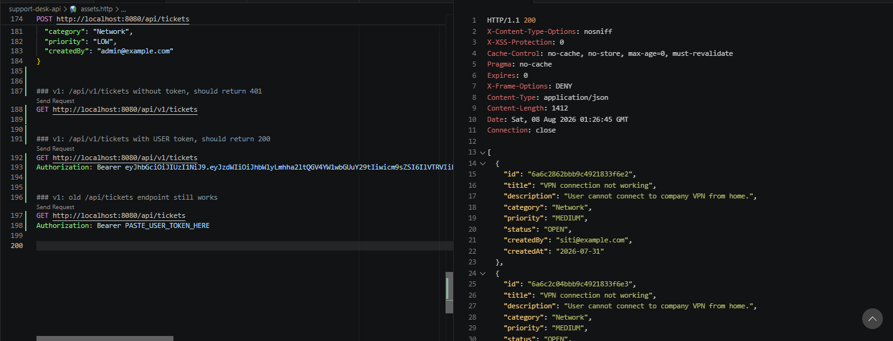
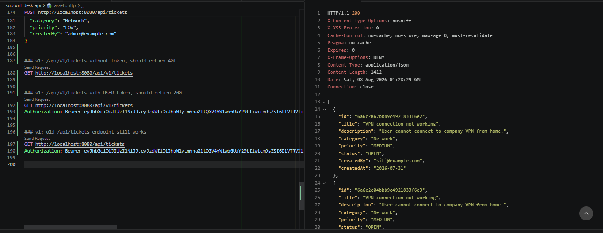
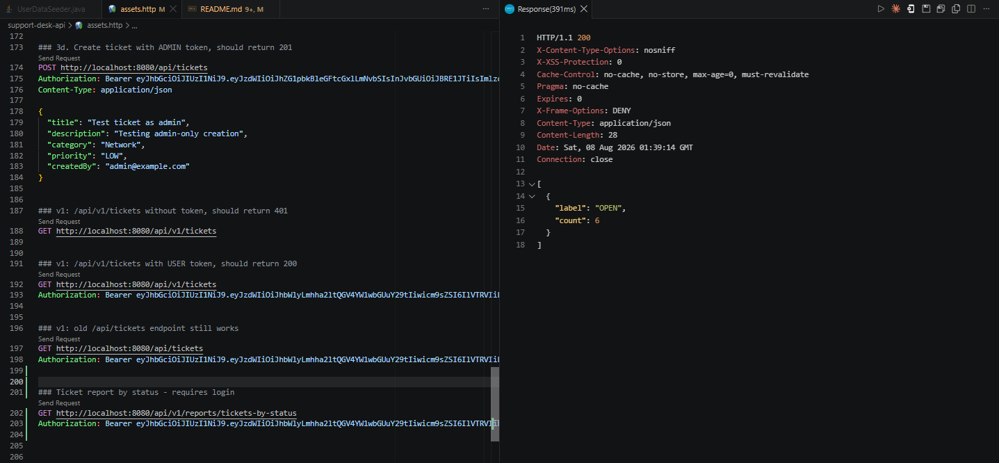
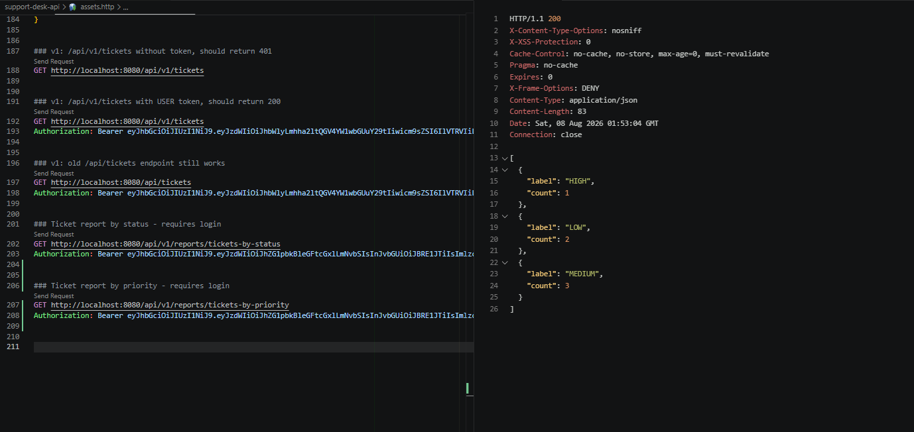
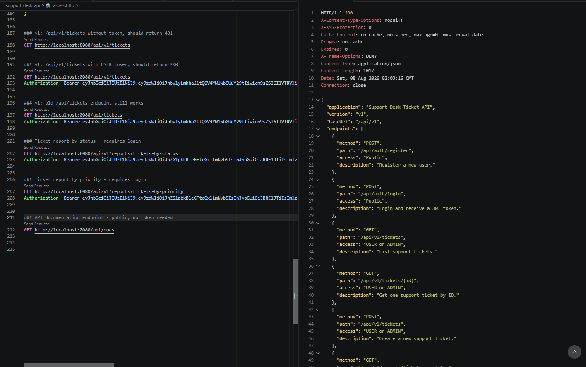
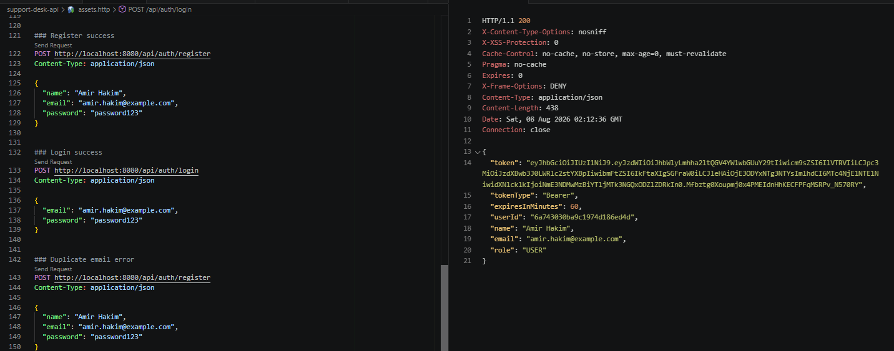

# NFS_JAVA_C2_2026 | Full-Stack Development with Java, React & MongoDB

## Programme Description

This 20-day programme is designed to help participants build a complete full-stack web application using Java, Spring Boot, React, and MongoDB.

The programme takes learners from programming and web fundamentals to backend API development, frontend interface design, database modelling, authentication, testing, performance improvement, and final capstone presentation.

Throughout the programme, participants will work on practical exercises and gradually build a small but production-like web application. The final outcome is a working capstone project that demonstrates the use of a React frontend, Spring Boot backend, MongoDB database, secure authentication, API documentation, testing practices, and deployment-readiness basics.

AI tools such as Gemini are used as learning accelerators to help scaffold examples, suggest refactoring ideas, draft tests, generate sample data, and support MongoDB query or aggregation design. However, participants are expected to review, verify, understand, and take ownership of all generated code.

---

## Programme Duration

* Duration: 20 training days

* Daily Duration: 7 hours per day

* Total Training Hours: 140 hours

* Mode: Instructor-led training with guided labs, team build activities, review sessions, quizzes, and capstone development

---

## Programme Objectives

By the end of this programme, participants will be able to:

* Understand web fundamentals, HTTP, REST, and JSON.

* Write basic to intermediate Java and JavaScript code.

* Build REST APIs using Spring Boot.

* Apply validation, authentication, authorisation, and error-handling practices.

* Model data effectively using MongoDB.

* Use MongoDB indexes, queries, pagination, and aggregation pipelines.

* Build accessible React user interfaces with routing, forms, state, and data fetching.

* Apply testing practices for backend and frontend development.

* Use AI coding assistants responsibly for learning, refactoring, testing, and documentation.

* Design, build, document, and present a full-stack capstone project.

---

---

## Day 10 Exercise 01 - Add Versioned Ticket API Endpoints

Run `mvn spring-boot:run` inside `support-desk-api` to run this exercise. Requires MongoDB running locally.

### Files created

- `TicketV1Controller.java` — versioned copy of `TicketController` under `/api/v1/tickets`, reusing the same `TicketService` methods. Exposes `GET /api/v1/tickets`, `GET /api/v1/tickets/{id}`, and `POST /api/v1/tickets`.
- `SecurityConfig.java` — added rules so `GET /api/v1/tickets/**` requires `USER` or `ADMIN`, and `POST /api/v1/tickets` requires `USER` or `ADMIN` (looser than the original `/api/tickets` POST rule, which is `ADMIN`-only).
- `assets.http` — added test requests confirming `/api/v1/tickets` rejects requests without a token, works with a valid token, and that the old `/api/tickets` endpoint still works.

### Reflection Question

**Why might a company keep both `/api/tickets` and `/api/v1/tickets` temporarily?**

To avoid breaking existing clients. If other applications, mobile apps, or frontend code are already calling `/api/tickets`, removing it immediately would break them the moment the new versioned route goes live. Keeping both allows a gradual migration, existing consumers keep working on the old route while new consumers adopt `/api/v1/tickets`, until everyone has switched over and the old route can be safely retired.

### Output Screenshot

*GET /api/v1/tickets without a token returns 401*

*GET /api/v1/tickets with a USER token returns 200*

*The old GET /api/tickets endpoint still works unchanged*

---

## Day 10 Exercise 02 - Create a Ticket Report by Status

Run `mvn spring-boot:run` inside `support-desk-api` to run this exercise. Requires MongoDB running locally.

### Files created

- `ReportCountResponse.java` — a simple DTO with `label` and `count` fields, shaping each group's result.
- `TicketReportService.java` — uses `MongoTemplate` and MongoDB's aggregation pipeline to group ticket documents by a field, count how many fall into each group, then rename the default `_id` group key to `label` to match `ReportCountResponse`.
- `ReportController.java` — exposes `GET /api/v1/reports/tickets-by-status`, returning the grouped counts.
- `assets.http` — added a test request for the report endpoint.

No changes were needed in `SecurityConfig.java` — the existing `.anyRequest().authenticated()` catch-all rule already requires any logged-in user (regardless of role) to access `/api/v1/reports/**`.

### Reflection Question

**Why is a grouped report endpoint better than asking the frontend to download all tickets and count them manually?**

Downloading every ticket just to count them wastes bandwidth and processing, especially as the collection grows, since the client would be pulling full ticket objects (title, description, dates, etc.) just to throw most of that data away and only keep a count. A grouped report endpoint does the counting inside the database itself, which is built to handle this efficiently, and only sends back a few small summary numbers instead of potentially thousands of full documents. It is also faster and more consistent, since the same aggregation logic lives in one place on the backend instead of every frontend needing to implement its own counting logic correctly.

### Output Screenshot

*GET /api/v1/reports/tickets-by-status returns grouped counts by status*

---

## Day 10 Exercise 03 - Create a Ticket Report by Priority

Run `mvn spring-boot:run` inside `support-desk-api` to run this exercise. Requires MongoDB running locally.

### Files updated

- `TicketReportService.java` — added `countTicketsByPriority()`, reusing the existing `countTicketsByField()` aggregation helper with `"priority"` instead of `"status"`.
- `ReportController.java` — added `GET /api/v1/reports/tickets-by-priority`.
- `assets.http` — added a test request for the priority report endpoint.

### Reflection Question

**How could this report help a support manager decide where to assign staff?**

If the report shows a large number of `HIGH` priority tickets compared to `LOW`, the manager knows urgent issues are piling up and can assign more staff to handle them first, rather than spreading the team evenly across all tickets regardless of urgency. It turns raw ticket data into a quick decision-making tool, showing where the team's attention is needed most without anyone having to manually scroll through every ticket.

### Output Screenshot

*GET /api/v1/reports/tickets-by-priority returns grouped counts by priority*

---

## Day 10 Exercise 04 - Create a Simple API Documentation Endpoint

Run `mvn spring-boot:run` inside `support-desk-api` to run this exercise.

### Files created

- `EndpointInfo.java` — a DTO holding `method`, `path`, `access`, and `description` for one documented endpoint.
- `ApiDocsResponse.java` — a DTO holding `application`, `version`, `baseUrl`, and a `List<EndpointInfo>`.
- `ApiDocsController.java` — exposes `GET /api/docs`, returning a static but structured list of the API's important endpoints (auth, tickets, reports, health).
- `SecurityConfig.java` — added `/api/docs/**` to the `permitAll()` rules, so this endpoint is public.
- `assets.http` — added a test request for the docs endpoint.

### Reflection Question

**Why is API documentation useful before frontend integration?**

Frontend developers need to know exactly what endpoints exist, what HTTP method to use, what access level is required, and what each endpoint does, before they can start writing code that calls the API correctly. Without documentation, they would have to read through the backend source code or guess, which slows integration down and increases the chance of mistakes like using the wrong method or missing a required token. A documentation endpoint like this gives frontend developers a live, always-up-to-date reference they can query directly from the running API.

### Output Screenshot

*GET /api/docs is public and returns the structured endpoint list*

---

## Day 10 Exercise 05 - Backend Milestone Review

This is a review exercise, no new code. It confirms the backend is ready for frontend integration.

### Checklist

| Item | Status |
|---|---|
| Project runs successfully | Done |
| MongoDB connection works | Done |
| Ticket model uses `@Document` and `@Id` | Done |
| `TicketRepository` extends `MongoRepository` | Done |
| Basic CRUD endpoints work | Done |
| Filtering works | Done |
| Pagination works | Done |
| Sorting works | Done |
| Duplicate or validation errors return clear responses | Done |
| Register endpoint works | Done |
| Login endpoint returns JWT | Done |
| Protected endpoints reject missing token | Done |
| Protected endpoints accept valid token | Done |
| Versioned `/api/v1` routes exist | Done |
| Report endpoint works | Done |
| API documentation endpoint exists | Done |
| `.http` file contains test evidence | Done |

### Reflection Question

**What is one thing you would improve before connecting this backend to React?**

I would fix `getFilteredTickets()` so it can combine multiple query parameters at once instead of only applying one filter at a time (found during Day 8 Exercise 5 troubleshooting). Right now, calling `/api/tickets?status=OPEN&priority=HIGH` silently ignores the second filter, which would confuse a frontend developer building a search form with multiple filter fields, since they would expect both conditions to apply together.

### Output Screenshot

*Successful login response with a JWT token*

*Protected endpoint working with a valid token*

*Report endpoint returning grouped ticket counts*

*API documentation endpoint response*

---

## AI-Assisted Learning Guidelines

Participants may use AI tools to:

* Generate README drafts and documentation sections.

* Create API call examples and JSON payload samples.

* Suggest method signatures and edge cases.

* Propose refactoring options.

* Draft test scenarios for backend and frontend features.

* Suggest MongoDB document structures, queries, indexes, and aggregation pipelines.

* Improve demo scripts and presentation notes.

Participants must always review, verify, test, and understand any AI-generated output. No passwords, API keys, tokens, private keys, or confidential data should be placed into AI prompts.

